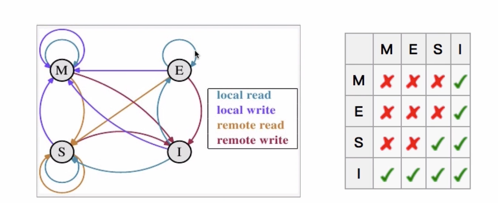

## 基本概念  
- 并发：同时拥有两个或多个线程  
  如果程序在单核处理器运行，多个线程将交替的换入或者换出内存，线程同时存在，每个线程处于执行过程的某个状态  
  如果运行在多核处理器上，程序中每个线程都将分配到一个处理器核上，可以同时运行  
- 高并发：（High Concurrency）是互联网分布式系统构架设计中必须考虑的因素之一，通常是指，通过设计保证系统能够`同时并行处理`多个请求  
- 并发：多个线程操作相同的资源，保证线程安全，合理使用资源  
- 高并发：服务能同时处理很多请求，提高程序性能  
### CPU多级缓存  

- 为什么需要CPU cache?  
CPU的频率太快了，快到主存跟不上，这样在处理器时钟周期内，CPU常常要等待主存，浪费资源。  
Cache的出现，是为了缓解CPU和内存之间速度的不匹配问题  
结构：CPU -> cache -> memeory  
- CPU cache有什么意义？  
  1. 时间局部性：如果某个数据被访问，那么在不久的将来它可能被再次访问  
  2. 空间局部性：如果某个数据被访问，那么与它相邻的数据很快也可能被访问  
#### CPU多级缓存 - 缓存一致性（MESI）  
用于保证多个CPU cache之间缓存共享数据的一致  
  
#### CPU多级缓存 - 乱序执行优化  
处理器为提高运算速度而做出违背代码原则顺序的优化  
### Java内存模型  （Java Memory Model,JMM）  
  
Java内存模型与计算机缓存映射  

线程间通过主内存通信

### Java内存模型 - 同步八种操作  
- lock(锁定)：作用于主内存变量，把一个变量标识为一条线程独占状态  
- unlock(解锁)：作用于主内存的变量，把一个处于锁定状态的变量释放出来，释放后的变量才可以被其他线程锁定  
- read(读取)：作用于主内存变量，把一个变量从主内存传输到线程的工作内存中，以便随后的load动作使用  
- load(载入)：作用于工作内存的变量，它把read操作从主内存中得到的变量值放入工作内存的变量副本中  
- use(使用)：作用于工作内存的变量，把工作内存中的一个变量值传递给执行引擎  
- assign(赋值)：作用于工作内存的变量，把一个从执行引擎接收到的值赋给工作内存的变量  
- store(存储)：作用于工作内存的变量，把工作内存中的一个变量的值传送到主内存中，以便随后的write操作  
- write(写入)：作用于主内存变量，把store操作从工作内存中一个变量的值传送到主内存的变量中  
### Java内存模型 - 同步规则  
- 如果要把一个变量从主内存复制到工作内存，就需要按顺序的执行read和load操作，把变量从工作内存中同步回主内存中，按顺序执行store和write操作。但Java内存模型只要求上述操作必须按顺序执行，而没有保证必须是连续执行  
- 不允许read和load、store和write操作之一单独出现  
- 不允许一个线程丢弃它的最近assign的操作，即变量在工作内存中改变了之后`必须`同步到主内存中  
- 不允许一个线程无原因的（没有发生过任何assign操作）把数据从工作内存同步回主内存中  
- 一个新的变量只能从主内存中诞生，不允许在工作内存中直接使用一个未被初始化（load或assign）的变量。就是对一个变量实施use和store操作之前，必须先执行过assign和load操作  
- 一个变量在同一时刻只允许一条线程对其进行lock操作，但lock操作可以被同一线程重复执行多次，多次执行lock后，只有执行相同次数的unlock操作，变量才会被解锁  
  lock和unlock必须成对出现  
- 如果对一个变量执行lock操作，将会清空工作内存中此变量的值，在执行引擎使用这个变量前需要重新执行load或assign操作初始化变量的值  
- 如果一个变量事先没有被lock操作锁定，则不允许对它执行unlock操作，也不允许去unlock一个被其他线程锁定的变量  
- 对一个变量执行unlock操作之前，必须先把此变量同步到主内存中（执行store和write操作）  
### Java内存模型 - 同步操作与规则  
  
### 并发的优势与风险  
  
