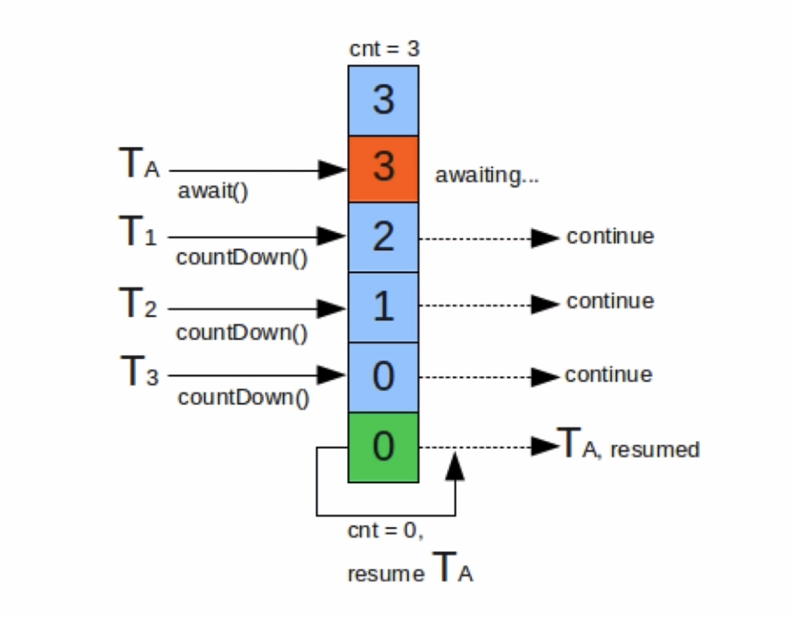

## 并发模拟  
- postman：Http请求模拟工具  
- Apache Bench（AB）：Apache附带的工具，测试网站性能  
- JMeter：Apache组织开发的压力测试工具  
- 代码：Semaphore、CountDownLatch等  
### Postman  
### Apache Bench
命令行：ab -n 1000 -c 50 url  
50个线程请求1000次该url  
### 代码模拟并发
- CountDownLatch  
    
- Semaphore  