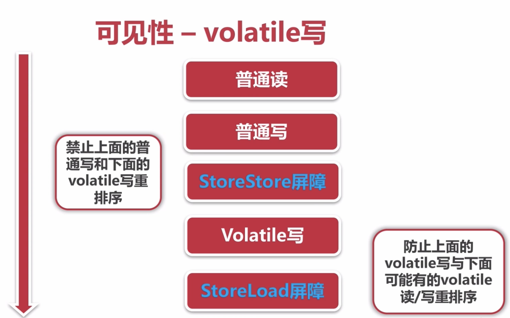
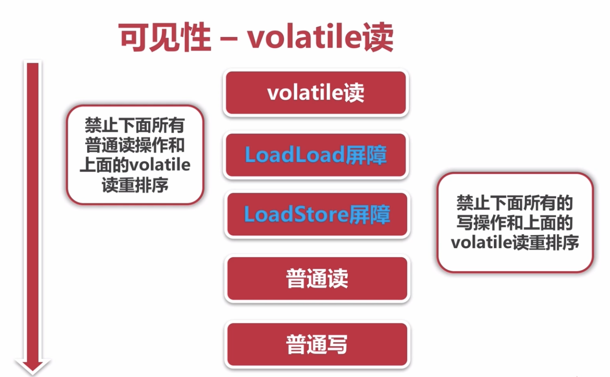

## 线程安全性  
- 当多个线程访问某个类时，不管运行时环境采用`何种调度方式`或者这些进程将如何交替执行，并且在主调代码中`不需要任何额外的同步或协同`，这个类都能表现出`正确的行为`，那么就称这个类是线程安全的  

表现方面：  
- 原子性：提供了互斥访问，同一时刻只能有一个线程来对它进行操作  
- 可见性：一个线程对主内存的修改可以及时的被其他线程观察到  
- 有序性：一个线程观察其他线程中的指令执行顺序，由于指令重排序的存在，该观察结果一般杂乱无序  

### 原子性 - Atomic包  
- AtomicXXX：CAS、Unsafe.compareAndSwapInt  
  ```java
  count.incrementAndGet();
  ```
  ```java
    public final int incrementAndGet() {
        return unsafe.getAndAddInt(this, valueOffset, 1) + 1;
    }
  ```
  ```java
    // var2 传进来的原生值 var4 增加的值 比如 count++时 原count为 （2 + 1）的计算
    public final int getAndAddInt(Object var1, long var2, int var4) {
        int var5;
        do {
            // 从Java底层获取的 var2的值 是否相等，被其他线程修改
            var5 = this.getIntVolatile(var1, var2);
            // var1 count对象 当 传进来var2与底层 var5值相同，count对象更新成 var5 + var4
        } while(!this.compareAndSwapInt(var1, var2, var5, var5 + var4));

        return var5;
    }
  ```
- AtomicLong、LongAdder  
  CAS的底层实现是在一个死循环中不断尝试修改目标值，直到修改成功。  
  如果竞争不激烈时，修改成功概率很高，反之，修改失败的概率很高，在大量失败的情况下会进行多次的循环尝试，性能会受到一定影响  
  对于普通类型的long、double变量，JVM允许将64位的读/写操作，拆分成两个32位的操作

  LongAdder的实现思想：  
  它将热点数据分离，比如将AtomicLong的内部核心数据`value`分离成一个数组，每个线程访问时通过hash等算法，映射到其中的一个数字进行计数，而最终结果是这个数组的求和累加  
  其中热点数据value会被分离成多个单元的`Cell`，每个Cell独立维护内部的值，当前对象的值由所有的cell累计合成，这样热点就进行了有效的分离，并提高了并行度  
  LongAdder在AtomicLong的基础上，将单点的更新压力分散到各个节点上，在低并发的时候，通过对`base`的直接更新，可以很好地保障和Atomic的性能基本一致；在高并发时则通过分散提高了性能  

  LongAdder的缺点：    
  在统计时如果有并发更新，可能会导致统计数据有误差  
  实际使用中，在高并发情况下可以优先使用LongAdder  
  在线程竞争很低的情况下，使用Atomic更简单，直接，并且效率高一点  
  其他情况，比如序号生成，这种情况下需要准确的数值，全局唯一的AtomicLong才是正确的选择  
- AtomicReference、AtomicReferenceFieldUpdater  
- AtomicStampReference：CAS的ABA问题  
  什么是ABA问题？在CAS操作时，其他线程将变量的值A改成了B，再改回A，本线程使用期望值A与当前变量比较的时候，发现A变量没有变，CAS将A值做了交换操作，这时实际上该值已经被其他线程改变过的， 对于数据思想是不符合的  
  ABA问题的解决思路是每次变量更新的时候把变量的版本号+1  
  A版本是1，改为B时版本为2，再改回A版本变更为3，只要变量被修改过，该变量的版本就会发生递增变化  
### 原子性 - 锁
- synchronized: 依赖JVM  
- Lock：依赖特殊的CPU指令，代码实现：ReentrantLock  
#### synchronized  
- 修饰代码块：大括号括起来的代码，作用于`调用的对象`  
- 修饰方法：整个方法，作用于`调用的对象`  
- 修饰静态方法：整个静态方法，作用于`所有对象`  
- 修饰类：括号括起来的部分，作用于`所有对象`  
### 原子性 - 对比
- synchronized：不可中断锁，适合竞争不激烈，可读性好  
- Lock：可中断锁，多样化同步，竞争激烈时能维持常态  
- Atomic：竞争激烈时能维持常态，比Lock性能好；一次只能同步一个值  
### 可见性  
导致共享变量在线程间不可见的原因  
- 线程交叉执行  
- 重排序结合线程交叉执行  
- 共享变量更新后的值没有在工作内存与主存间及时更新  
#### 可见性 - synchronized
JMM关于synchronized的两条规定  
- 线程解锁前，必须把共享变量的最新值刷新到主内存  
- 线程加锁时，将清空工作内存中共享变量的值，从而使用共享变量时需要从主内存中重新读取最新的值
  （注意：加锁与解锁是同一把锁）  
#### 可见性 - volatile
通过加入`内存屏障`和`禁止重排序`优化来实现  
- 对volatile变量写操作时，会在写操作后加入一条store屏障指令，将本地内存中的共享变量值刷新到主内存  
- 对volatile变量读操作时，会在读操作前加入一条load屏障指令，从主内存中读取共享变量  
  
  
volatile不具有原子性，不能保证线程安全  

volatile使用  
- 对变量的写操作不依赖于当前值  
- 该变量没有包含着具有其他变量的式子中  
volatile适合作为状态标记量  
### 有序性  
- Java内存模型中，允许编译器和处理器对指令进行`重排序`，但重排序过程不会影响到`单线程`程序的执行，却会影响到多线程并发执行的正确性  
- volatile、synchronized、Lock  
### 有序性 - happens-before原则  
- 程序次序规则：一个线程内，按照代码顺序、书写在前面的操作先行发生于书写在后面的操作  
- 锁定规则：一个unlock操作先行发生于后面对同一个锁的lock操作  
- volatile变量规则：对一个变量的写操作先行发生于后面对这个变量的读操作  
- 传递规则：如果操作A先行发生于操作B，而操作B又先行发生于操作C，则可以得出操作A先行发生于操作C 
- 线程启动规则：Thread对象的start()方法先行发生于此线程的每一个动作  
- 线程中断规则：对线程interrupt()方法的调用先行发生于被中断线程的代码检测到中断事件的发生  
- 线程终结规则：线程中所有的操作都先行发生于线程的终止检测，可以通过Thread.join()方法结束、Thread.isAlive()的返回值手段检测到线程已经终止执行  
- 对象终结规则：一个对象的初始化完成先行发生于他的finalize()方法的开始  