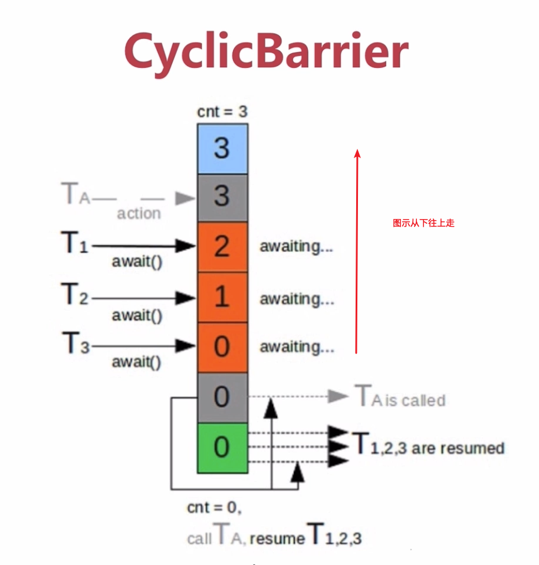

## AbstractQueuedSynchronizer - AQS  
底层使用的是双向链表  
  
- 使用Node实现FIFO队列，可以用于构建锁或者其他同步装置的基础构架  
- 利用了一个int类型表示状态  
- 使用方法是继承  
- 子类通过继承并通过实现它的方法管理其状态 {`acquire` 和`release`}的方法操纵状态  
- 可以同时实现`排它锁`和`共享锁`模式（独占、共享）  
## AQS同步组件  
- CountDownLatch  闭锁  
- Semaphore  
- CyclicBarrier  
- ReentrantLock  
- Condition  
- FutureTask  
### CountDownLatch  
```java
    private static int threadCount = 200;

    public static void main(String[] args) throws Exception {
        ExecutorService exec = Executors.newCachedThreadPool();
        final CountDownLatch countDownLatch = new CountDownLatch(threadCount);

        for (int i = 0; i < threadCount; i++) {
            final int threadNum = i;
            Thread.sleep(1);
            exec.execute(() -> {
                try {
                    test(threadNum);
                } catch (Exception e) {
                    log.error("exception {}", e);
                } finally {
                    countDownLatch.countDown();
                }
            });
        }
        countDownLatch.await(10, TimeUnit.MILLISECONDS);
        log.info("finish");
        exec.shutdown();
    }

    private static void test(int threadNum) throws Exception {
        log.info("{}", threadNum);
    }
```
countDownLatch.await()未指定等待时间时，会等待countDownLatch中`计数器等于 0`再向下继续执行  
countDownLatch指定等待线程时间时，超过等待时间，将会直接向下执行  

调用到exec.shutdown()时，并不会将所有线程立即销毁，而是`当前已有的线程`继续执行完成  

指定时间的好处：  
1. 不管线程执行的怎么样，都会继续向下执行  
2. 不会出现忘记调用 `countDownLatch.countDown()`而出现死等待的情况  
### Semaphore  
```java
    private static int threadCount = 20;

    public static void main(String[] args) throws Exception {
        ExecutorService exec = Executors.newCachedThreadPool();
        final Semaphore semaphore = new Semaphore(3);

        for (int i = 0; i < threadCount; i++) {
            final int threadNum = i;
            exec.execute(() -> {
                try {
                    // 获取一个许可
                    semaphore.acquire();
                    test(threadNum);
                    // 释放一个许可
                    semaphore.release();
                } catch (Exception e) {
                    log.error("exception {}", e);
                }
            });
        }
        log.info("finish");
        exec.shutdown();
    }

    private static void test(int threadNum) throws Exception {
        log.info("{}", threadNum);
        Thread.sleep(100);
    }
```
上述例子就是20个线程，并发线程为3个，每次只能放行3个线程执行  
```java
 // 获取多个许可
semaphore.acquire(3);
test(threadNum);
// 释放多个许可
semaphore.release(3);
```
一个线程也可以获取多个许可  
按上面的代码，每次只允许3个许可通过，而一个线程就获取了3个许可，此时就是一个一个线程依次执行，类似于单线程  
```java
exec.execute(() -> {
    try {
        // 如果线程能获取到许可 继续执行
        // 如果无法获取许可 丢弃
        if (semaphore.tryAcquire()) { // 尝试获取一个许可 可以传参，等待时间  
            test(threadNum);
            semaphore.release(); // 释放许可
        }
    } catch (Exception e) {
        log.error("exception {}", e);
    }
});
```
```java
exec.execute(() -> {
    try {
        // 如果线程能获取到许可 继续执行
        // 如果无法获取许可 丢弃
        if (semaphore.tryAcquire(200, TimeUnit.MILLISECONDS)) { // 尝试获取一个许可 可以传参，等待时间
            test(threadNum);
            semaphore.release(); // 释放许可
        }
    } catch (Exception e) {
        log.error("exception {}", e);
    }
});
```
### CyclicBarrier  

也是一个同步辅助类,实现 一组线程相互等待  
到达某一`屏障点`，通过它完成多个线程相互等待，只有当每个线程都准备完成后，才能各自继续往下执行  
与`CountDownLatch`有类似的地方，都是通过`计数器`来实现的  
CyclicBarrier释放等待线程后，可以重用，所以又称为`循环屏障`  
使用场景和`CountDownLatch`很相似，可以用于`多线程计算数据，最后合并计算结果的应用场景`  

与`CountDownLatch`的差别  
1. CountDownLatch的计数器只能使用一次，CyclicBarrier可以重复使用  
2. CountDownLatch主要实现 1或n个线程需要等待其他线程完成某项操作后才能继续往下执行，描述的是 1或n个线程等待其他线程的关系  
   CyclicBarrier主要是实现了多个线程之间相互等待，直到所有线程都满足了条件之后，才能继续执行后续操作，它描述的是各个线程内部相互等待的关系
```java
private static CyclicBarrier barrier = new CyclicBarrier(5);

public static void main(String[] args) throws Exception {
    ExecutorService executor = Executors.newCachedThreadPool();

    for (int i = 0; i < 10; i++) {
        Thread.sleep(1000);
        final int threadNum = i;
        executor.execute(() ->{
            try {
                race(threadNum);
            } catch (Exception e) {
                log.error("exception", e);
            }
        });
    }
}

private static void race(int threadNum) throws Exception {
    Thread.sleep(1000);
    log.info("{} is ready", threadNum);
    barrier.await();
    log.info("{} continue", threadNum);
}
```
```java
    // await指定传入等待时间
    try {
        barrier.await(2000, TimeUnit.MILLISECONDS);
    } catch (BrokenBarrierException | TimeoutException e) {
        log.warn("BrokenBarrierException", e);
    }
    log.info("{} continue", threadNum);
```
```java
// 声明CyclicBarrier指定Runable
// 当线程到达屏障时，优先执行runable
private static CyclicBarrier barrier = new CyclicBarrier(5, () -> {log.info("callback is running");});
```
### ReentrantLock 与 锁  
Java中两类锁  
1. synchronized 关键字修饰的锁  
2. J.U.C中里面提供的锁，核心的锁就是`ReentrantLock`。同时它属于锁，其核心即 `lock`与`unlock`  

- ReentrantLock(可重入锁)和synchronized区别  
  1. 可重入性  
   两者都是可重入的，相差不大，都是同一个线程进入一次，锁的计数器就自增1，所以要等锁的计数器下降为0时才能释放锁  
  2. 锁的实现  
    synchronized依赖于JVM实现，类似于`操作系统实现`，对用户黑盒，无法查看源码  
    ReentrantLock依赖于JDK实现，类似于`用户自行代码实现`，可以通过阅读源码，知道实现过程  
  3. 性能的区别  
   synchronized优化前性能相较于`ReentrantLock`差很多，自从引入`偏向锁`、`自旋锁`后两者性能接近。在两者都可用的情况下，官方更推荐synchronized，因为写法更容易  
   synchronized优化就是借鉴了ReentrantLock的CAS技术，都是试图在用户态就把加锁问题解决，避免进入内核态的线程阻塞  
  4. 功能区别  
   （1）便利性。synchronized使用，方便简洁，并且由编译器保证加锁和释放的，ReentrantLock需要手动加锁和释放锁，为了避免加锁忘记释放锁而造成死锁，最好在finally里声明释放锁  
    (2) 锁的细粒度和灵活度。明显ReentrantLock优于synchronized  

ReentrantLock独有功能  
- 可指定是公平锁还是非公平锁  
  synchronized只能是非公平锁  
  所谓的`公平锁`就是: 先等待的锁先获得锁  
- 提供了一个Condition类，可以分组唤醒需要唤醒的线程  
  不像synchronized，要么随机唤醒一个线程，要么唤醒所有线程  
- 提供能够终端等待锁的线程的机制，`lock.lockInterruptibly()`  
   
ReentrantLock实现是一种自旋锁，通过循环调用CAS操作来实现加锁，性能好，是因为使线程避免进入内核态的阻塞状态  

什么时候使用ReentrantLock？  
- 使用它独有的此三个功能  

其他情况下可以根据`性能`、`业务场景`等等来选择使用`ReentrantLock`还是`synchronized`  

ReentrantLock在调用方法中手动加锁、解锁  
```java
    private final static Lock LOCK = new ReentrantLock();


    private static void add() {
        LOCK.lock();
        try {
            count++;
        } finally {
            LOCK.unlock();
        }
    }
```

### ReentrantReadWriteLock  
在没有任何读写锁的情况下时，才可以取得写入锁  
可以用于实现`悲观读取`  
但是在读取多，写入少时，会造成线程饥饿。（因为在写入前必须保证所有读操作均已完成）  
### StampedLock  
控制锁有三种模式：写、读、乐观读  
```java
    private final static StampedLock LOCK = new StampedLock();

    private static void add() {
        long stamp = LOCK.writeLock();
        try {
            count++;
        } finally {
            LOCK.unlock(stamp);
        }
    }
```