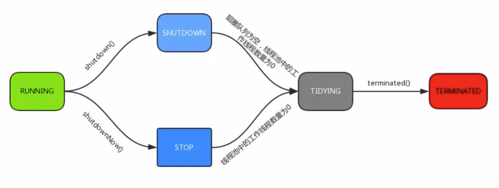
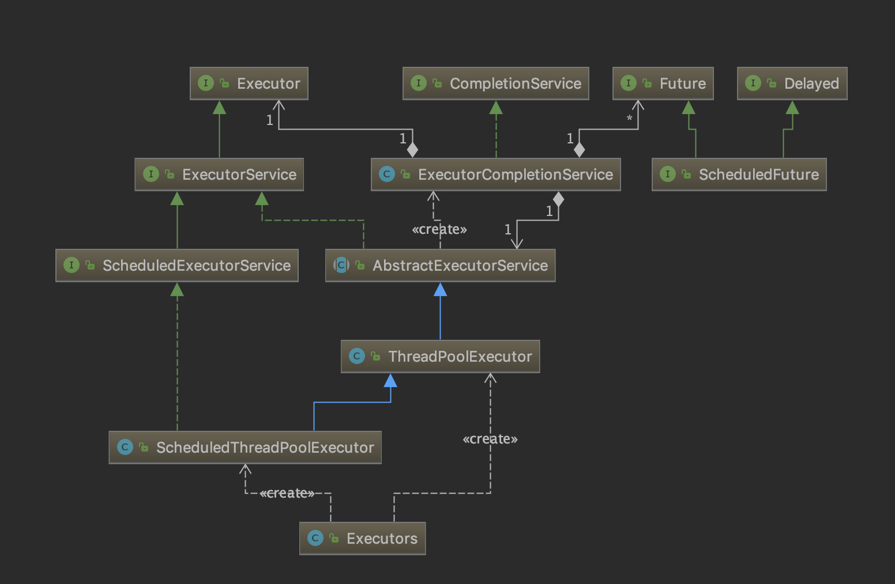

## 线程池  
- new Thread弊端  
  1. 每次`new Thread`新建对象，性能差  
  2. 线程缺乏统一管理，可能无限制的新建线程，相互竞争，有可能占用过多系统资源导致死机或OOM  
  3. 缺少更多的功能，如更多执行、定期执行、线程中断  
- 线程池的好处  
  1. 重用存在的线程，减少对象创建、消亡的开销，性能佳  
  2. 可有效控制最大并发线程数，提高系统资源利用率，同时可以避免过多资源竞争，避免阻塞  
  3. 提供定时执行、定期执行、单线程、并发数控制等功能  
### 线程池 - ThreadPoolExecutor  
- corePoolSize: 核心线程数量  
- maximumPoolSize: 线程最大线程数  
- workQueue: 阻塞队列，存储等待执行的任务，很重要，会对线程池运行过程产生重大影响  

如果运行的线程数＜corePoolSize，直接创建新线程处理任务  
如果线程数量≥corePoolSize且小于maximumPoolSize，只有当workQueue队列装满时，才创建新的线程处理任务  
如果corePoolSize和maximumPoolSize相同，那么创建的线程池大小是固定的，这时，如果workQueue没有装满，就将请求装入队列，等待有空闲的线程，取出任务进行处理；如果线程数大于corePoolSize且workQueue已满，将会使用一个叫`拒绝策略`的参数来指定策略，处理任务  

workQueue是一个阻塞队列。当提交一个新任务到线程池以后，线程池会根据当前线程池中正在运行着的线程数量来决定该任务的处理方式  
处理方式有三种：  
1. 直接切换 `SynchronousQueue`  
2. 使用无限队列 使用基于链表的阻塞队列`LinkedBlockingQueue`，这种方式线程池中能创建的最大线程数就是`corePoolSize`，而`maximumPoolSize`不再发生作用  
3. 使用有界队列 `ArrayBlockingQueue`，这种方式最大线程数可以限制为`maximumPoolSize`，这样可以降低资源的消耗，但是也使线程池对线程的调度更困难，因为线程池对应的容量是有限的。所以要使线程池处理任务的吞吐率达到一个相对合理的范围，又想使线程调度相对简单，并且还尽可能降低线程池对资源的消耗，就需要合理的设置`corePoolSize和maximumPoolSize`的数量  
  如果想降低系统资源的消耗，CPU使用率、操作系统对应的消耗、环境切换的开销等等，可以设置`较大的队列容量`和`较小的线程池容量`，这样会降低线程处理的吞吐量  
- keepAliveTime: 线程没有执行任务时最多保持多久时间终止  
- unit: keepAliveTime的时间单位  
- threadFactory: 线程工厂，用来创建线程  
- rejectHandler: 当拒绝处理任务时的策略  
  1. 也是默认，抛出异常  
  2. 用调用者所在的线程执行任务  
  3. 丢弃队列中最靠前的任务，执行当前任务  
  4. 直接丢弃任务  
### 线程池实例化状态  
  
- execute(): 提交任务，交给线程池执行  
- submit(): 提交任务，能够返回执行结果 execute + Future  
- shutdown(): 关闭线程池，等待任务都执行完  
- shutdownNow(): 关闭线程池，不等待任务执行完  
- getTaskCount(): 线程池已执行和未执行的任务总数  
- getCompletedTaskCount(): 已完成的任务数量  
- getPoolSize(): 线程池当前的线程数量  
- getActiveCount(): 当前线程池中正在执行任务的线程数量  
### 线程池类图  
  
### 线程池 - Executor框架接口  
- Executors.newCachedThreadPool  
  创建一个可缓存的线程池，如果线程池长度超过处理的需要，可以灵活回收空闲线程，如果没有可以回收的就创建线程  
- Executors.newFixedThreadPool  
  创建的是一个定长的线程池，可以控制进程的最大并发数，超出的线程会在队列中等待  
- Executors.newScheduledThreadPool  
  创建的是一个定长的线程池，支持定时和周期性的任务执行  
- Executors.newSingleThreadPool  
  创建一个单线程化的线程池，只会用唯一的一个线程来执行任务，保证所有任务按照指定顺序（先入先出、优先级）执行
### 线程池 - 合理配置  
- CPU密集型任务，就需要尽量压榨CPU，参考值可以设为`CPU数量 + 1`  
- IO密集型任务，参考值可以设置为`2 * CPU数量`  