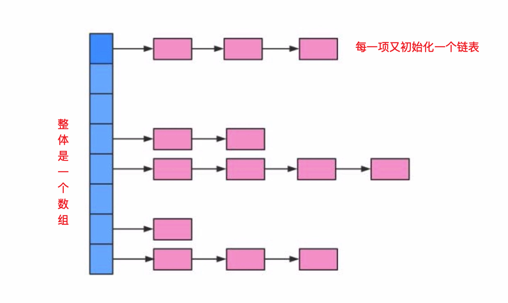

## 多线程并发拓展  
### 死锁  
- 死锁 - 必要条件  
  1. 互斥条件
  2. 请求和保持条件
  3. 不剥夺条件
  4. 环路等待条件  
### 多线程并发最佳实践
- 使用本地变量  
- 使用不可变类
- 最小化锁的作用域范围: S=1/(1-a+a/n)  
  a是并行计算所占的比例 
  n是并行处理的节点个数  
  s表示最小加速比  
  当`1-a=0`时，没有串行，只有并行，s是等于n的  
  当`a=0`时，只有串行，没有并行，最小加速比s等于1  
  当n趋向于无穷大时，s趋向于 `1/1-a`，这也是加速比的上限  
  `阿姆达尔定律`
- 使用线程池的Executor，而不是直接`new Thread`执行  
- 宁可使用`同步`，也不要使用线程的wait和notify  
- 使用`BlockingQueue`实现生产-消费模式  
- 使用`并发集合`而不是加了锁的同步集合  
- 使用`Semaphore`创建有界的访问  
- 宁可使用`同步代码块`，也不使用同步的方法  
- 避免使用静态变量  
### Spring与线程安全  
- Spring bean:singleton、 prototype  
  Spring对每个Bean提供了scope（作用域），它是这个Bean的生命周期  
  比如scope为singleton（单例），在第一次注入时会创建一个单例对象，该对象会一直复用到应用结束，singleton是容器默认的scope，生命周期与Spring IOC容器是一致的  
  scope为prototype时，每次注入都会创建一个新的对象
- 无状态对象  
  每个无状态的单例对象都是线程安全的  
  自身没有状态，自然不会因为多个线程交替调度，破坏自身状态导致线程安全问题  
  无状态对象包括DTO、VO这些只作为数据实体对象，还有Service、Dao、Controller  

Spring根本就没有对Bean的多线程安全问题做出任何的保证与措施，对于每个Bean的线程安全问题根本原因是因为每个Bean自身的设计：`没有在Bean中声明任何有状态的实例变量或类变量`  
如果必须在Spring管理中加入有状态的实例或类变量，让类变成一个有状态的对象时，那么就需要使用ThreadLocal把变量变成线程私有的  
如果Bean的实例变量或类变量需要在多个线程间共享，就只能使用`syncsynchronized`、`Lock`、`CAS`等实现线程同步的方法  
### HashMap 与 ConcurrentHashMap  
HashMap  
  
初始容量: hash表在创建时的容量，默认16
```java
static final int DEFAULT_INITIAL_CAPACITY = 1 << 4; // aka 16
```
加载因子: hash表在其容量自动增加之前可以达到多满的尺度  
```java
static final float DEFAULT_LOAD_FACTOR = 0.75f;
```
容量超过 初始容量 * 加载因子，自动调用`resize()`方法扩容  

#### hashMap的寻址方式  
对于一个新插入的数据或读取数据，hashMap需要将它的`key`按照一定的计算规则计算出的`hash值`，并对数组的长度进行取模，结果作为查找在数组中的`index`，再进行结果查找  
计算机中取模的代价远远高于位运算的代价，hashMap要求数组的长度必须为`2^n`，此时将替代hash值，对`2^{n-1}`进行`与运算`，结果与取模运算时相同的  
hashMap并不要求用户在指定HashMap容量时必须传入一个 2^n 的整数，而是在初始化时根据传入的容量值，计算出一个满足 2^n 容量，调用的方法是`tableSizeFor()`  
hashMap是线程不安全的，而不安全主要体现在调用`resize()`方法时可能出现死循环，或使用迭代器时出现  
hashMap扩容方法: 创建一个新的容量是原来2倍的数组，保证新的容量是 2^n，从而保证寻址方式仍然适用，同时需要将原来的数组全部重新插入到新的数组，这个过程称之为`ReHash`  
这个方法并不保证线程安全，而且在多线程并发调用时，可能出现死循环  
#### ReHash  
单线程情况下  
  
多线程并发下ReHash  
上面是线程一，执行ReHash操作时，在索引1先插入了key=5的值，而指针指向key=9，执行未完成，CPU执行时间到期而暂停  
下面是线程二，并完成了ReHash操作，并且key=9的下一个元素是key=5  
  
线程一再次被唤醒时，数组1位置指向key=5，然后处理key=9  
  
线程一处理完key=9后，由于线程二的key=9已经处理完，并且新增了key=5和null，所以线程一发现后面key=5需要继续处理  
  
线程一处理后有会尝试将key=5放在线程一数组的索引1的首部，这时就会形成一个循环的链表，因为5指向9，9也是指向5的。并且key=11是无法加入到线程一的数组中，下次访问时依旧会造成死循环  
  
### ConcurrentHashMap  
Java7 ConcurrentHashMap底层示意图  
  
底层结构仍是数组和链表  
最晚层不是一个大的数组，而是Segment数组，一个Segment包含一个和HashMap差不多的链表数组  
读取key时，先取出key的hash值，并将hash值的高分位对Segment各组取模，从而得到该key属于哪一Segment，接着就像操作HashMap一样操作Segment  
为了保证不同的值均匀的分布到不同的Segment里面，hash值也专门做了优化  
Segment是`继承自JUC中的ReentrantLock`，所以可以很方便的对每一个Segment上锁，做锁相关的处理  

HashMap和ConcurrentHashMap不同点  
- HashMap是非线程安全的，ConcurrentHashMap是线程安全的  
- HashMap允许`key和Value`为空，而ConcurrentHashMap不允许  
- HashMap不允许通过Iterator遍历的同时通过HashMap来修改，而ConcurrentHashMap允许该行为，并且这种更新对后续的遍历是可见的  

Java7为了引入并行访问引入Segment结构，实现了`分段锁`，理论上最大并发数与segment个数是相等的  
Java8为了进一步提高并发性，废弃了分段锁的方案，直接使用了一个大的数组，同时为了提高hash碰撞下的寻址做了优化  
容量默认值是8，超过8时才将`链表结构更换为了红黑树`，寻址时间复杂度 从o(n)提升为o(logn)
Java8之后ConcurrentHashMap底层示意图
  