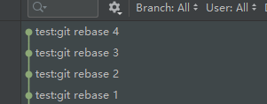
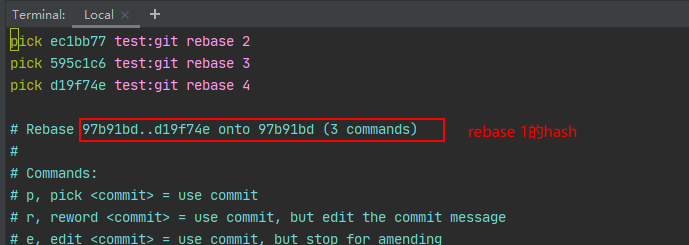
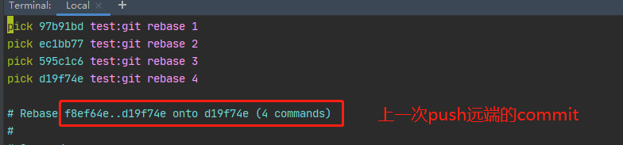
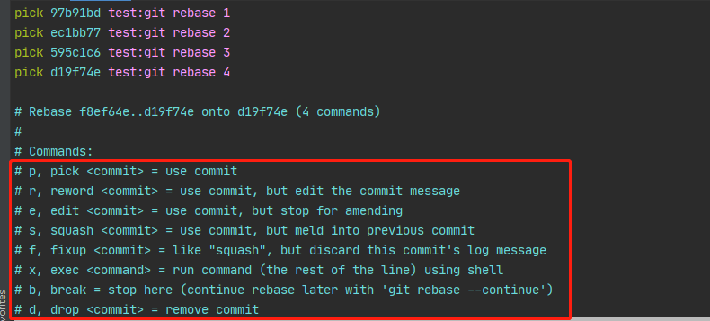
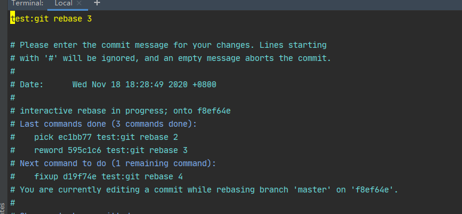
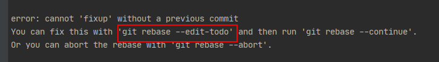

### git rebase使用

在使用git的过程中由于高频次的进行commit导致提交记录非常长，而且充斥着冗余的git提交记录，比如`暂存`、或者`XX日下班提交`。如果一个开发的代码功能较为复杂，周期很长，避免代码丢失的情况下，多次的git commit提交是不可避免的，因此在功能开发完毕后整理git commit提交记录，是必要的一个步骤。要实现这个效果，就是基于git rebase实现的。

<h4>合并同分支提交记录</h4>

假设本地有多次提交记录如下：




方式一：使用以下命令：

```shell
git rebase -i HEAD~x 合并x条提交记录

例如 git rebase -i HEAD~3
此时会以 rebase 1 作为基础来进行 commit 合并
```

执行结果如图



方式二：

```shell
git rebase -i
不指定合并内容

此时会以 上一次远端提交 作为基础来进行 commit 合并
```

执行结果如图




<h5>rebase规则修改</h5>

执行该指令后弹出的界面为`vim`编辑模式，如上图所示

前面的`pick ........`开头的就是我们要合并的commit 及commit message

不过 pick这个命令的作用是什么呢，其实下面注释的文档已经说明，只不过是英文内容而已



含义如下：

* pick：保留该commit
* reword：保留该commit，但需要修改该commit的注释
* edit：保留该commit, 但要停下来修改该提交(不仅仅修改注释)
* squash：将该commit和前一个commit合并
* fixup：将该commit和前一个commit合并，但不要保留该提交的注释信息
* exec：执行shell命令
* drop：我要丢弃该commit
* label：用名称标记当前HEAD
* reset：将HEAD重置为标签
* merge：创建一个合并分支并使用原版分支的commit的注释

图片中前面的字母为命令缩写，所以修改时可以使用全称，也可以使用缩写


修改好后，输入VIM的`:wq`保存退出，如果没有修改commit message，会直接执行git rebase的内容;如果修改了注释，则还会进入一个编写新commit message的界面，保存后可以得到新的commit



<h5>注意：</h5>

在执行了git rebase语句后，git状态会变成`Rebasing ...`，此时因为一些特殊原因，没有执行完，或者放弃rebase操作，可以执行一下命令

```shell
// 放弃当前rebase操作
git rebase --abort

// 继续 rebase操作
git rebase --continue
```

如果编辑rebase内容时出错，git是不会执行内容，并且会将错误位置打印出来，方便修改



```shell
// 重新进入编辑界面
git rebase --edit-todo

// 修改后继续rebase操作
git rebase --continue
```

