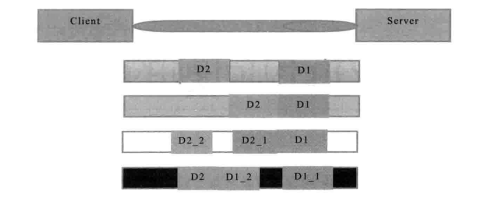

### TCP粘包/拆包问题

<h4> TCP粘包和拆包</h4>

TCP是个"流"协议，所谓流，就是没有界限的一串数据

TCP底层并不了解上层业务，它会根据TCP缓冲区的实际情况进行包的划分，所以在业务上认为，一个完整的包可能会被TCP拆分成多个包进行发送，也有可能把多个小的包封装成一个大的数据包发送

这就是所谓的TCP 粘包和拆包问题

<h5>TCP粘包/拆包问题说明</h5>



假设客户端分别发送两个数据包`D1`和`D2`给服务端，由于服务端一次读取到的字节数是不确定的，故可能存在以下4种情况

1、服务端分两次读取了两个独立的数据包，分别是`D1`和`D2`，没有粘包和拆包

2、服务端一次接收了两个的数据包，`D1`和`D2`粘合在一起，被称为`TCP粘包`

3、服务端分两次读取到了两个数据包，第一次读取到了完成的`D1`包和`D2`包的部分内容，第二次读取到了`D2`包的剩余内容，这被成为`TCP拆包`

4、服务端分两次读取到了两个数据包，第一次读取到了D1包的部分内容`D1_1`，第二次读取到了D1包的剩余内容`D1_2`和D2包的整包

如果此时服务端TCP接收滑窗非常小，而数据包D1和D2比较大，很可能发生`第五种`可能，即服务端分多次才能将`D1`和`D2`包接收完全，期间发生多此拆包

<h5>TCP粘包/拆包发生的原因</h5>

1、应用程序write写入的字节大小大于套接口发送缓冲区大小

2、进行MSS大小的TCP分段

3、以太网帧的payload大于MTU进行IP分片

<h5>TCP粘包/拆包的解决策略</h5>

由于TCP无法理解上层业务数据，所以在底层无法保证数据不被拆分和重组，这个问题只能`通过上层的应用协议栈设计`来解决

业界主流协议的解决方案：

​	1、消息定长，例如，每个报文的大小固定为长度200字节，如果不够，空位补空格；

​	2、在包尾增加回车换行符进行分割，例如FTP协议；

​	3、将消息分为消息头和消息体，消息头中包含表示消息总长度（或者消息体长度）的字段，通常设计思路为消息头的第一个字段使用`int32`来表示消息的总长度

​	4、更复杂的应用层协议

Netty提供的半包解码器来解决TCP粘包/拆包问题

<h4> 利用LineBasedFrameDecoder解决TCP粘包问题</h4>

为了解决TCP粘包/拆包导致的半包读写问题，Netty默认提供了多种编解码器用于处理半包，需要熟练掌握这些类库

```java
protected void initChannel(SocketChannel socketChannel) throws Exception {
            socketChannel.pipeline().addLast(new LineBasedFrameDecoder(1024));
            socketChannel.pipeline().addLast(new StringDecoder());
        }
```


<h5>LineBasedFrameDecoder和StringDecoder的原理分析</h5>

LineBaseFramDecoder工作原理：

​	1、依次遍历ByteBuf中的可读字节，判断看是否有“\n”或者“\r\n”

​	2、如果有，就以此位置为结束位置，从可读索引到结束位置区间的字节就组成了一行。

​	3、它是以换行符为结束标志的解码器，支持携带结束符或者不携带结束符两种解码方式，同时支持配置单行的最大长度

​	4、如果连续读取到最大长度后仍然没有发现换行符，就会抛出异常，同时忽略掉之前读到的异常码流

StringDecoder工作原理就是将接收到的对象转换成字符串，然后继续调用后面的handler


LineBasedFrameDecoder +StringDecoder组合就是按行切换的文本解码器，被设计用来支持TCP的粘包和拆包

如果发送的消息不是以换行符结束怎么办？Netty提供多种支持TCP粘包/拆包的解码器，用来满足不同的诉求

### 分隔符和定长解码器

TCP上层协议设计有四种模式：1、消息长度固定；2、将回车换行符作为消息的结束标志；3、将特殊的分隔符作为消息的结束标志；4、通过在消息头中定义长度字段来标识消息的总长度

两种实用的解码器

DelimiterBasedFrameDecoder：自动完成以分隔符作为结束标志的消息的解码

FixedLengthFrameDecoder：自动完成对定长消息的解码
