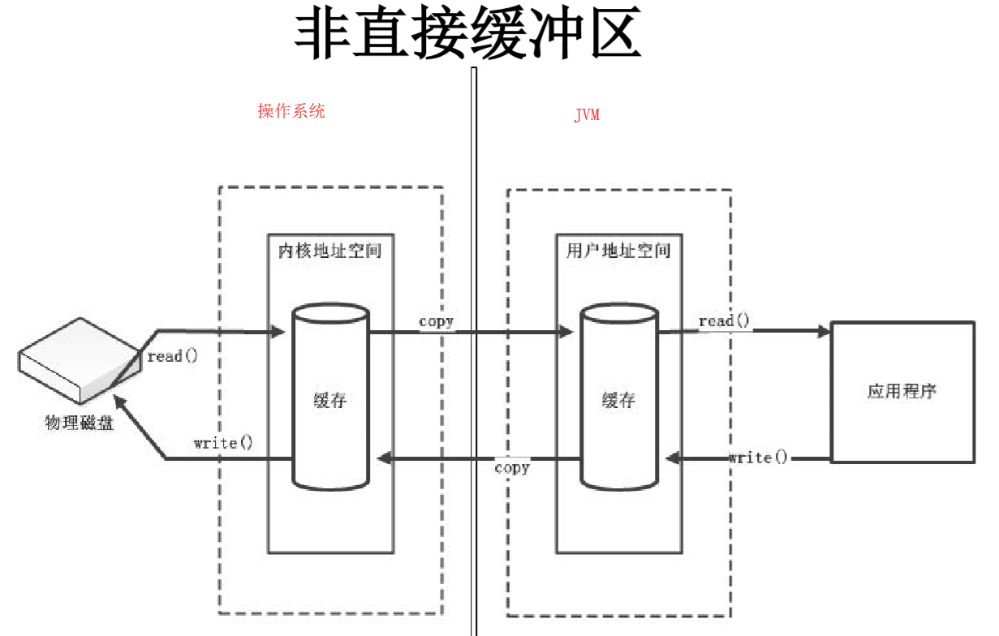
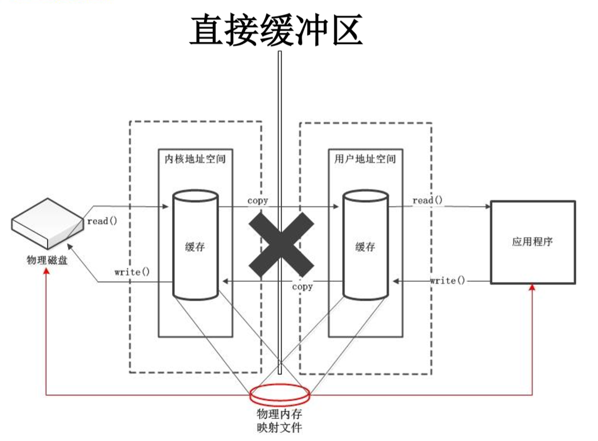
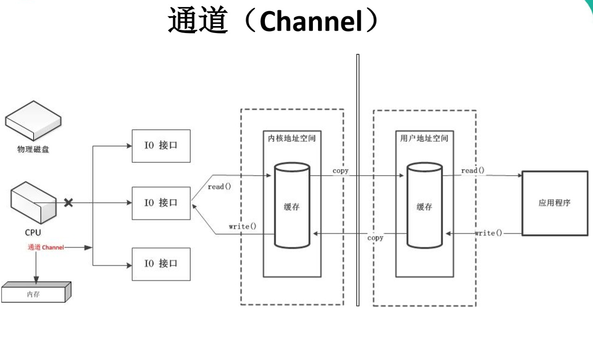

## Java NIO简介
`Java NIO`（New IO / Non Blocking IO）是从Java 1.4版本开始引入的一个新的IO API，可以替代标准的Java IO API  
NIO与原来的IO有同样的作用和目的，但是`使用方式`完全不同，NIO支持`面向缓冲区`的、基于`通道`的IO操作  
NIO将以更加高效的方式进行文件的读写操作  
### Java NIO 与 IO 的主要区别
<table>
    <tr>
        <td>IO</td>
        <td>NIO</td>
    </tr>
    <tr>
        <td>面向流（Stream Oriented）</td>
        <td>面向缓冲区（Buffer Oriented）</td>
    </tr>
    <tr>
        <td>阻塞IO （Blocking IO）</td>
        <td>非阻塞IO （Non Blocking IO）</td>
    </tr>
    <tr>
        <td>（无）</td>
        <td>选择器（Selectors）</td>
    </tr>
</table>

### 通道（Channel）与缓冲区（Buffer）
Java NIO系统的核心在于：`通道(Channel)`和`缓冲区(Buffer)`  

通道表示打开到IO设备(例如：文件、 套接字)的连接  
若需要使用NIO系统，需要获取用于连接IO设备的通道以及用于容纳数据的缓冲区,然后操作缓冲区，对数据进行处理  
简而言之，Channel负责传输，Buffer负责存储  
#### 缓冲区（Buffer）
- 缓冲区（Buffer）：一个用于`特定基本数据类型`的`容器`。由java.nio包定义的，所有缓冲区都是Buffer抽象类的子类  
- Java NIO中的Buffer主要用于与NIO通道进行交互，数据是`从通道读入缓冲区，从缓冲区写入通道中的`  
- Buffer就像一个数组，可以保存多个相同类型的数据。根据数据类型不同(boolean 除外)，有以下 Buffer 常用子类：  
    > ByteBuffer  
    > CharBuffer  
    > ShortBuffer  
    > IntBuffer  
    > LongBuffer  
    > FloatBuffer  
    > DoubleBuffer  
    上述Buffer类都采用相似的方法进行管理数据，只是管理的数据类型不同  
static XxxBuffer allocate(int capacity):创建一个容量为capacity的XxxBuffer对象  
##### 缓冲区的基本属性
- `容量 (capacity) `：表示Buffer最大数据容量，缓冲区容量不能为负，并且创建后不能更改  
- `限制 (limit)`：第一个不应该读取或写入的数据的索引，即位于limit后的数据不可读写  
  缓冲区的限制不能为负，并且不能大于其容量  
- `位置 (position)`：下一个要读取或写入的数据的索引  
  缓冲区的位置不能为负，并且不能大于其限制  
- `标记 (mark)与重置 (reset)`：  
  标记是一个索引，通过Buffer中的`mark()`方法 指定Buffer中一个特定的position,之后可以通过调用`reset()`方法恢复到这个position  

`position` <= `limit` <= `capacity`
##### Buffer 的常用方法
<table>
    <tr>
        <td>方法</td>
        <td>描述</td>
    </tr>
    <tr>
        <td>Buffer clear()</td>
        <td>清空缓冲区并返回对缓冲区的引用</td>
    </tr>
    <tr>
        <td>Buffer flip()</td>
        <td>将缓冲区的界限设置为当前位置，并将当前位置充值为 0</td>
    </tr>
    <tr>
        <td>int capacity()</td>
        <td>返回 Buffer 的 capacity 大小</td>
    </tr>
    <tr>
        <td>boolean hasRemaining()</td>
        <td>判断缓冲区中是否还有元素</td>
    </tr>
    <tr>
        <td>int limit()</td>
        <td>返回 Buffer 的界限(limit) 的位置</td>
    </tr>
    <tr>
        <td>Buffer limit(int n)</td>
        <td>将设置缓冲区界限为 n, 并返回一个具有新 limit 的缓冲区对象</td>
    </tr>
    <tr>
        <td>Buffer mark()</td>
        <td>对缓冲区设置标记</td>
    </tr>
    <tr>
        <td>int position()</td>
        <td>返回缓冲区的当前位置 position</td>
    </tr>
    <tr>
        <td>Buffer position(int n)</td>
        <td>将设置缓冲区的当前位置为 n , 并返回修改后的 Buffer 对象</td>
    </tr>
    <tr>
        <td>int remaining()</td>
        <td>返回 position 和 limit 之间的元素个数</td>
    </tr>
    <tr>
        <td>Buffer reset()</td>
        <td>将位置 position 转到以前设置的 mark 所在的位置</td>
    </tr>
    <tr>
        <td>Buffer rewind()</td>
        <td>将位置设为为 0， 取消设置的 mark</td>
    </tr>
</table>

##### 缓冲区的数据操作
- Buffer所有子类提供了两个用于数据操作的方法：`get() `与`put()` 方法  
- 获取 Buffer 中的数据  
  > get() ：读取单个字节 
  > get(byte[] dst) ：批量读取多个字节到 dst 中  
  > get(int index)：读取指定索引位置的字节(不会移动 position)  
- 放入数据到 Buffer 中  
  > put(byte b)：将给定单个字节写入缓冲区的当前位置  
  > put(byte[] src)：将 src 中的字节写入缓冲区的当前位置  
  > put(int index, byte b)：将指定字节写入缓冲区的索引位置(不会移动 position)  

```java
package vip.proyi.demo.NIO;

import org.junit.test;

import java.nio.ByteBuffer;


public class TestBuffer {
    @Test
    public void test1() {
        String str = "abcde";

        // 1.分配一个指定大小的缓冲区
        ByteBuffer buffer = ByteBuffer.allocate(1024);

        System.out.println("-----------allocate()------------");
        System.out.println(buffer.position());
        System.out.println(buffer.limit());
        System.out.println(buffer.capacity());

        // 2.利用 put() 存入数据到缓冲区中
        buffer.put(str.getBytes());

        System.out.println("-----------put()------------");
        System.out.println(buffer.position());
        System.out.println(buffer.limit());
        System.out.println(buffer.capacity());

        // 3.切换读取数据模式
        buffer.flip();

        System.out.println("-----------flip()------------");
        System.out.println(buffer.position());
        System.out.println(buffer.limit());
        System.out.println(buffer.capacity());

        // 4. 利用 get()读取缓冲区中的数据
        byte[] dst = new byte[buffer.limit()];
        buffer.get(dst);
        System.out.println(new String(dst, 0, dst.length));

        System.out.println("-----------get()------------");
        System.out.println(buffer.position());
        System.out.println(buffer.limit());
        System.out.println(buffer.capacity());

        // 5.rewind():可重复读
        buffer.rewind();

        System.out.println("-----------rewind()------------");
        System.out.println(buffer.position());
        System.out.println(buffer.limit());
        System.out.println(buffer.capacity());

        // 6.clear():清空缓冲区. 但是缓冲区中的数据依然存在，但是处于“被遗忘”状态
        buffer.clear();

        System.out.println("-----------clear()------------");
        System.out.println(buffer.position());
        System.out.println(buffer.limit());
        System.out.println(buffer.capacity());
        System.out.println((char) buffer.get());
    }

    @Test
    public void test2() {
        String str = "abcde";

        ByteBuffer buffer = ByteBuffer.allocate(1024);

        buffer.put(str.getBytes());

        buffer.flip();

        byte[] dst = new byte[buffer.limit()];
        buffer.get(dst, 0, 2);
        System.out.println(new String(dst, 0, 2));
        System.out.println(buffer.position());

        // mark() : 标记
        buffer.mark();

        buffer.get(dst, 2, 2);
        System.out.println(new String(dst, 2, 2));
        System.out.println(buffer.position());

        // reset() : 恢复到mark的位置
        buffer.reset();
        System.out.println(buffer.position());

        // 判断缓冲区中是否还有剩余数据
        if (buffer.hasRemaining()) {
            // 获取缓冲区中可以操作的数量
            System.out.println(buffer.remaining());
        }
    }
}
```
##### 直接与非直接缓冲区


- 字节缓冲区要么是直接的，要么是非直接的  
  如果为`直接字节缓冲区`，则Java虚拟机会尽最大努力直接在此缓冲区上`执行本机I/O操作`  
  也就是说，在每次调用基础操作系统的一个本机I/O操作之前（或之后）， 虚拟机都会尽量避免将缓冲区的内容复制到中间缓冲区中（或从中间缓冲区中复制内容）  
- 直接字节缓冲区可以通过调用此类的`allocateDirect()`工厂方法来创建  
  此方法返回的缓冲区进行`分配`和`取消分配`所需成本通常`高于`非直接缓冲区  
  直接缓冲区的内容可以驻留在常规的垃圾回收堆之外，因此，它们对应用程序的内存需求量造成的影响可能并不明显  
  所以，建议将直接缓冲区主要分配给那些`易受基础系统的本机I/O操作影响`的大型、持久的缓冲区  
  一般情况下，最好仅在直接缓冲区能在程序性能方面带来明显好处时分配它们  
- 直接字节缓冲区还可以通过`FileChannel`的`map()`方法 将文件区域直接映射到内存中来创建  
  该方法返回`MappedByteBuffer`  
  Java平台的实现有助于通过JNI从本机代码创建直接字节缓冲区  
  如果以上这些缓冲区中的某个缓冲区实例指的是不可访问的内存区域，则试图访问该区域不会更改该缓冲区的内容，并且将会在访问期间或稍后的某个时间导致抛出不确定的异常。
- 字节缓冲区是直接缓冲区还是非直接缓冲区可通过调用其`isDirect()`方法来确定  
  提供此方法是为了`能够在`性能关键型代码中执行`显式缓冲区管理`  
```java
@Test
public void test3() {
    // 分配直接缓冲区
    ByteBuffer buffer = ByteBuffer.allocateDirect(1024);

    // isDirect()方法判断是直接或非直接缓冲区
    System.out.println(buffer.isDirect());
}
```
#### 通道（Channel）
由 java.nio.channels 包定义 的  
Channel 表示`IO源`与`目标`打开的连接  
Channel 类似于传统的“流”,只不过 Channel 本身不能直接访问数据，Channel只能与Buffer进行交互  
  
##### 通道的主要实现类
- FileChannel：用于读取、写入、映射和操作文件的通道  
- DatagramChannel：通过 UDP 读写网络中的数据通道  
- SocketChannel：通过 TCP 读写网络中的数据  
- ServerSocketChannel：可以监听新进来的TCP连接，对每一个新进来的连接都会创建一个 SocketChannel
##### 获取通道
1. Java 针对支持通道的类提供了 getChannel() 方法  
    - 本地IO：  
    FileInputStream/FileOutputStream
    RandomAccessFile  
    - 网络IO：  
    Socket
    ServerSocket
    DatagramSocket
		
2. 在 JDK 1.7 中的 NIO.2 针对各个通道提供了静态方法`open()`
3. 在 JDK 1.7 中的 NIO.2 的Files工具类的`newByteChannel()`  
```java 
package vip.proyi.demo.NIO;

import org.junit.test;

import java.io.FileInputStream;
import java.io.FileNotFoundException;
import java.io.FileOutputStream;
import java.io.IOException;
import java.nio.ByteBuffer;
import java.nio.MappedByteBuffer;
import java.nio.channels.FileChannel;
import java.nio.file.Path;
import java.nio.file.Paths;
import java.nio.file.StandardOpenOption;

public class TestChannel {

    // 利用通道完成文件的复制(非直接缓冲区)
    @Test
    public void test1() {
        FileInputStream fis = null;
        FileOutputStream fos = null;

        FileChannel inChannel = null;
        FileChannel outChannel = null;
        try {
            fis = new FileInputStream("D:\\1.jpg");
            fos = new FileOutputStream("D:\\2.jpg");

            // 1.获取通道
            inChannel = fis.getChannel();
            outChannel = fos.getChannel();

            // 2.分配指定大小的缓冲区
            ByteBuffer buf = ByteBuffer.allocate(1024);

            // 3.将通道中的数据存入缓冲区中
            while (inChannel.read(buf) != -1) {
                // 切换读数取数据的模式
                buf.flip();

                // 4.将缓冲区中的数据写入通道中
                outChannel.write(buf);
                // 清空缓冲区
                buf.clear();
            }
        } catch (IOException e) {
            e.printStackTrace();
        } finally {
            if (outChannel != null) {
                try {
                    outChannel.close();
                } catch (IOException e) {
                    e.printStackTrace();
                }
            }
            if (inChannel != null) {
                try {
                    inChannel.close();
                } catch (IOException e) {
                    e.printStackTrace();
                }
            }
            if (fos != null) {
                try {
                    fos.close();
                } catch (IOException e) {
                    e.printStackTrace();
                }
            }
            if (fis != null) {
                try {
                    fis.close();
                } catch (IOException e) {
                    e.printStackTrace();
                }
            }
        }
    }

    // 通道之间的数据传输(直接缓冲区)
    @Test
    public void test2() throws IOException {

        long start = System.currentTimeMillis();

        FileChannel inChannel = FileChannel.open(Paths.get("D:\\", "1.jpg"), StandardOpenOption.READ);
        FileChannel outChannel = FileChannel.open(Paths.get("D:\\", "3.jpg"), StandardOpenOption.READ, StandardOpenOption.WRITE, StandardOpenOption.CREATE_NEW);

        // 内存映射文件 相当于allocateDirect()方法创建.只有ByteBuffer支持直接缓冲区文件
        MappedByteBuffer inMappedBuf = inChannel.map(FileChannel.MapMode.READ_ONLY, 0, inChannel.size());
        MappedByteBuffer outMappedBuf = outChannel.map(FileChannel.MapMode.READ_WRITE, 0, inChannel.size());

        // 直接对缓冲区进行数据的读写操作
        byte[] dst = new byte[inMappedBuf.limit()];
        inMappedBuf.get(dst);
        outMappedBuf.put(dst);

        outChannel.close();
        inChannel.close();

        long end = System.currentTimeMillis();
        System.out.println("耗费时间为：" + (end - start));
    }
}
```
##### 通道之间的数据传输  
transferFrom()  将数据从`源通道`读取到`其他Channel`中  
transferTo()  将数据从`源通道`传输到`其他 Channel`中  
```java
@Test
public void test3() throws IOException {
    FileChannel inChannel = FileChannel.open(Paths.get("D:", "1.jpg"), StandardOpenOption.READ);
    FileChannel outChannel = FileChannel.open(Paths.get("D:", "4.jpg"), StandardOpenOption.READ, StandardOpenOption.WRITE, StandardOpenOption.CREATE);

    //inChannel.transferTo(0, inChannel.size(), outChannel);
    outChannel.transferFrom(inChannel, 0, inChannel.size());

    inChannel.close();
    outChannel.close();
}
```
##### 分散(Scatter)和聚集(Gather)
`分散读取（Scattering Reads）`: 指从Channel中读取的数据`分散`到`多个Buffer`中  
注意：按照缓冲区的`顺序`，从Channel中读取的数据依次将Buffer填满  
`聚集写入（Gathering Writes）`：指将多个Buffer中的数据`聚集`到`Channel`  
注意：按照缓冲区的顺序，写入 position 和limit 之间的数据到 Channel  
```java
// 分散和聚集
@Test
public void test4() throws IOException{
    RandomAccessFile raf1 = new RandomAccessFile("D:\\1.txt", "rw");
    
    // 1.获取通道
    FileChannel channel1 = raf1.getChannel();
    
    // 2.分配指定大小的缓冲区
    ByteBuffer buf1 = ByteBuffer.allocate(100);
    ByteBuffer buf2 = ByteBuffer.allocate(1024);
    
    // 3.分散读取
    ByteBuffer[] bufs = {buf1, buf2};
    channel1.read(bufs);
    
    for (ByteBuffer byteBuffer : bufs) {
        byteBuffer.flip();
    }
    
    System.out.println(new String(bufs[0].array(), 0, bufs[0].limit()));
    System.out.println("-----------------");
    System.out.println(new String(bufs[1].array(), 0, bufs[1].limit()));
    
    // 4.聚集写入
    RandomAccessFile raf2 = new RandomAccessFile("D:\\2.txt", "rw");
    FileChannel channel2 = raf2.getChannel();
    
    channel2.write(bufs);
}
```
##### FileChannel 的常用方法
<table>
    <tr>
        <td>方法</td>
        <td>描述</td>
    </tr>
    <tr>
        <td>int read(ByteBuffer dst)</td>
        <td>从 Channel 中读取数据到 ByteBuffer</td>
    </tr>
    <tr>
        <td>long read(ByteBuffer[] dsts)</td>
        <td> 将 Channel 中的数据“分散”到 ByteBuffer[]</td>
    </tr>
    <tr>
        <td>int write(ByteBuffer src)</td>
        <td>将 ByteBuffer 中的数据写入到 Channel</td>
    </tr>
    <tr>
        <td>long write(ByteBuffer[] srcs)</td>
        <td>将 ByteBuffer[] 中的数据“聚集”到 Channel</td>
    </tr>
    <tr>
        <td>long position()</td>
        <td>返回此通道的文件位置</td>
    </tr>
    <tr>
        <td>FileChannel position(long p)</td>
        <td>设置此通道的文件位置</td>
    </tr>
    <tr>
        <td>long size()</td>
        <td>返回此通道的文件的当前大小
</td>
    </tr>
    <tr>
        <td>FileChannel truncate(long s)</td>
        <td>将此通道的文件截取为给定大小</td>
    </tr>
    <tr>
        <td>void force(boolean metaData)</td>
        <td>强制将所有对此通道的文件更新写入到存储设备中</td>
    </tr>
</table>

##### 字符集  
支持的字符集  
```java
@Test
public void test5(){
    Map<String, Charset> map = Charset.availableCharsets();
    
    Set<Entry<String, Charset>> set = map.entrySet();
    
    for (Entry<String, Charset> entry : set) {
        System.out.println(entry.getKey() + "=" + entry.getValue());
    }
}
```  
使用指定字符集编码与解码  
```java
@Test
public void test6() throws IOException{
    Charset cs1 = Charset.forName("UTF-8");
    
    // 获取编码器
    CharsetEncoder ce = cs1.newEncoder();
    
    // 获取解码器
    CharsetDecoder cd = cs1.newDecoder();
    
    CharBuffer cBuf = CharBuffer.allocate(1024);
    cBuf.put("中国！");
    cBuf.flip();
    
    // 编码
    ByteBuffer bBuf = ce.encode(cBuf);
    
    for (int i = 0; i < bBuf.limit(); i++) {
        System.out.println(bBuf.get());
    }
    
    // 解码
    bBuf.flip();
    CharBuffer cBuf2 = cd.decode(bBuf);
    System.out.println(cBuf2.toString());
    
    System.out.println("------------------------------------------------------");
    
    Charset cs2 = Charset.forName("GBK");
    bBuf.flip();
    CharBuffer cBuf3 = cs2.decode(bBuf);
    System.out.println(cBuf3.toString());
}
```