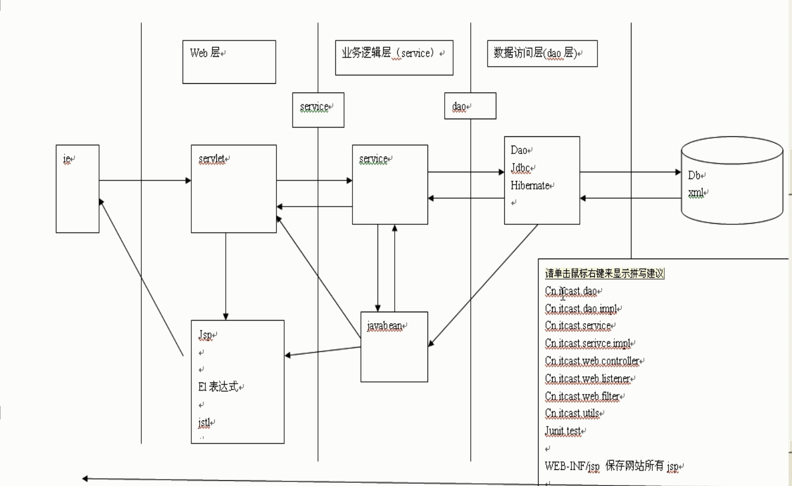

# 开发分析
  
先开发bean层，因为其他层都是依赖其进行工作的  
## 开发环境的搭建
### 第三方开发包
1. dom4j  
2. jstl  
3. beanUtils  
4. log4j  
### 创建组织程序的包
> bean  
> * me.test.domain  
> 数据访问层 
> * me.test.dao  
> * me.test.dao.impl  
> 业务逻辑层  
> * me.test.service  
> * me.test.service.impl  
> web层  
> * me.test.web.controller  
> * me.test.web.UI  
> * me.test.web.utils  
> 测试  
> * junit.test  

xml存储用户数据  
```xml
<?xml version="1.0" encoding="UTF-8"?>
<users>
    <user id="1" username="aaa" password="123" email="aaa@test.com" birthday="1990-08-08" nickname="张三"/>
</users>
```
## 开发用户注册模块
### dao层开发
通过xml的用户注册时存储哪些数据，来明确dao层可以操作哪些数据  
经过实际需求的分析，需要存储的数据分别为id、username、password、email、birthday、nickname  
>   建立javabean：user.java  
    ```java
    package me.test.domain;

    import java.util.Date;

    public class User {
        private String id;
        private String username;
        private String password;
        private String email;
        private Date birthday;
        private String nickname;
        public String getId() {
            return id;
        }
        public void setId(String id) {
            this.id = id;
        }
        public String getUsername() {
            return username;
        }
        public void setUsername(String username) {
            this.username = username;
        }
        public String getPassword() {
            return password;
        }
        public void setPassword(String password) {
            this.password = password;
        }
        public String getEmail() {
            return email;
        }
        public void setEmail(String email) {
            this.email = email;
        }
        public Date getBirthday() {
            return birthday;
        }
        public void setBirthday(Date birthday) {
            this.birthday = birthday;
        }
        public String getNickname() {
            return nickname;
        }
        public void setNickname(String nickname) {
            this.nickname = nickname;
        }
    }
    ```
>   创建操作数据库对象的工具类 me.test.utils.XmlUtils
    ```java
    package me.test.utils;

    import java.io.File;
    import java.io.FileOutputStream;
    import java.io.IOException;

    import org.dom4j.Document;
    import org.dom4j.io.OutputFormat;
    import org.dom4j.io.SAXReader;
    import org.dom4j.io.XMLWriter;

    public class XmlUtils {
        
        private static String filepath;
        static {
            filepath = XmlUtils.class.getClassLoader().getResource("users.xml").getPath();
        }
        
        public static Document getDocument() throws Exception{
            SAXReader reader = new SAXReader();
            Document document = reader.read(new File(filepath));
            
            return document;
        }
        
        public static void write2Xml(Document document) throws IOException {
            OutputFormat format = OutputFormat.createPrettyPrint();
            format.setEncoding("UTF-8");
            XMLWriter writer = new XMLWriter(new FileOutputStream(filepath),format);
            writer.write(document);
            
            writer.close();
        }
    }
    ```
>   dao层提供操作数据的方法 me.test.dao.impl.UserDaoImpl
    ```java
    package me.test.dao.impl;

    import java.text.SimpleDateFormat;

    import org.dom4j.Document;
    import org.dom4j.Element;

    import me.test.dao.UserDao;
    import me.test.domain.User;
    import me.test.utils.XmlUtils;

    public class UserDaoImpl implements UserDao {
        @Override
        public void add(User user) {
            try {
                Document document = XmlUtils.getDocument();
                Element root = document.getRootElement();
                
                Element user_tag = root.addElement("user");
                user_tag.setAttributeValue("id", user.getId());
                user_tag.setAttributeValue("username", user.getUsername());
                user_tag.setAttributeValue("password", user.getPassword());
                user_tag.setAttributeValue("email", user.getEmail());
                user_tag.setAttributeValue("birthday", user.getBirthday()==null?"":user.getBirthday().toLocaleString());
                user_tag.setAttributeValue("nickname", user.getNickname());
                
                XmlUtils.write2Xml(document);
            } catch (Exception e) {
                throw new RuntimeException(e);
            }
        }
        
        @Override
        public User find(String username, String password) {
            try {
                
                Document document = XmlUtils.getDocument();
                Element e = (Element) document.selectSingleNode("//user[@username='"+ username +"' and @password='"+ password +"']");
                if(e == null) {
                    return null;
                }
                
                User user = new User();
                
                String date = e.attributeValue("birthday");
                
                if(date == null || date.equals("")) {
                    user.setBirthday(null);
                }else {
                    SimpleDateFormat df = new SimpleDateFormat("yyyy-mm-dd");
                    user.setBirthday(df.parse(date));
                }
                
                user.setEmail(e.attributeValue("email"));
                user.setId(e.attributeValue("id"));
                user.setNickname(e.attributeValue("nickname"));
                user.setPassword(e.attributeValue("password"));
                user.setUsername(e.attributeValue("username"));
                
                return user;
            }catch(Exception e) {
                throw new RuntimeException(e);
            }
        }
        
        // 查找注册用户是否在数据库中存在
        @Override
        public boolean find(String username) {
    try {
                
                Document document = XmlUtils.getDocument();
                Element e = (Element) document.selectSingleNode("//user[@username='"+ username +"']");
                if(e == null) {
                    return false;
                }
                return true;  
            }catch(Exception e) {
                throw new RuntimeException(e);
            }
        }
    }
    ```
>   将UserDaoImpl抽取成接口对其他层进行提供　　
    ```java
    package me.test.dao;

    import me.test.domain.User;

    public interface UserDao {

        void add(User user);

        User find(String username, String password);

        // 查找注册用户是否在数据库中存在
        boolean find(String username);
    }
    ```
>   dao层开发完毕，每一次开发完成后，需对其进行测试 junit.Test  
    ```java
    package junit.test;

    import java.util.Date;

    import org.junit.Test;

    import me.test.dao.UserDao;
    import me.test.dao.impl.UserDaoImpl;
    import me.test.domain.User;

    public class UserDaoTest {
        
        @Test
        public void testAdd() {
            User user = new User();
            user.setBirthday(new Date());
            user.setEmail("bbb@test.me");
            user.setId("2");
            user.setNickname("李四");
            user.setUsername("bbb");
            user.setPassword("456");
            
            UserDao dao = new UserDaoImpl();
            dao.add(user);
        }
        
        @Test
        public void testFind() {
            UserDao dao = new UserDaoImpl();
            dao.find("aaa","123");
        }
        
        @Test
        public void testFindByUsername() {
            UserDao dao = new UserDaoImpl();
            dao.find("aaa");
        }
    }
    ```
注：使用Junit4测试时报错，百度后导入jaxen-1.1.6.jar，问题解决  

### service层开发
>   service进行业务逻辑的开发，提供注册及登录服务  
    ```java
    package me.test.service.impl;

    import me.test.dao.UserDao;
    import me.test.dao.impl.UserDaoImpl;
    import me.test.domain.User;
    import me.test.exception.UserException;
    import me.test.utils.ServiceUtils;

    // 对web层提供所有的业务服务
    public class BusinessServiceImpl {
        
        private UserDao dao = new UserDaoImpl(); // 解耦，使用工厂模式，或者spring
        
        // 对web层提供注册服务
        public void register(User user) throws UserException {
            // 先判断当前要注册的用户是否存在
            boolean b = dao.find(user.getUsername());
            if(b) {
                throw new UserException(); // 发现要注册的用户已存在，则给web层抛一个编译时异常，提醒web层处理这个异常，给用户一个友好提示
            }else {
                user.setPassword(ServiceUtils.md5(user.getPassword()));
                dao.add(user);
            }
        }
        
        // 对web层提供登录服务
        public User login(String username, String password) {
            password = ServiceUtils.md5(password);
            return dao.find(username, password);
        }
    }
    ```
>   提供服务时对异常情况需进行处理，所以自定义异常包及UserException  
    ```java
    package me.test.exception;

    public class UserException extends Exception {

        public UserException() {
            // TODO Auto-generated constructor stub
        }

        public UserException(String message) {
            super(message);
            // TODO Auto-generated constructor stub
        }

        public UserException(Throwable cause) {
            super(cause);
            // TODO Auto-generated constructor stub
        }

        public UserException(String message, Throwable cause) {
            super(message, cause);
            // TODO Auto-generated constructor stub
        }

        public UserException(String message, Throwable cause,
                boolean enableSuppression, boolean writableStackTrace) {
            super(message, cause, enableSuppression, writableStackTrace);
            // TODO Auto-generated constructor stub
        }
    }
    ```
>   注册时提供密码的md5加密服务  
    ```java
    package me.test.utils;

    import java.security.MessageDigest;
    import java.security.NoSuchAlgorithmException;

    import sun.misc.BASE64Encoder;

    public class ServiceUtils {
        public static String md5(String message) {
            try {
                MessageDigest md = MessageDigest.getInstance("md5");
                byte[] md5 = md.digest(message.getBytes());
                
                BASE64Encoder encoder = new BASE64Encoder();
                return encoder.encode(md5);
            } catch (NoSuchAlgorithmException e) {
                throw new RuntimeException(e);
            }
        }
    }
    ```
>   service层开发完毕，进行测试
    ```java
    package junit.test;

    import java.util.Date;

    import org.junit.Test;

    import me.test.domain.User;
    import me.test.exception.UserException;
    import me.test.service.impl.BusinessServiceImpl;

    public class ServiceTest {

        @Test
        public void testRegister() {
            User user = new User();
            user.setBirthday(new Date());
            user.setEmail("bbb@test.me");
            user.setId("2");
            user.setNickname("李四");
            user.setUsername("bbb");
            user.setPassword("456"); 
            
            BusinessServiceImpl service = new BusinessServiceImpl();
            try {
                service.register(user);
                System.out.println("注册成功！");
            } catch (UserException e) {
                System.out.println("用户已存在！");
            }
        }
        
        @Test
        public void testLogin() {
            BusinessServiceImpl service = new BusinessServiceImpl();
            User user = service.login("bbb", "456");
            System.out.println(user);
        }
    }
    ```

### Web层开发
>   用户首先通过首页进行选择登陆还是注册，通过跳转到相应的页面进行工作  创建首页index.jsp  
    ```jsp
    <%@ page language="java" contentType="text/html; charset=UTF-8"
        pageEncoding="UTF-8" isELIgnored="false"%>
    <!DOCTYPE html PUBLIC "-//W3C//DTD HTML 4.01 Transitional//EN" "http://www.w3.org/TR/html4/loose.dtd">
    <html>
    <head>
    <meta http-equiv="Content-Type" content="text/html; charset=UTF-8">
    <title>首页</title>
    </head>
        <body>
            <a href="${pageContext.request.contextPath}/servlet/RegisterUIServlet">注册</a>
            <a href="${pageContext.request.contextPath}/servlet/LoginUIServlet">登录</a> 
        </body>
    </html>
    ```
>   首页跳转注册时，RegisterUIServlet处理请求后输出注册页面  
    ```java
    package me.test.web.UI;

    import java.io.IOException;
    import javax.servlet.ServletException;
    import javax.servlet.annotation.WebServlet;
    import javax.servlet.http.HttpServlet;
    import javax.servlet.http.HttpServletRequest;
    import javax.servlet.http.HttpServletResponse;

    // 为用户提供注册界面
    @WebServlet("/servlet/RegisterUIServlet")
    public class RegisterUIServlet extends HttpServlet {
        
        protected void doGet(HttpServletRequest request, HttpServletResponse response) throws ServletException, IOException {
            request.getRequestDispatcher("/WEB-INF/jsp/register.jsp").forward(request, response);
        }

        protected void doPost(HttpServletRequest request, HttpServletResponse response) throws ServletException, IOException {
            doGet(request, response);
        }
    }
    ```
    ```jsp
    <%@ page language="java" contentType="text/html; charset=UTF-8"
    pageEncoding="UTF-8"%>
    <!DOCTYPE html PUBLIC "-//W3C//DTD HTML 4.01 Transitional//EN" "http://www.w3.org/TR/html4/loose.dtd">
    <html>
    <head>
    <meta http-equiv="Content-Type" content="text/html; charset=UTF-8">
    <title>注册界面</title>
    </head>
    <body>
        <form action="${pageContext.request.contextPath}/servlet/RegisterServlet" method="post">
            用户名<input type="text" name="username" value="${form.username}"/><span>${form.errors.username}</span><br/>
            密码<input type="password" name="password"><span>${form.errors.password}</span><br/>
            确认密码<input type="password" name="password2"><span>${form.errors.password2}</span><br/>
            email<input type="text" name="email" value="${form.email}"><span>${form.errors.email}</span><br/>
            生日<input type="text" name="birthday" value="${form.birthday}"><span>${form.errors.birthday}</span><br/>
            昵称<input type="text" name="nickname" value="${form.nickname}"><span>${form.errors.nickname}</span><br/>
            <input type="submit" value="注册">
        </form>
    </body>
    </html>
    ```
>   RegisterServlet处理form表单提交过来的数据及请求  
    ```java
    package me.test.web.controller;

    import java.io.IOException;
    import javax.servlet.ServletException;
    import javax.servlet.annotation.WebServlet;
    import javax.servlet.http.HttpServlet;
    import javax.servlet.http.HttpServletRequest;
    import javax.servlet.http.HttpServletResponse;

    import me.test.domain.User;
    import me.test.exception.UserException;
    import me.test.service.impl.BusinessServiceImpl;
    import me.test.utils.WebUtils;
    import me.test.web.formbean.RegisterForm;

    // 处理注册请求
    @WebServlet("/servlet/RegisterServlet")
    public class RegisterServlet extends HttpServlet {
        protected void doGet(HttpServletRequest request, HttpServletResponse response) throws ServletException, IOException {
            
            request.setCharacterEncoding("UTF-8");
            
            // 1.对提交表单的字段进行合法性校验(把表单数据封装到formbean)
            RegisterForm form = WebUtils.request2Bean(request, RegisterForm.class);
            boolean b = form.validate();
            
            // 2.如果校验失败，跳回到表单页面，回显校验失败信息
            if(!b) {
                request.setAttribute("form", form);
                request.getRequestDispatcher("/WEB-INF/jsp/register.jsp").forward(request, response);
                return;
            }
            // 3.如果校验成功，则调用service处理注册请求
            User user = new User();
            WebUtils.copyBean(form, user);
            user.setId(WebUtils.generateID());
            BusinessServiceImpl service = new BusinessServiceImpl();
            try {
                service.register(user);
                // 6.如果service处理成功，跳转到网站的全局消息显示页面，为用户显示注册成功的消息 
                request.setAttribute("message", "恭喜您，注册成功");
                request.getRequestDispatcher("/message.jsp").forward(request, response);
            } catch (UserException e) {
                // 4.如果service处理不成功，并且不成功的原因，是因为注册用户已存在的话，则跳回到注册页面，显示注册用户已存在的消息
                form.getErrors().put("username", "注册的用户名已存在");
                request.setAttribute("form", form);
                request.getRequestDispatcher("/WEB-INF/jsp/register.jsp").forward(request, response);
                return;
            }catch (Exception e) {
                // 5.如果service处理不成功，并且不成功的原因是其他问题的话，跳转到网站的全局消息显示页面，为用户显示友好错误消息
                e.printStackTrace();
                request.setAttribute("message", "服务器出现未知错误");
                request.getRequestDispatcher("/message.jsp").forward(request, response);
                return;
            }
        }

        protected void doPost(HttpServletRequest request, HttpServletResponse response) throws ServletException, IOException {
            doGet(request, response);
        }
    }
    ```
>   表单数据封装到formbean中，对提交字段进行合法性校验  
    ```java
    package me.test.web.formbean;

    import java.util.HashMap;
    import java.util.Map;

    import org.apache.commons.beanutils.locale.converters.DateLocaleConverter;

    public class RegisterForm {

        private String username;
        private String password;
        private String password2;
        private String email;
        private String birthday;
        private String nickname;
        
        private Map errors = new HashMap(); // 生成一个集合来保存校验失败的消息
        public String getUsername() {
            return username;
        }
        public void setUsername(String username) {
            this.username = username;
        }
        public String getPassword() {
            return password;
        }
        public void setPassword(String password) {
            this.password = password;
        }
        public String getPassword2() {
            return password2;
        }
        public void setPassword2(String password2) {
            this.password2 = password2;
        }
        public String getEmail() {
            return email;
        }
        public void setEmail(String email) {
            this.email = email;
        }
        public String getBirthday() {
            return birthday;
        }
        public void setBirthday(String birthday) {
            this.birthday = birthday;
        }
        public String getNickname() {
            return nickname;
        }
        public void setNickname(String nickname) {
            this.nickname = nickname;
        } 
        public Map getErrors() {
            return errors;
        }
        public void setErrors(Map errors) {
            this.errors = errors;
        }
        /*
        * 数据校验规则(根据实际需求制定)
        * 用户名不能为空，并且要是3-8位字母
        * 密码不能为空，并且是3-8位数字
        * 确认密码不能为空，并且要和第一次一致
        * 电子邮箱不能为空，并且要是一个格式合法的邮箱
        * 生日可以为空，不为空时，必须要是一个日期
        * 昵称不可以为空，并且要是汉字
        */
        public boolean validate() {
            boolean isOK = true;
            
            if(this.username == null || this.username.trim().equals("")) {
                isOK = false;
                errors.put("username", "用户名不能为空");
            }else {
                if(!this.username.matches("[A-Za-z]{3,8}")) {
                    isOK = false;
                    errors.put("username", "用户名必须要是3-8位字母");
                }
            }
            
            if(this.password == null || this.password.trim().equals("")) {
                isOK = false;
                errors.put("password", "密码不能为空");
            }else {
                if(!this.password.matches("\\d{3,8}")) {
                    isOK = false;
                    errors.put("password", "密码必须要是3-8位数字");
                }
            }
            
            if(this.password2 == null || this.password2.trim().equals("")) {
                isOK = false;
                errors.put("password2", "确认密码不能为空");
            }else {
                if(!this.password.equals(password2)) {
                    isOK = false;
                    errors.put("password2", "两次密码要一致");
                }
            }
            
            if(this.email == null || this.email.trim().equals("")) {
                isOK = false;
                errors.put("email", "邮箱不能为空");
            }else {
                // 邮箱格式  任意字符（可以多次重复出现）@任意字符+".+任意字符（多次重复）"
                // \\w+@\\w+(\\.\\w+)+
                if(!this.email.matches("\\w+@\\w+(\\.\\w+)+")) {
                    isOK = false;
                    errors.put("email", "邮箱格式错误");
                }
            }
            
            // 日期的校验，要将表单提交的字符串转换为日期格式进行判断，能转成日期不抛出异常就是正确格式
            if(this.birthday != null && !this.birthday.trim().equals("")) {
                try {
                    DateLocaleConverter dlc = new DateLocaleConverter();
                    dlc.convert(this.birthday, "yyyy-MM-dd");
                }catch(Exception e) {
                    isOK = false;
                    errors.put("birthday", "日期格式不对");
                }    
            }
            
            if(this.nickname == null || this.nickname.trim().equals("")) {
                isOK = false;
                errors.put("nickname", "昵称不能为空");
            }else {
                if(!this.nickname.matches("^[\u4e00-\u9fa5]+$")) {
                    isOK = false;
                    errors.put("nickname", "昵称必须是汉字");
                }
            }
            return isOK;
        }
    }
    ```
>   数据校验过后，需要将表单中的数据封装到bean中，然后将formbean中的数据转成userbean,以及提供id编号等功能  
    ```java
    package me.test.utils;

    import java.lang.reflect.InvocationTargetException;
    import java.text.ParseException;
    import java.text.SimpleDateFormat;
    import java.util.Date;
    import java.util.Enumeration;
    import java.util.UUID;

    import javax.servlet.http.HttpServletRequest;

    import org.apache.commons.beanutils.BeanUtils;
    import org.apache.commons.beanutils.ConvertUtils;
    import org.apache.commons.beanutils.Converter;

    public class WebUtils {

        public static <T> T request2Bean(HttpServletRequest request, Class<T> beanClass) {
            try {
                // 1.创建要封装的数据的bean
                T bean = beanClass.newInstance();
                
                // 2.把request中的数据整到bean中
                Enumeration e = request.getParameterNames();
                while(e.hasMoreElements()) {
                    String name = (String) e.nextElement(); // 得到username、password、email...
                    String value = request.getParameter(name); // 得到值 aaa、123...
                    BeanUtils.setProperty(bean, name, value); // 将数据反射到相应的bean中
                }
                return bean;
            }catch(Exception e) {
                throw new RuntimeException(e);
            }
        }
        
        // 将封装表单数据的bean中的数据拷贝到daobean中，相同的字段可以通过BeanUtils直接拷贝
        // 只支持8种基本类型，复杂类型就需要自定义转换器了
        public static void copyBean(Object src, Object dest) {
            
            // 注册日期转换器
            ConvertUtils.register(new Converter() {
                public Object convert(Class type, Object value) {
                    if(value == null) {
                        return null;
                    }
                    String str = (String) value;
                    if(str.trim().equals("")) {
                        return null;
                    }
                    SimpleDateFormat df = new SimpleDateFormat("yyyy-MM-dd");
                    try {
                        return df.parse(str);
                    } catch (ParseException e) {
                        throw new RuntimeException(e);
                    }
                    
                }
            }, Date.class);
            
                try {
                    BeanUtils.copyProperties(dest, src); // 将src中的值赋给dest
                } catch (IllegalAccessException | InvocationTargetException e) {
                    throw new RuntimeException(e);
                }
        }
        
        // 产生全球唯一的id
        public static String generateID() {
            return UUID.randomUUID().toString();
        }
    }
    ```
    **注**：在自定义转换类型时，一定要确定导入的Date.class包是正确的import java.util.Date  
    程序运行时BeanUtils报错，百度错误后导入commons-collections-3.2.2.jar问题解决，最新的commons-collections4-4.1导入无法解决  
>   Web层工具类将错误信息全部封装到了HashMap集合error中，jsp页面使用el表达式<span>${form.errors.username}</span>即可取出错误信息  
>   全局消息显示友好信息提示  
    ```jsp
    <%@ page language="java" contentType="text/html; charset=UTF-8"
    pageEncoding="UTF-8"%>
    <!DOCTYPE html PUBLIC "-//W3C//DTD HTML 4.01 Transitional//EN" "http://www.w3.org/TR/html4/loose.dtd">
    <html>
    <head>
    <meta http-equiv="Content-Type" content="text/html; charset=UTF-8">
    <title>网站全局消息显示页面</title>
    </head>
    <body>
        ${message}<br/>
    </body>
    </html>
    ```
### 登录模块
>   首页<a href="${pageContext.request.contextPath}/servlet/LoginUIServlet">登录</a>跳转至LoginUIServlet输出登录界面进行登录验证  
    ```java
    package me.test.web.UI;

    import java.io.IOException;
    import javax.servlet.ServletException;
    import javax.servlet.annotation.WebServlet;
    import javax.servlet.http.HttpServlet;
    import javax.servlet.http.HttpServletRequest;
    import javax.servlet.http.HttpServletResponse;

    @WebServlet("/servlet/LoginUIServlet")
    public class LoginUIServlet extends HttpServlet {
        
        protected void doGet(HttpServletRequest request, HttpServletResponse response) throws ServletException, IOException {
            
            request.getRequestDispatcher("/WEB-INF/jsp/login.jsp").forward(request, response);
        }

        protected void doPost(HttpServletRequest request, HttpServletResponse response) throws ServletException, IOException {
            doGet(request, response);
        }
    }
    ```
    ```jsp
    <%@ page language="java" contentType="text/html; charset=UTF-8"
        pageEncoding="UTF-8"%>
    <!DOCTYPE html PUBLIC "-//W3C//DTD HTML 4.01 Transitional//EN" "http://www.w3.org/TR/html4/loose.dtd">
    <html>
    <head>
    <meta http-equiv="Content-Type" content="text/html; charset=UTF-8">
    <title>登录界面</title>
    </head>
    <body>
        <form action="${pageContext.request.contextPath}/servlet/LoginServlet" method="post">
            用户名：<input type="text" name="username"/><br/>
            密码：<input type="password" name="password"/><br/>
            <input type="submit" value="登录"><br/>
            <input type="button" onclick="window.location.href='${pageContext.request.contextPath}/servlet/RegisterUIServlet'" value="注册">
        </form>
    </body>
    </html>
    ```
>   LoginServlet处理登录请求  
    ```java
    package me.test.web.controller;

    import java.io.IOException;
    import javax.servlet.ServletException;
    import javax.servlet.annotation.WebServlet;
    import javax.servlet.http.HttpServlet;
    import javax.servlet.http.HttpServletRequest;
    import javax.servlet.http.HttpServletResponse;

    import me.test.domain.User;
    import me.test.service.impl.BusinessServiceImpl;

    // 处理登录请求
    @WebServlet("/servlet/LoginServlet")
    public class LoginServlet extends HttpServlet {
        
        protected void doGet(HttpServletRequest request, HttpServletResponse response) throws ServletException, IOException {
            
            String username = request.getParameter("username");
            String password = request.getParameter("password");
            
            BusinessServiceImpl service = new BusinessServiceImpl();
            User user = service.login(username, password);
            if(user!=null) {
                request.getSession().setAttribute("user", user);
                // 让用户登录成功后，跳转到首页
                response.sendRedirect(request.getContextPath() + "/index.jsp");
                return;
            }
            request.setAttribute("message", "用户名或密码错误");
            request.getRequestDispatcher("/message.jsp").forward(request, response);
        }

        protected void doPost(HttpServletRequest request, HttpServletResponse response) throws ServletException, IOException {
            doGet(request, response);
        }
    }
    ```
>   LogoutServlet处理注销请求  
    ```java
    package me.test.web.controller;

    import java.io.IOException;
    import javax.servlet.ServletException;
    import javax.servlet.annotation.WebServlet;
    import javax.servlet.http.HttpServlet;
    import javax.servlet.http.HttpServletRequest;
    import javax.servlet.http.HttpServletResponse;
    import javax.servlet.http.HttpSession;

    // 处理用户注销请求
    @WebServlet("/servlet/LogoutServlet")
    public class LogoutServlet extends HttpServlet {
        
        protected void doGet(HttpServletRequest request, HttpServletResponse response) throws ServletException, IOException {
            
            HttpSession session = request.getSession(false);
            if(session != null) {
                session.removeAttribute("user");
            }
            
            // 注销成功，跳转到全局消息显示页面，显示注销成功消息，并控制消息显示页面过3秒后跳转到首页
            request.setAttribute("message", "注销成功,浏览器将在3秒后跳转，如果没有跳转，请点击<meta http-equiv='refresh' content='3;url="+request.getContextPath()+"/index.jsp'>");
            request.getRequestDispatcher("/message.jsp").forward(request, response);
        }

        protected void doPost(HttpServletRequest request, HttpServletResponse response) throws ServletException, IOException {
            doGet(request, response);
        }
    }
    ```
>   首页优化，通过session判断用户是否已经登录过，通过el表达式及jstl标签进行不同情况的判断
    ```jsp
    <%@ page language="java" contentType="text/html; charset=UTF-8"
    pageEncoding="UTF-8" isELIgnored="false"%>
    <%@taglib uri="http://java.sun.com/jsp/jstl/core" prefix="c"%>
    <!DOCTYPE html PUBLIC "-//W3C//DTD HTML 4.01 Transitional//EN" "http://www.w3.org/TR/html4/loose.dtd">
    <html>
    <head>
    <meta http-equiv="Content-Type" content="text/html; charset=UTF-8">
    <title>首页</title>
    </head>
    <body>
        
        <c:if test="${user!=null }">
            欢迎您：${user.nickname } <a href="${pageContext.request.contextPath}/servlet/LogoutServlet">注销</a>
        </c:if>
        <c:if test="${user == null}">
            <a href="${pageContext.request.contextPath}/servlet/RegisterUIServlet">注册</a>
            <a href="${pageContext.request.contextPath}/servlet/LoginUIServlet">登录</a>
        </c:if>
        
    </body>
    </html>
    ```