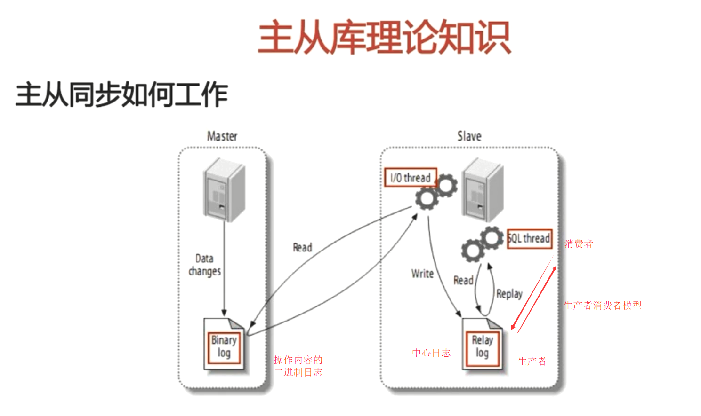

# MySql主从同步
## Mysql主从同步理论知识
  
## 主从同步数据库配置
1.  两台服务器均安装mysql数据库（或者本机装两套mysql数据库软件，开启时选择不同的端口）  
2.  配置主服务器的mysqld文件。/etc/my.cnf  
    ```
    [mysqld]
    ...
    # 服务器id
    server-id=1
    #打开二进制日志
    log-bin=master-bin
    # 打开日志索引
    log-bin-index=master-bin.index
    ```
    重启mysql服务  
    service mysqld restart   

    在mysql中查看主库状态：show master status;
3.  配置从服务器  
    同样进入/etc/my.cnf  
    ```
    [mysqld]
    ...
    # 服务器id
    server-id=2
    #打开从库日志
    relay-log=slave-relay-bin
    # 打开日志索引
    relay-log-index=slave-relay-bin.index
    ```
    重启mysql服务的另一种方式：Linux下直接输入  
    /etc/init.d/mysql stop  
    /etc/init.d/mysql start
4.  在主库中为从库建立一个账户，并授予权限  
    登录mysql：  
    create user repl;  
    grant replication slave on *.* to 'repl'@'从库服务器地址' identified by 'repl账户密码';  
    flush privileges;  
5.  进入从库中mysql  
    change master to master_host='主服务器IP',master_port=3306,master_user='repl',master_password='repl账户密码',master_log_file='master-bin.000001',master_log_pos=0;  
    
    //master_log_file的值是查看主库状态：show master status可以找到相应开启的文件。master_log_pos=0是从0开始读取日志    
    
    start slave;//开启主从跟踪
6.  show slave status \G;  
    查看主从同步状态，如果有错误就不能同步
## 读写分离的代码实现
1.  创建继承spring切换数据源的接口，实现读写分离  
    ```java
    import org.springframework.jdbc.datasource.lookup.AbstractRoutingDataSource;
    /**
    * 〈功能简述〉
    * 〈实现mysql读写主从分离〉
    */
    //继承AbstractRoutingDataSource后可以从不同的数据源获取数据，实现主从分离
    public class DynamicDataSource extends AbstractRoutingDataSource {

        @Override
        protected Object determineCurrentLookupKey() {
            //返回不同的key,调用不同的数据源
            return DynamicDataSourceHolder.getDbType();
        }
    }
    ```
2.  创建DynamicDataSourceHolder，实现切换控制  
    ```java
    import org.slf4j.Logger;
    import org.slf4j.LoggerFactory;

    public class DynamicDataSourceHolder {
        //日志对象
        private static Logger logger = LoggerFactory.getLogger(DynamicDataSourceHolder.class);
        //线程安全
        private static ThreadLocal<String> contextHolder = new ThreadLocal<String>();

        //key
        public static final String DB_MASTER = "master";
        public static final String DB_SLAVE = "slave";

        //获取线程的DbType
        public static String getDbType() {
            String db = contextHolder.get();
            if (db == null) {
                db = DB_MASTER;
            }
            return db;
        }

        //设置线程的DbType
        public static void setDbType(String str) {
            logger.debug("所使用的数据源为：" + str);
            contextHolder.set(str);
        }

        //清理连接类型
        public static void clearDbType() {
            contextHolder.remove();
        }
    }
    ```
3.  新建mybatis拦截器，实现mysql切换条件的代码实现  
    注意导包的问题，Executor一定导入mybatis的包。  
    因为导包问题找了好久bug...  
    ```java
    import org.apache.ibatis.executor.Executor;
    import org.apache.ibatis.executor.keygen.SelectKeyGenerator;
    import org.apache.ibatis.mapping.BoundSql;
    import org.apache.ibatis.mapping.MappedStatement;
    import org.apache.ibatis.mapping.SqlCommandType;
    import org.apache.ibatis.plugin.*;
    import org.apache.ibatis.session.ResultHandler;
    import org.apache.ibatis.session.RowBounds;
    import org.slf4j.Logger;
    import org.slf4j.LoggerFactory;
    import org.springframework.transaction.support.TransactionSynchronizationManager;

    import java.util.Locale;
    import java.util.Properties;

    public class DynamicDataSourceInterceptor implements Interceptor{
    //日志对象
    private static Logger logger = LoggerFactory.getLogger(DynamicDataSourceInterceptor.class);
    //匹配是cud哪种sql的正则
    private static final String REGEX = ".*insert\\u0020.*|.*delete\\u0020.*|.*update\\u0020.*";

        @Override
        public Object intercept(Invocation invocation) throws Throwable {
            //检查是否是事务管理
            boolean synchronizationActive = TransactionSynchronizationManager.isSynchronizationActive();

            //接收对象参数名
            Object[] objects = invocation.getArgs();
            MappedStatement mappedStatement = (MappedStatement) objects[0];
            String lookupKey = DynamicDataSourceHolder.DB_MASTER;

            if (synchronizationActive != true) {
                //读方法
                if (mappedStatement.getSqlCommandType().equals(SqlCommandType.SELECT)) {
                    //selectKey为自增Id查询主键（select last_insert_id()）方法，使用主库
                    if (mappedStatement.getId().contains(SelectKeyGenerator.SELECT_KEY_SUFFIX)) {
                        lookupKey = DynamicDataSourceHolder.DB_MASTER;
                    } else {
                        //objects[1]就是参数值，即sql
                        BoundSql boundSql = mappedStatement.getSqlSource().getBoundSql(objects[1]);
                        String sql = boundSql.getSql().toLowerCase(Locale.CHINA).replaceAll("[\\t\\n\\r]", " ");
                        //如果是REGEX中的某种方法就使用主库
                        if (sql.matches(REGEX)) {
                            lookupKey = DynamicDataSourceHolder.DB_MASTER;
                        } else {
                            //保证写操作用主库，读操作使用从库
                            lookupKey = DynamicDataSourceHolder.DB_SLAVE;
                        }
                    }
                }
            } else {
                //非事务使用主库
                lookupKey = DynamicDataSourceHolder.DB_MASTER;
            }
            logger.debug("设置方法[{}] use [{}] Strategy, SqlCommanType [{}]..", mappedStatement.getId(), lookupKey, mappedStatement.getSqlCommandType().name());
            DynamicDataSourceHolder.setDbType(lookupKey);
            return invocation.proceed();
        }
        /*
        如果target对象是Executor类型的对象，就包装到wrap进行拦截,否则不进行拦截直接返回
        */
        @Override
        public Object plugin(Object target) {
            if (target instanceof Executor) {
                return Plugin.wrap(target, this);
            } else{
                return target;                   
            }
        }

        @Override
        public void setProperties(Properties properties) {

        }
    }
    ```
4.  配置mybatis的配置文件
    ```xml
    <!-- mysql主从分离配置 -->
    <plugins>
        <plugin interceptor="org.test.o2o.dao.split.DynamicDataSourceInterceptor"></plugin>
    </plugins>
    ```
5.  配置spring配置文件：数据库连接池部分
    ```xml
    <!-- 2.配置C3P0连接池
        设置mysql主从分离:abstract="true" destroy-method="close"
    -->
    <bean id="abstractDataSource" abstract="true" class="com.mchange.v2.c3p0.ComboPooledDataSource" destroy-method="close">
        <!--c3p0连接池的私有属性-->
        <property name="maxPoolSize" value="30"/>
        <property name="minPoolSize" value="10"/>
        <!--关闭连接后不自动commit-->
        <property name="autoCommitOnClose" value="false"/>
        <!--获取连接超时时间-->
        <property name="checkoutTimeout" value="10000"/>
        <!--当获取连接失败重试次数-->
        <property name="acquireRetryAttempts" value="2"/>
    </bean>
    <!-- 配置主库连接信息 -->
    <bean id="master" parent="abstractDataSource">
        <!--配置连接池属性-->
        <property name="driverClass" value="${jdbc.driver}"/>
        <property name="jdbcUrl" value="${jdbc.master.url}"/>
        <property name="user" value="${jdbc.username}"/>
        <property name="password" value="${jdbc.password}"/>
    </bean>
    <!-- 配置从库连接信息 -->
    <bean id="slave" parent="abstractDataSource">
        <!--配置连接池属性-->
        <property name="driverClass" value="${jdbc.driver}"/>
        <property name="jdbcUrl" value="${jdbc.slave.url}"/>
        <property name="user" value="${jdbc.username}"/>
        <property name="password" value="${jdbc.password}"/>
    </bean>
    ```
6.  修改db.properties中数据库的配置信息  
    ```
    jdbc.driver=com.mysql.jdbc.Driver
    /*主从库分别将localhost更换为数据库ip及用户名和密码也可以单独设置*/
    jdbc.master.url=jdbc:mysql://localhost:3306/o2o?useUnicode=true&characterEncoding=utf8
    jdbc.slave.url=jdbc:mysql://localhost:3306/o2o?useUnicode=true&characterEncoding=utf8
    jdbc.username=root
    jdbc.password=root
    ```
7.  在spring中实现动态数据源  
    ```xml
    <!--配置动态数据源，这儿targetDateSources就是数据源所对应的名称-->
    <bean id="dynamicDataSource" class="org.test.o2o.dao.split.DynamicDataSource">
        <property name="targetDataSources">
            <map>
                <!--value-ref和上面bean保持一致 ，key和DynamicDataSourceHolder里的key保持一致-->
                <entry value-ref="master" key="master"/>
                <entry value-ref="slave" key="slave"/>
            </map>
        </property>
    </bean>
    <!--因为只有在mybatis在执行sql时才进行，所以设置mybatis懒加载-->
    <bean id="dataSource" class="org.springframework.jdbc.datasource.LazyConnectionDataSourceProxy">
        <property name="targetDataSource">
            <ref bean="dynamicDataSource"/>
        </property>
    </bean>
    ```
8.  单元测试进行测试。
    日志输出结果：
    ```
    2018-09-13 23:07:18.947 [main] DEBUG o.test.o2o.dao.split.DynamicDataSourceInterceptor - 设置方法[org.test.o2o.dao.AreaDao.queryArea] use [slave] Strategy, SqlCommanType [SELECT]..
    2018-09-13 23:07:18.953 [main] DEBUG org.test.o2o.dao.split.DynamicDataSourceHolder - 所使用的数据源为：slave
    ```
