## 持续集成工具Jenkins  
### 项目开发效率优化  
1. 持续部署  
    > 开发过程中进行单元测试能够通过，但是部署到服务器上运行出现问题  

    那怎么做会好一些呢？  
        
    仅仅单元测试还不够，各个模块都必须能够在服务器上运行  
    `持续部署的关注点`在于项目功能部署至服务器后可以运行，为下一步测试环节或最终用户正式使用做好准备  
2. 持续集成  
    > 各个小组分别负责各个具体模块开发，本模块独立测试虽然能够通过，但是上线前夕将所有模块整合到一起集成测试却发现很多问题，想要解决就需要把很多代码返工重写而且仍然有可能有问题，但现在时间很可能不够了  
    
    那怎么做会好一些呢？  

    经常性、频繁的把所有模块集成在一起进行测试，有问题尽早发现，这就是持续集成  
    `持续集成的关注点`在于尽早发现项目整体运行问题，尽早解决  
3. 持续交付  
    > 项目的各个升级版本之间间隔时间太长，对用户反馈感知迟钝，无法精确改善用户体验，用户流失严重  

    那怎么做会好一些呢？  

    用小版本不断进行快速迭代，不断收集用户反馈信息，用最快的速度改进优化  
    `持续交付的关注点`在于研发团队的最新代码能够尽快让最终用户体验到  
4. 总体目标  
    * 降低风险  
        ```
        进行多次的集成，并做了相应的测试，这样有利于检查缺陷，了解软件的健康状况，减少假定
        ```
    * 减少重复过程  
        ```
        产生重复过程有两个方面的原因  
        一个是编译、测试、打包、部署等等固定操作都必须要做，无法省略任何一个环节  
        另一个是一个缺陷如果没有及时发现，有可能导致后续代码的开发方向是错误的，要修复问题需要重新编写受影响的所有代码  
        
        而使用Jenkins 等持续集成工具既可以把构建环节从手动完成转换为自动化完成，又可以通过增加集成频次尽早发现缺陷避免方向性错误  
        ```
    * 任何时间、任何地点生成可部署的软件
        ```
        持续集成可以让您在任何时间发布可以部署的软件  
        从外界来看，这是持续集成最明显的好处  
        
        我们可以对改进软件品质和减少风险说起来滔滔不绝，但对于客户来说，可以部署的软件产品是最实际的资产  利用持续集成，可以经常对源代码进行一些小改动，并将这些改动和其他的代码进行集成  
        如果出现问题，项目成员马上就会被通知到，问题会第一时间被修复  
        
        不采用持续集成的情况下，这些问题有可能到交付前的集成测试的时候才发现，有可能会导致延迟发布产品  
        而在急于修复这些缺陷的时候又有可能引入新的缺陷，最终可能导致项目失败  
        ```  
    * 增强项目的可见性  
        ```
        持续集成让我们能够注意到趋势并进行有效的决策  
        
        如果没有真实或最新的数据提供支持，项目就会遇到麻烦，每个人都会提出他最好的猜测  
        通常，项目成员通过手工收集这些信息，增加了负担，也很耗时
        
        持续集成可以带来两点积极效果：
        (1)有效决策：持续集成系统为项目构建状态和品质指标提供了及时的信息，有些持续集成系统可以报告功能完成度和缺陷率  
        (2)注意到趋势：由于经常集成，我们可以看到一些趋势，如构建成功或失败、总体品质以及其它的项目信息  
        ```
    * 建立团队对开发产品的信心  
        ```
        持续集成可以建立开发团队对开发产品的信心，因为他们清楚的知道每一次构建的结果，他们知道他们对软件的改动造成了哪些影响，结果怎么样  
        ```
### 持续集成工具  
1. Jenkins 和Hudson  
    目前最流行的一款持续集成及自动化部署工具  
    由于历史原因，Jenkins和Hudson是两款非常相似的产品  
2. 技术组合  
    Jenkins 可以整合GitHub 或Subversion  
    Husband 也可以整合GitHub 或Subversion  
3. JavaEE 项目部署方式对比  
    * 手动部署  
    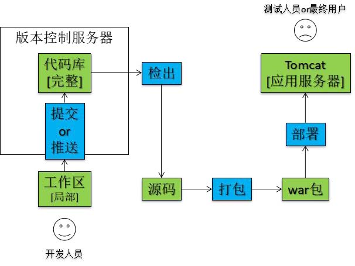  
    * 自动化部署  
    `自动化`的具体体现：  
    向版本库提交新的代码后，应用服务器上自动部署，用户或测试人员使用的马上就是最新的应用程序  
    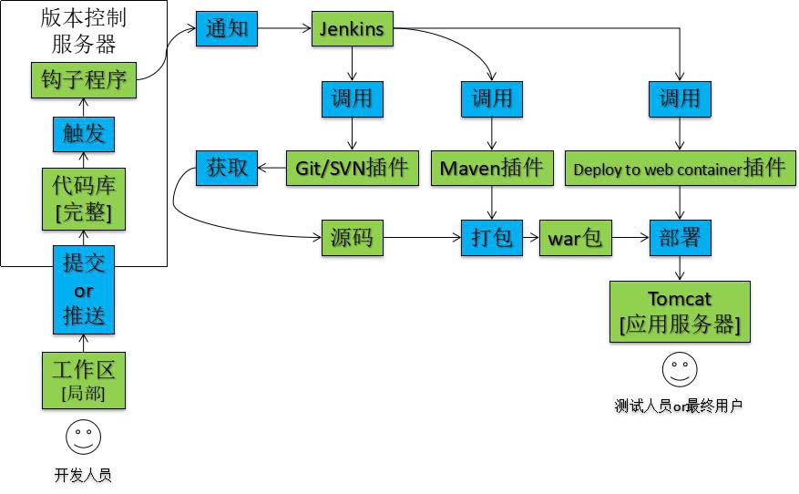  
    搭建上述持续集成环境可以把整个构建、部署过程自动化，很大程度上减轻工作量  
    对于程序员的日常开发来说不会造成任何额外负担——自己把代码提交上去之后，服务器上运行的马上就是最新版本——一切都发生在无形中  
### Jenkins+SVN 持续集成环境搭建  
1. 系统结构总述  
    * 版本控制子系统  
    > * Subversion 服务器/ git管理系统  
    > * 项目对应版本库  
    > * 版本库中钩子程序  
    * 持续集成子系统  
    > * JDK  
    > * Tomcat  
    > * Maven  
    > * Jenkins  
    > * - 主体程序  
    > * - SVN 插件  
    > * - Maven 插件  
    > * - Deploy to Web Container 插件  
    * 应用发布子系统  
    > * JDK  
    > * Tomcat  
2. 版本控制子系统
    * svn版本控制  
    安装过程省略，这里记录版本库的访问账号密码  
        ```
        [user]
        subman = xxx
        ```
        特别提示：svnserve.conf 文件中anon-access 一定要打开注释并设置为none  
        ```
        [general]
        anon-access = none
        auth-access = write
        ```
    * git  
    webhook  
3. 应用发布子系统  
    详细过程省略，仅记录Tomcat 服务器的账号密码  
    配置文件位置：/opt/tomcat/conf/tomcat-users.xml  
    ```xml
    <!-- 添加角色 -->
    <role rolename="manager-gui"/>
    <role rolename="manager-script"/>
    <role rolename="manager-jmx"/>
    <role rolename="manager-status"/>
    <user username="tomcat_user" password="123456"roles="manager-gui,manager-script,manager-jmx,manager-status" />

    <!-- username，password可以自定义-->
    ```
    开启tomcat远程管理  
    修改tomcat/conf/Catalina/localhost/manager.xml，如果不存在则新建  
    ```xml
    <Context privileged="true" antiResourceLocking="false"   
         docBase="${catalina.home}/webapps/manager">
             <Valve className="org.apache.catalina.valves.RemoteAddrValve" allow="^.*$" />
    </Context>
    ```
    修改tomcat/conf/context.xml  
    ```xml
    <Context antiResourceLocking="false" privileged="true">
        <!-- 下面三行是默认的，我没有改动
            context后面的两个参数是后来增加的  
        -->
        <WatchedResource>WEB-INF/web.xml</WatchedResource>
        <WatchedResource>WEB-INF/tomcat-web.xml</WatchedResource>
        <WatchedResource>${catalina.base}/conf/web.xml</WatchedResource>
    </Context>
    ```
4. Jenkins主体程序安装配置  
    > 把jenkins.war放在`持续集成服务器`的Tomcat解压目录/webapps目录下  
    > 打开Tomcat解压目录/server.xml 修改URL 地址的编码解码字符集
        
    ```xml
    <Connector port="8080" protocol="HTTP/1.1" connectionTimeout="20000" redirectPort="8443" URIEncoding="UTF-8"/>
    ```
    > 启动Tomcat 并通过浏览器访问  
    
    可以修改安装目录的/Jenkins/jenkins.xml，避免tomcat的8080端口占用问题  
    ```xml
    <arguments>-Xrs -Xmx256m -Dhudson.lifecycle=hudson.lifecycle.WindowsServiceLifecycle -jar "%BASE%\jenkins.war" --httpPort=8088 --webroot="%BASE%\war"</arguments>  
    <!-- 修改 httpPort=xxx-->
    ```

    本次`持续集成服务器`是本地计算机的 Windows10平台  
    在jenkins下载Windows版本安装到本地  
    安装完成后会自动打开浏览器： http://localhost:8080  
    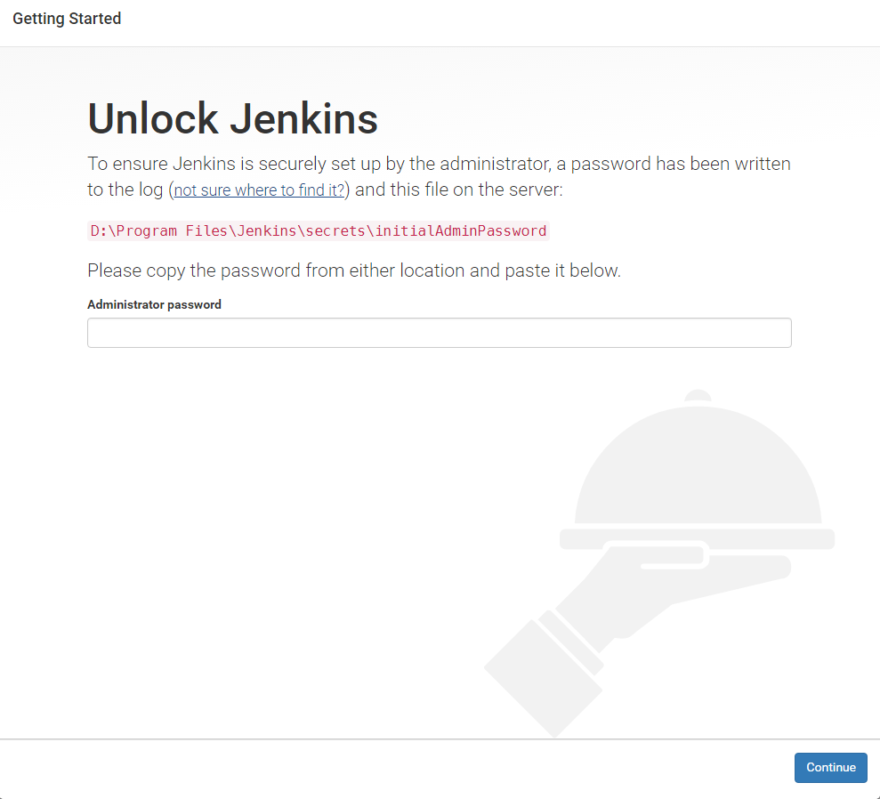
    依照提示，查看secrets/initialAdminPassword 文件内容填入文本框  
    这里填入的密文同时也是admin 账号的密码  
    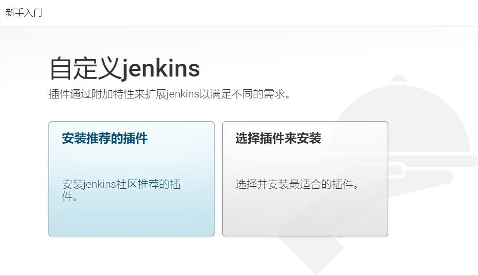  
    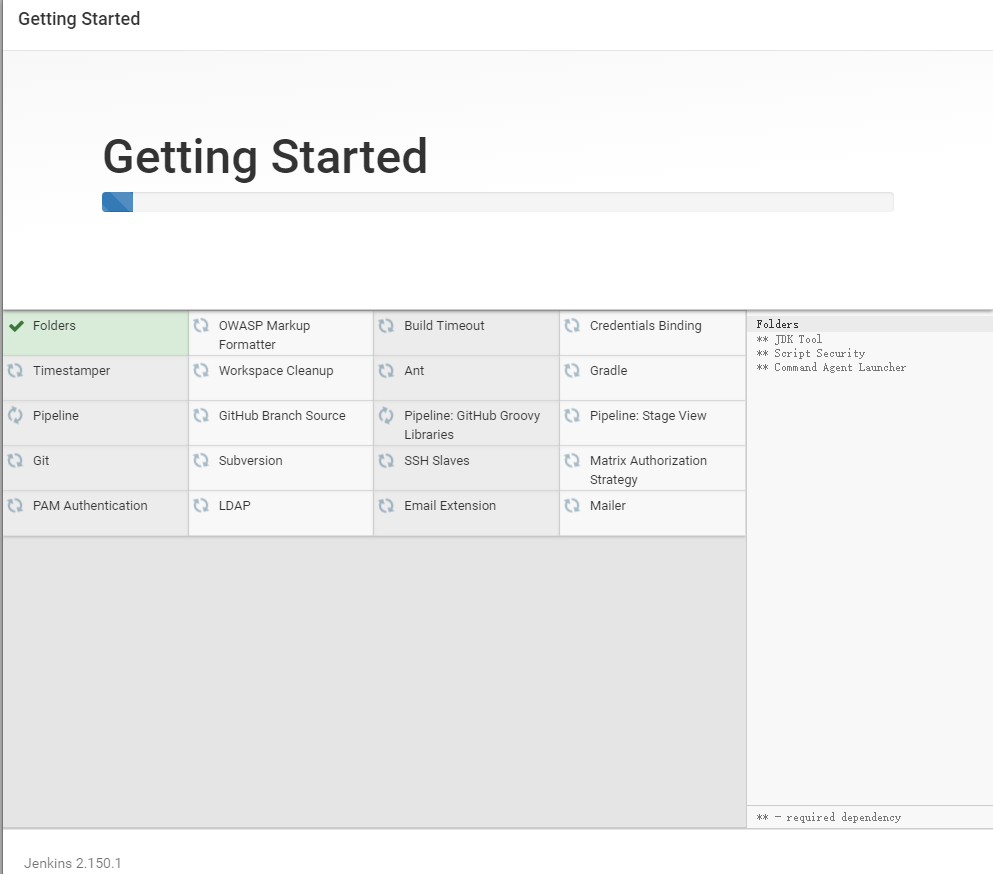  
    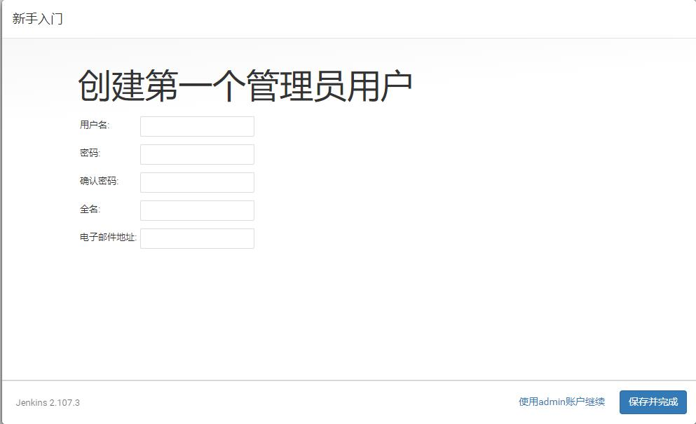  
      
    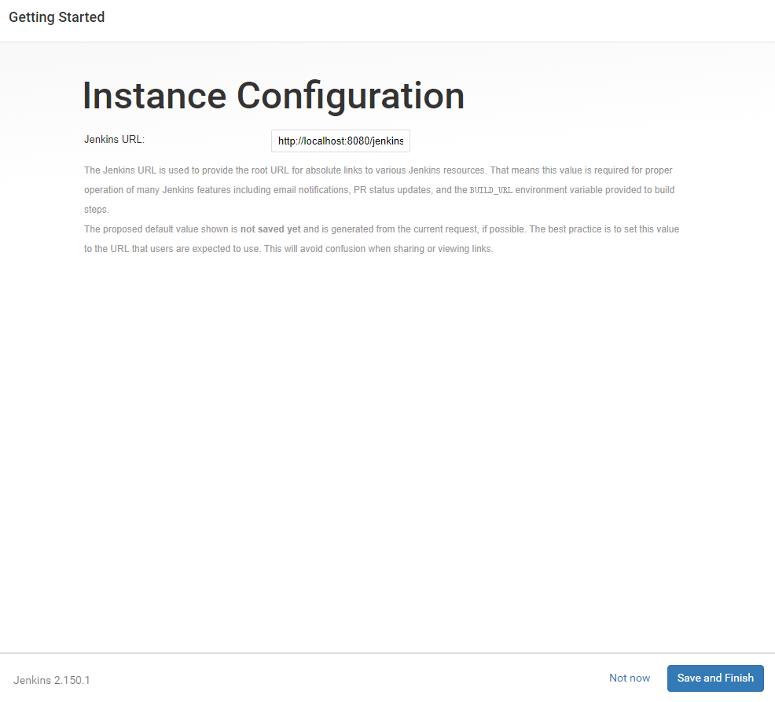  
    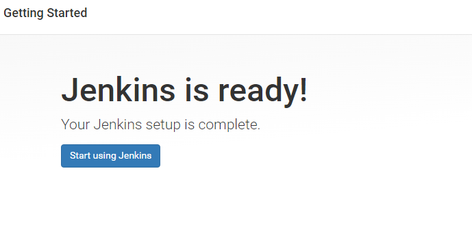  
    **注意**：LTS2.150.1中对于识别浏览器默认语言以后的本地化处理存在问题（会出现部分中文，部分英文）, 切换Jenkins版本到上一个LTS版本2.138.4。下载地址：[LTS版本2.138.4 windows版本](https://mirrors.tuna.tsinghua.edu.cn/jenkins/windows-stable/jenkins-2.138.4.zip)
5. 系统初始化配置  
    * 如果之前安装的时候没有注册用户，使用administrator账户跳过操作的，可以在设置中重新打开`允许注册`功能  
    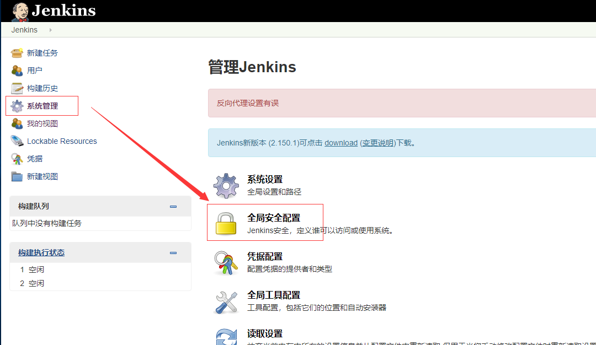  
    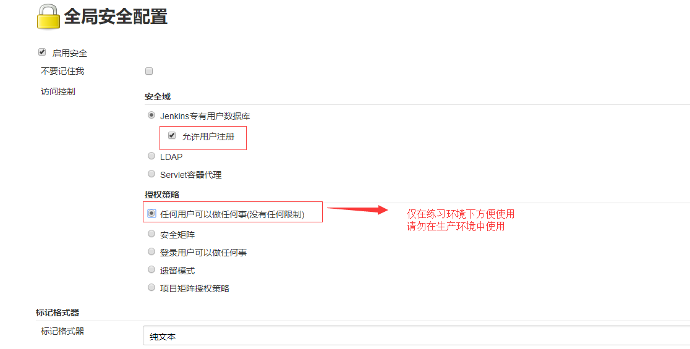  

    * 配置jdk和maven并安装Deploy插件  
    `系统管理` -> `全局工具配置`  
    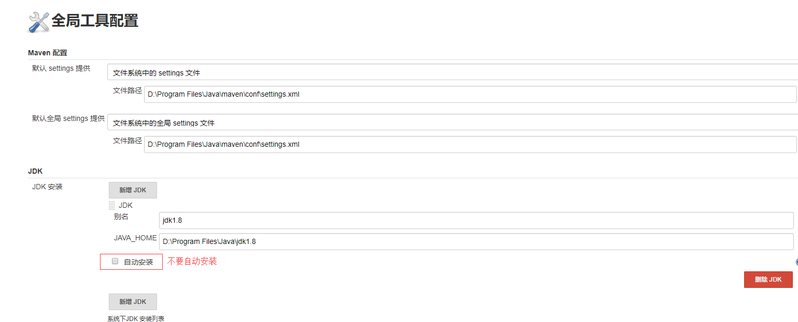  
    windows的话配置全局git那一栏，需要配置成`安装目录\bin\git.exe`  
    例如：`D:\Program Files\Git\bin\git.exe`  
    之前以为是`D:\Program Files\Git\git-bash.ext`，导致项目构建一直报错  
    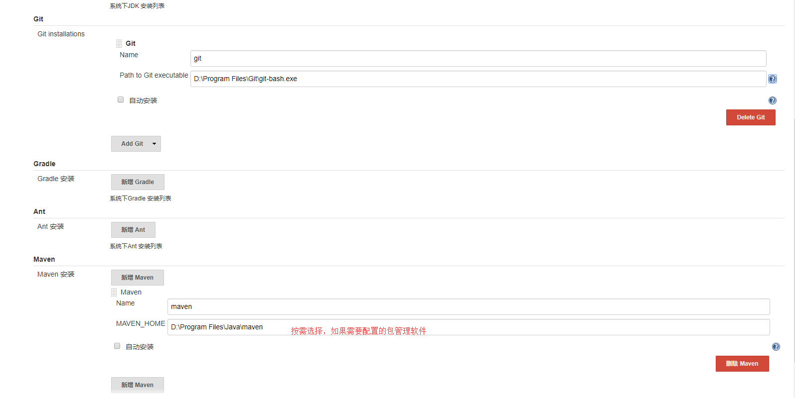  
6. 安装插件  
    `系统管理` -> `插件管理`  
    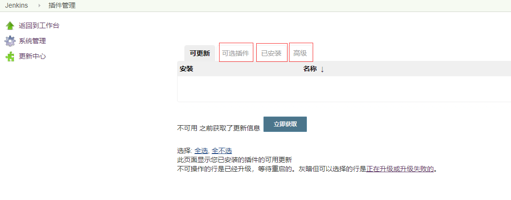  
    安装Deploy to container Plugin  
    有可能因为网络原因导致安装失败，可以更新为清华的Jenkins更新地址  
    `插件管理` -> `高级` -> `升级站点url`  
    https://mirrors.tuna.tsinghua.edu.cn/jenkins/updates/update-center.json  
7. 创建工程  
      
    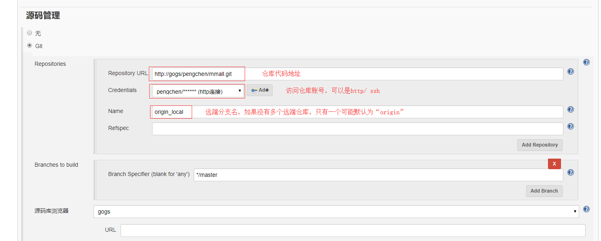  
    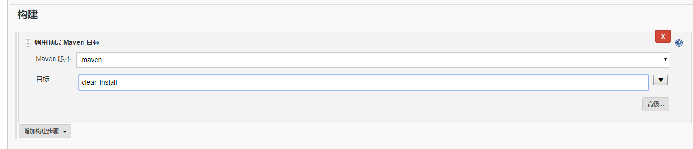  
    点击`构建项目`后即可完成从版本库获取代码,打成war包  

    可是还是没有实现自动部署到tomcat  
    继续进行`配置` -> `构建后操作`  
    这里就用到了Deploy to container插件，如果没有安装该插件是没有此选项的  
    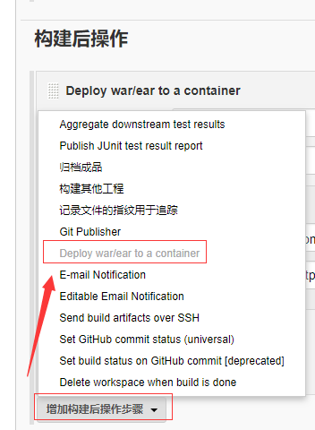  
    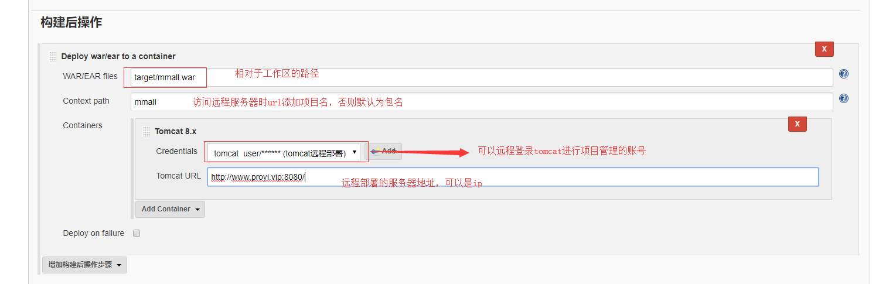  
    再次点击`立即构建`，就会把war部署到相应的远程服务器上，可以通过网页管理查看  
8. 构建触发器  
    现在我们已经实现`获取源码` -> `maven自动打包` -> `远程部署`  
    关键在于我们如何实现提交代码后Jenkins自动完成这些动作，不需要`手动`点击立即构建  
    根据自动部署流程图可以知道，在代码库中配置`钩子程序`，代码提交或者推送后，钩子程序自动通知Jenkins，然后Jenkins即可完成一系列动作，完成自动部署  
    * 如果是svn版本库，就在项目配置中配置`构建触发器`  
        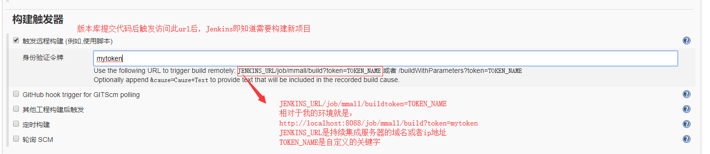  
        配置后得到拼接好的url在浏览器地址栏测试，访问自己项目的url，例如我的地址是http://localhost:8088/job/mmall/build?token=mytoken  
        观察是否触发了新的构建  
        - 配置svn的钩子程序  
        进入svn安装目录/hooks文件夹  
        参看post-commit.tmpl文件（该文件执行提交之后的操作）发送http请求触发url  
        
        Linux 的curl 命令用来发送HTTP 请求  
        -X 参数：指定请求方式  
        -v 参数：显示响应结果  
        -u 参数：携带用户名/密码  
        -H 参数：携带请求消息头信息  

        ```
        curl -X post -v 
        -u [Jenkins 用户名]:[Jenkins 密码] 
        -H "请求消息头信息" 
        http://[服务器IP 地址]:[服务器端口号]/jenkins/job/[Jenkins 项目名称]/build?token=[身份验证令牌]  

        例：
        curl -X post -v -u admin:2f6bff33bda14baba83ba1c002045f05 -H
        "Jenkins-Crumb:88a12946e07d82b3b0d567c7c4610c9a"
        http://xxx:8080/jenkins/job/xxx/build?token=XXX

        此处的admin：密码是默认Jenkins生成的，就是之前解锁Jenkins的密码  
        Jenkins-Crumb是一个允许跨站请求伪造的请求头验证信息
        ```
        可以在Linux命令行中测试此命令是否可以触发构建  

        - Jenkins-Crumb的来源  
        `Jenkins` -> `系统管理` -> `全局安全配置`  
          
        - 获取Jenkins-Crumb的值  
        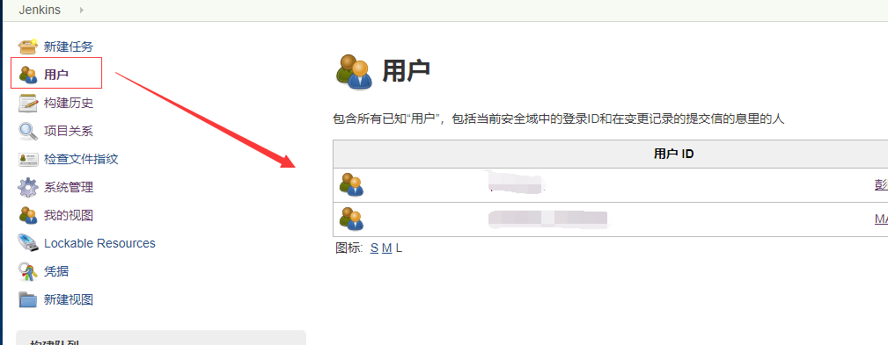  
        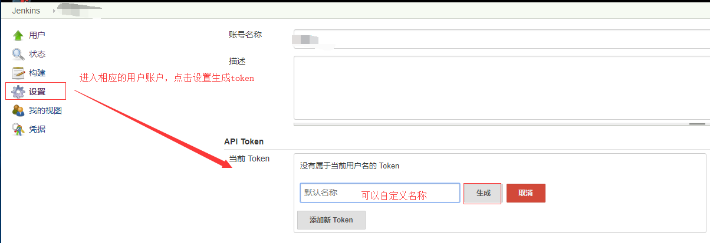  
        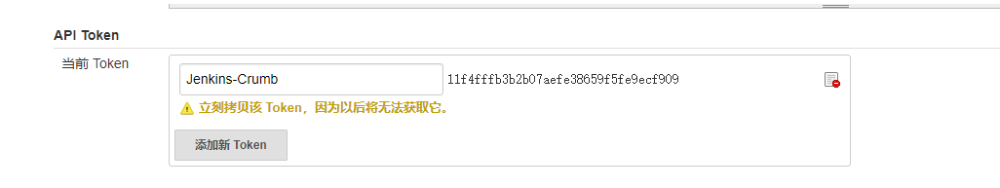  
        - 编辑svn钩子程序  
        复制post-commit.tmpl文件，文件名为`post-commit`，不要携带任何后缀  
        将之前的内容全部删除或者注释  
        将curl命令内容写入，保存，修改权限 `chmod 755 post-commit`  
        钩子程序已经完成  
    * git版本控制服务器  
    添加webhook
    我自己本地搭建的是gogs，可以根据自己的版本库灵活配置，基本操作一样  
    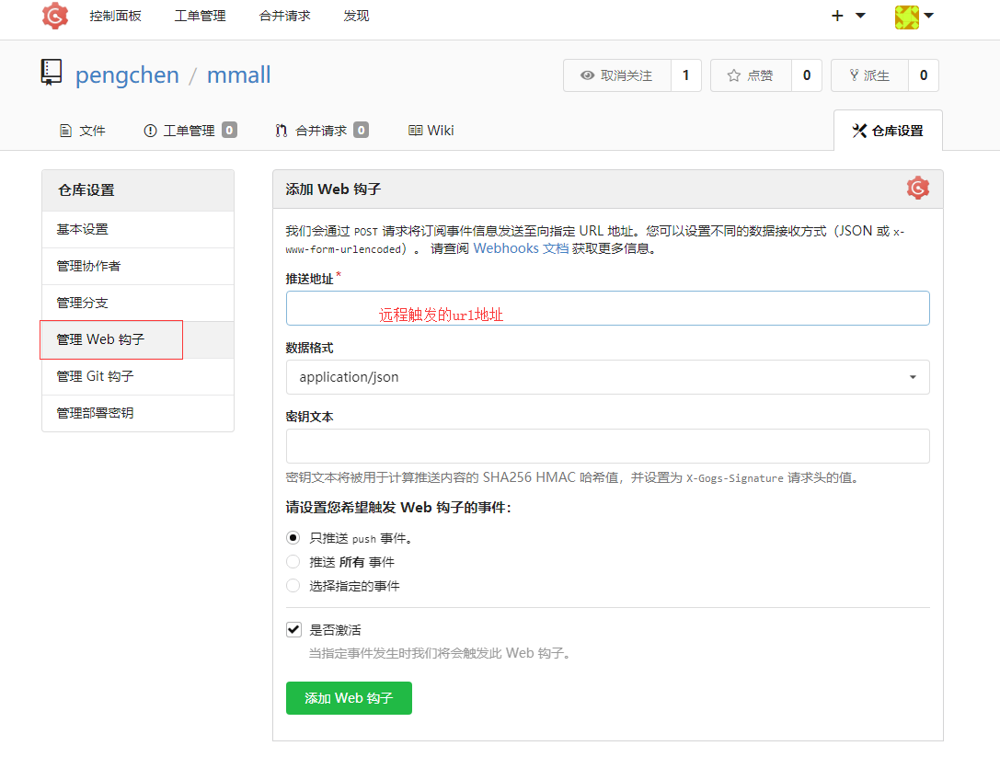  
    因为有的webhook是无法携带请求头验证消息,或者和Jenkins验证的请求头不一样，所以需要在`系统管理` -> `全局安全配置`关闭防止跨站点请求伪造  
9. 测试验证整个自动化持续集成流程  
    svn版本库自动部署发现每次自动部署的结果都是比代码库中的代码落后一个版本，并不是最新的代码进行部署  
    解决方案：  
    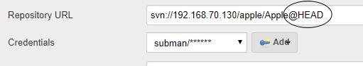
        


