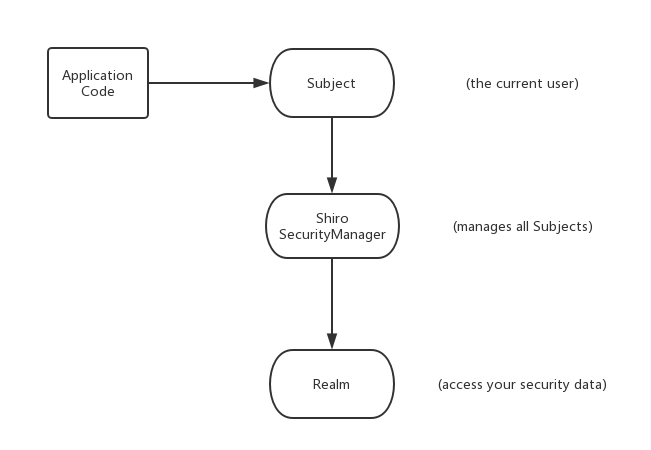
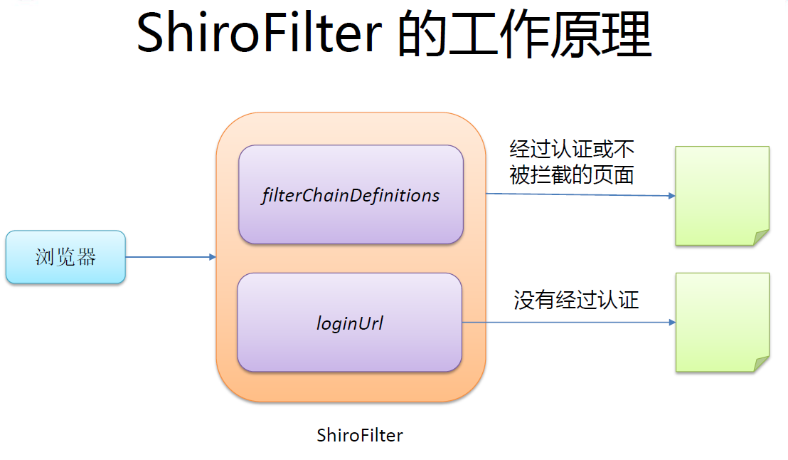

## shiro简介  
* ApacheShiro是Java的一个`安全（权限）框架 `
* Shiro可以非常容易的开发出足够好的应用，其不仅可以用在JavaSE环境，也可以用在JavaEE环境  
* Shiro可以完成：认证、授权、加密、会话管理、与Web 集成、缓存等  

## 功能简介  
* Authentication：`身份认证/登录`，验证用户是不是拥有相应的身份  
* Authorization：`授权`，即权限验证，验证某个已认证的用户是否拥有某个权限  
    即判断用户是否能进行什么操作，如：验证某个用户是否拥有某个角色  
    或者细粒度的验证某个用户对某个资源是否具有某个权限  
* Session Manager：`会话管理`，即用户登录后就是一次会话，在没有退出之前，它的所有信息都在会话中  
    会话可以是普通JavaSE环境，也可以是Web 环境的  
* Cryptography：`加密`，保护数据的安全性，如密码加密存储到数据库，而不是明文存储  
* Web Support：`Web 支持`，可以非常容易的集成到Web 环境  
* Caching：`缓存`，比如用户登录后，其用户信息、拥有的角色/权限不必每次去查，这样可以提高效率  
* Concurrency：Shiro支持`多线程应用的并发验证`，即如在一个线程中开启另一个线程，能把权限自动传播过去  
* Testing：`提供测试支持`  
* Run As：允许一个用户`假装为另一个用户（如果他们允许）的身份进行访问`  
* Remember Me：`记住我`，这个是非常常见的功能，即一次登录后，下次再来的话不用登录了  

### shiro构架（Shiro外部来看）
从外部来看Shiro，即从应用程序角度来观察如果使用Shiro完成工作  
  
* Subject：应用代码直接交互的对象是Subject，也就是说Shiro的对外API `核心就是Subject`  
    Subject 代表了`当前用户`，这个用户不一定是一个具体的人，与当前应用交互的任何东西都是Subject，如网络爬虫，机器人等  
    与Subject 的所有交互都会委托给SecurityManager  
    Subject 其实是一个门面，SecurityManager才是实际的执行者  

* SecurityManager：安全管理器；即所有与安全有关的操作都会与SecurityManager交互  
    且其管理着所有Subject  
    可以看出它是Shiro的核心，它负责与Shiro的其他组件进行交互，它相当于SpringMVC中DispatcherServlet的角色  
* Realm：Shiro从Realm 获取安全数据（如用户、角色、权限）  
    就是说SecurityManager要验证用户身份，那么它需要从Realm 获取相应的用户进行比较以确定用户身份是否合法  
    也需要从Realm 得到用户相应的角色/权限进行验证用户是否能进行操作  
    可以把Realm 看成DataSource  
### shiro构架（Shiro内部来看）
  
* Subject：  
    任何可以与应用交互的`用户`  
* SecurityManager：  
    相当于SpringMVC中的DispatcherServlet，是Shiro的心脏  
    所有具体的交互都通过SecurityManager进行控制  
    它管理着所有Subject、且负责进行认证、授权、会话及缓存的管理  
* Authenticator：  
    负责Subject 认证，是一个扩展点，可以自定义实现  
    可以使用认证策略（Authentication Strategy），即什么情况下算用户认证通过了  
* Authorizer：
    授权器、即访问控制器，用来决定主体是否有权限进行相应的操作  
    即控制着用户能访问应用中的哪些功能  
* Realm：  
    可以有1 个或多个Realm，可以认为是安全实体数据源，即用于获取安全实体的  
    可以是JDBC 实现，也可以是内存实现等等  
    由用户提供  
    所以一般在应用中都需要实现自己的Realm  
* SessionManager：
    管理Session 生命周期的组件  
    而Shiro并不仅仅可以用在Web 环境，也可以用在如普通的JavaSE环境  
* CacheManager：
    缓存控制器，来管理如用户、角色、权限等的缓存的  
    因为这些数据基本上很少改变，放到缓存中后可以提高访问的性能  
* Cryptography：  
    密码模块，Shiro提高了一些常见的加密组件用于如密码加密/解密  

## 快速开始  
### 搭建开发环境  
新建java项目加入如下jar 包：  
* shiro-all-1.3.2.jar  
* log4j-1.2.15.jar  
* slf4j-api-1.6.1.jar  
* slf4j-log4j12-1.6.1.jar  

拷贝官方demo代码学习，demo下载地址：[shiro](https://github.com/apache/shiro/releases)  
下载解压后在 shiro-shiro-root-1.4.0/shiro-shiro-root-1.4.0/samples/quickstart路径下即可找到Quickstart.java和相应的配置文件，这版下载的版本是1.4.0  
### 阅读Quickstart.java  
配合`shiro.ini`这个配置文件阅读  
```java
/*
 * Licensed to the Apache Software Foundation (ASF) under one
 * or more contributor license agreements.  See the NOTICE file
 * distributed with this work for additional information
 * regarding copyright ownership.  The ASF licenses this file
 * to you under the Apache License, Version 2.0 (the
 * "License"); you may not use this file except in compliance
 * with the License.  You may obtain a copy of the License at
 *
 *     http://www.apache.org/licenses/LICENSE-2.0
 *
 * Unless required by applicable law or agreed to in writing,
 * software distributed under the License is distributed on an
 * "AS IS" BASIS, WITHOUT WARRANTIES OR CONDITIONS OF ANY
 * KIND, either express or implied.  See the License for the
 * specific language governing permissions and limitations
 * under the License.
 */

import org.apache.shiro.SecurityUtils;
import org.apache.shiro.authc.*;
import org.apache.shiro.config.IniSecurityManagerFactory;
import org.apache.shiro.mgt.SecurityManager;
import org.apache.shiro.session.Session;
import org.apache.shiro.subject.Subject;
import org.apache.shiro.util.Factory;
import org.slf4j.Logger;
import org.slf4j.LoggerFactory;


/**
 * Simple Quickstart application showing how to use Shiro's API.
 *
 * @since 0.9 RC2
 */
public class Quickstart {

    private static final transient Logger log = LoggerFactory.getLogger(Quickstart.class);


    public static void main(String[] args) {

        // The easiest way to create a Shiro SecurityManager with configured
        // realms, users, roles and permissions is to use the simple INI config.
        // We'll do that by using a factory that can ingest a .ini file and
        // return a SecurityManager instance:

        // Use the shiro.ini file at the root of the classpath
        // (file: and url: prefixes load from files and urls respectively):
        Factory<SecurityManager> factory = new IniSecurityManagerFactory("classpath:shiro.ini");
        SecurityManager securityManager = factory.getInstance();

        // for this simple example quickstart, make the SecurityManager
        // accessible as a JVM singleton.  Most applications wouldn't do this
        // and instead rely on their container configuration or web.xml for
        // webapps.  That is outside the scope of this simple quickstart, so
        // we'll just do the bare minimum so you can continue to get a feel
        // for things.
        SecurityUtils.setSecurityManager(securityManager);

        // Now that a simple Shiro environment is set up, let's see what you can do:

        // get the currently executing user:
        // 获取当前的subject 调用SecurityUtils.getSubject()
        Subject currentUser = SecurityUtils.getSubject();

        // Do some stuff with a Session (no need for a web or EJB container!!!)
        // 测试使用session
        // 获取session：调用subjec的getSession()
        Session session = currentUser.getSession();
        session.setAttribute("someKey", "aValue");
        String value = (String) session.getAttribute("someKey");
        if (value.equals("aValue")) {
            log.info("Retrieved the correct value! [" + value + "]");
        }

        // let's login the current user so we can check against roles and permissions:
        // 测试当前的用户是否已经被认证，即是否登录  
        // 调用subject的isAuthenticated()
        if (!currentUser.isAuthenticated()) {
            // 把用户名和密码封装为UsernamePasswordToken对象  
            UsernamePasswordToken token = new UsernamePasswordToken("lonestarr", "vespa");
            token.setRememberMe(true);
            try {
                // 执行登录
                currentUser.login(token);
            } 
            // 若没有指定的账户，shiro将会抛出UnknownAccountException 未知账户异常
            catch (UnknownAccountException uae) {
                log.info("There is no user with username of " + token.getPrincipal());
            } 
            // 若密码错误，shiro将会抛出IncorrectCredentialsException 错误的凭证异常
            catch (IncorrectCredentialsException ice) {
                log.info("Password for account " + token.getPrincipal() + " was incorrect!");
            } 
            // 用户被锁定异常 
            catch (LockedAccountException lae) {
                log.info("The account for username " + token.getPrincipal() + " is locked.  " +
                        "Please contact your administrator to unlock it.");
            }
            // ... catch more exceptions here (maybe custom ones specific to your application?
            // 所有认证时异常的父类
            catch (AuthenticationException ae) {
                //unexpected condition?  error?
            }
        }

        //say who they are:
        //print their identifying principal (in this case, a username):
        log.info("User [" + currentUser.getPrincipal() + "] logged in successfully.");

        //test a role:
        // 测试是否有某一个角色, 调用Subject的hasRole()方法
        if (currentUser.hasRole("schwartz")) {
            log.info("May the Schwartz be with you!");
        } else {
            log.info("Hello, mere mortal.");
        }

        //test a typed permission (not instance-level)
        // 测试用户是否具备某一行为。调用subject的isPermitted()方法  currentUser可以对lightsaber做wield权限的事
        if (currentUser.isPermitted("lightsaber:wield")) {
            log.info("You may use a lightsaber ring.  Use it wisely.");
        } else {
            log.info("Sorry, lightsaber rings are for schwartz masters only.");
        }

        //a (very powerful) Instance Level permission:
        // 测试用户是否具备某一行为(控制更加具体)  允许对winnebago类型的eagle5实例做drive的动作
        // goodguy = user:delete:张三  当前登录者如果拥有goodguy角色，就拥有了对所有user中的张三进行删除操作的权利
        if (currentUser.isPermitted("winnebago:drive:eagle5")) {
            log.info("You are permitted to 'drive' the winnebago with license plate (id) 'eagle5'.  " +
                    "Here are the keys - have fun!");
        } else {
            log.info("Sorry, you aren't allowed to drive the 'eagle5' winnebago!");
        }

        //all done - log out!
        // 执行登出，调用subject的logout()方法
        currentUser.logout();

        System.exit(0);
    }
}
```
## 集成spring  
加入Spring 和Shiro的jar 包   
* 配置Spring 及SpringMVC  
* 参照：shiro-shiro-root-1.4.0/shiro-shiro-root-1.4.0/samples/spring 配置web.xml 文件和Spring 的配置文件  

* 修改web.xml文件，添加shiroFilter  
    ```xml
    <!--
        1. 配置Shiro的shiroFilter 
        2. DelegatingFilterProxy实际上是filter的一个代理对象。默认情况下，spring会到IOC容器中查找和<filter-name>对应的filter bean.也可以通过targetBeanName的初始化参数来配置filter bean的id
    -->
    <filter>
        <filter-name>shiroFilter</filter-name>
        <filter-class>org.springframework.web.filter.DelegatingFilterProxy</filter-class>
        <init-param>
            <param-name>targetFilterLifecycle</param-name>
            <param-value>true</param-value>
        </init-param>
            <!-- 如果配置了此参数，spring配置文件中shiroFilter bean的id就是abc-->
            <!-- <param-name>targetBeanName</param-name>
            <param-value>abc</param-value> -->
        <init-param>
            
        </init-param>
    </filter>

    <filter-mapping>
        <filter-name>shiroFilter</filter-name>
        <url-pattern>/*</url-pattern>
    </filter-mapping>
    ```
* 在spring配置文件中配置shiro  
```xml
<!-- =========================================================
         Shiro Core Components - Not Spring Specific
         ========================================================= -->
    <!-- Shiro's main business-tier object for web-enabled applications
         (use DefaultSecurityManager instead when there is no web environment)-->
    <!-- 
        1. 配置securityManager
    -->
    <bean id="securityManager" class="org.apache.shiro.web.mgt.DefaultWebSecurityManager">
        <property name="cacheManager" ref="cacheManager"/>
        <!-- Single realm app.  If you have multiple realms, use the 'realms' property instead. -->
        <property name="realm" ref="jdbcRealm"/>
        <property name="sessionManager" ref="sessionManager"/>
    </bean>

    <bean id="sessionManager" class="org.apache.shiro.web.session.mgt.DefaultWebSessionManager">
        <property name="sessionIdUrlRewritingEnabled" value="false"/>
    </bean>

    <!-- Let's use some enterprise caching support for better performance.  You can replace this with any enterprise
         caching framework implementation that you like (Terracotta+Ehcache, Coherence, GigaSpaces, etc -->
    <!-- 
        2. 配置cacheManager
        2.1 需要加入ehcache的jar包及配置文件
    -->
    <bean id="cacheManager" class="org.apache.shiro.cache.ehcache.EhCacheManager">
        <!-- Set a net.sf.ehcache.CacheManager instance here if you already have one.  If not, a new one
             will be creaed with a default config:
             <property name="cacheManager" ref="ehCacheManager"/> -->
        <!-- If you don't have a pre-built net.sf.ehcache.CacheManager instance to inject, but you want
             a specific Ehcache configuration to be used, specify that here.  If you don't, a default
             will be used.:
        <property name="cacheManagerConfigFile" value="classpath:some/path/to/ehcache.xml"/> -->
    </bean>

    <!-- Used by the SecurityManager to access security data (users, roles, etc).
         Many other realm implementations can be used too (PropertiesRealm,
         LdapRealm, etc. -->
    <!-- 
        3. 配置Realm
        自定义Realm myRealm implements Ream
    -->
    <bean id="jdbcRealm" class="xxx.realms.myRealm">

    <!-- =========================================================
         Shiro Spring-specific integration
         ========================================================= -->
    <!-- Post processor that automatically invokes init() and destroy() methods
         for Spring-configured Shiro objects so you don't have to
         1) specify an init-method and destroy-method attributes for every bean
            definition and
         2) even know which Shiro objects require these methods to be
            called. -->
    <!-- 
        4. 配置lifecycleBeanPostProcessor 生命周期bean post处理器
        可以自动的来调用配置在Spring IOC容器中shiro bean的生命周期方法
    -->
    <bean id="lifecycleBeanPostProcessor" class="org.apache.shiro.spring.LifecycleBeanPostProcessor"/>

    <!-- Enable Shiro Annotations for Spring-configured beans.  Only run after
         the lifecycleBeanProcessor has run: -->
    <!-- 
        5. 配置IOC 容器中使用shiro的注解，但必须在配置了lifecycleBeanPostProcessor之后才可以使用
    -->
    <bean class="org.springframework.aop.framework.autoproxy.DefaultAdvisorAutoProxyCreator"
          depends-on="lifecycleBeanPostProcessor"/>
    <bean class="org.apache.shiro.spring.security.interceptor.AuthorizationAttributeSourceAdvisor">
        <property name="securityManager" ref="securityManager"/>
    </bean>

    <!-- 
        6. 配置ShiroFilter
        6.1 id必须和web.xml文件中配置的 DelegatingFilterProxy的<filter-name>一致
        若不一致，则会抛出：NoSuchBeanDefinitionException  
        因为Shiro会来IOC 容器中查找和<filter-name> 名字对应的filter bean
    -->
    <!-- Define the Shiro Filter here (as a FactoryBean) instead of directly in web.xml -
         web.xml uses the DelegatingFilterProxy to access this bean.  This allows us
         to wire things with more control as well utilize nice Spring things such as
         PropertiesPlaceholderConfigurer and abstract beans or anything else we might need: -->
    <bean id="shiroFilter" class="org.apache.shiro.spring.web.ShiroFilterFactoryBean">
        <property name="securityManager" ref="securityManager"/>
        <property name="loginUrl" value="/s/login"/>
        <property name="successUrl" value="/s/index"/>
        <property name="unauthorizedUrl" value="/s/unauthorized"/>
        <!-- The 'filters' property is not necessary since any declared javax.servlet.Filter bean
             defined will be automatically acquired and available via its beanName in chain
             definitions, but you can perform overrides or parent/child consolidated configuration
             here if you like: -->
        <!-- <property name="filters">
            <util:map>
                <entry key="aName" value-ref="someFilterPojo"/>
            </util:map>
        </property> -->
        <!--
            配置哪些页面需要受保护，以及访问这些页面需要的权限
            1） anon 可以被匿名访问  
            2） authc 必须认证（即登录）后才可能访问的页面
        -->
        <property name="filterChainDefinitions">
            <value>
                /favicon.ico = anon
                /logo.png = anon
                /shiro.css = anon
                /s/login = anon
                # allow WebStart to pull the jars for the swing app:
                /*.jar = anon
                # protected using SecureRemoteInvocationExecutor
                /remoting/** = anon
                # everything else requires authentication:
                /** = authc
            </value>
        </property>
    </bean>
```
### 与Web 集成
* Shiro提供了与Web 集成的支持，其通过一个ShiroFilter入口来拦截需要安全控制的URL，然后进行相应的控制  
* ShiroFilter类似于如Strut2/SpringMVC这种web 框架的前端控制器，是安全控制的入口点，其负责读取配置（如ini配置文件），然后判断URL 是否需要登录/权限等工作  
### shiroFilter工作原理  
 
### DelegatingFilterProxy的细节
为什么spring配置文件中ShiroFilter bean的id必须和web.xml文件中配置的 DelegatingFilterProxy的<filter-name>一致？  
DelegatingFilterProxy实际上是filter的一个代理对象。  
默认情况下，spring会到IOC容器中查找和<filter-name>对应的filter bean.也可以通过targetBeanName的初始化参数来配置filter bean的id  
### 权限URL配置细节  
* [urls] 部分的配置，其格式是：`url=拦截器[参数]，拦截器[参数]`  
* 如果当前请求的url匹配[urls] 部分的某个url模式，将会执行其配置的拦截器  
* anon（anonymous）拦截器表示匿名访问（即不需要登录即可访问）  
* authc（authentication）拦截器表示需要身份认证通过后才能访问  
### shiro中默认的过滤器  
|过滤器名称|过滤器类|描述|例子|  
|:---|:---|:---|:---|  
|anon|org.apache.shiro.web.filter.authc.AnonymousFilter|没有参数，表示可以匿名使用|/admins/**=anon|  
|authc|org.apache.shiro.web.filter.authc.FormAuthenticationFilter|没有参数，表示需要认证（登录）才能使用|/user/**=authc|  
|authcBasic|org.apache.shiro.web.filter.authc.BasicHttpAuthenticationFilter|没有参数，表示需通过HttpBasic验证，如果不通过，跳转至登录页面|/user/**=authcBasic|  
|logout|org.apache.shiro.web.filter.authc.LogoutFilter|注销登录时完成一定的功能:任何现有的session都将会失效,而且任何身份都将失去关联(在web应用程序中，RememberMe cookie也将被删除)||  
|noSessionCreation|org.apache.shiro.web.filter.session.NoSessionCreationFilter|阻止在请求期间创建新的会话.以保证无状态的体验||  
|perms|org.apache.shiro.web.filter.authz.PermissionsAuthorizationFilter|参数可以写多个，多个时必须加上引号，并且参数之间用逗号分隔。<br>当有多个参数时，必须每个参数都通过才通过，相当于isPermitedAll()方法|/admins/\*\*=perms\[user:add:\*] <br> /admins/user/\*\*=perms\["user:add:\*,user:modify:\*"]|  
|port|org.apache.shiro.web.filter.authz.PortFilter|指定请求访问的端口。如果不匹配，则跳转到登录页面|/admins/**=port\[8081]|  
|rest|org.apache.shiro.web.filter.authz.HttpMethodPermissionFilter|根据请求的方法|/admins/user/\*\*=perms\[user:method]，其中method为post，get，delete等|  
|roles|org.apache.shiro.web.filter.authz.RolesAuthorizationFilter|角色过滤器，判断当前用户是否指定角色<br> 参数可以写多个，多个时必须加上引号，并且参数之间用逗号分隔<br>当有多个参数时，必须每个参数都通过才通过，相当于hasAllRoles()方法|/admins/user/\*\*=roles\["admin,guest"]|  
|ssl|org.apache.shiro.web.filter.authz.SslFilter|没有参数，表示安全的url请求,协议为https||  
|user|org.apache.shiro.web.filter.authc.UserFilter|没有参数，表示必须存在用户||  

### URL匹配模式  
url模式使用`Ant`风格模式  
* Ant 路径通配符支持`?`、`*`、`**`，注意通配符匹配不包括目录分隔符`/`    
–?：匹配一个字符，如/admin? 将匹配/admin1，但不匹配/admin 或/admin/  
–*：匹配零个或多个字符串，如/admin 将匹配/admin、/admin123，但不匹配/admin/1  
–\*\*：匹配路径中的零个或多个路径，如/admin/** 将匹配/admin/a 或/admin/a/b  
### URL匹配顺序
* URL权限采取第一次匹配优先的方式  
    即从头开始使用第一个匹配的url模式对应的拦截器链  
    ```
    如：
    –/bb/**=filter1
    –/bb/aa=filter2
    –/**=filter3
    
    –如果请求的url是“/bb/aa”，因为按照声明顺序进行匹配，那么将使用filter1 进行拦截
    ```