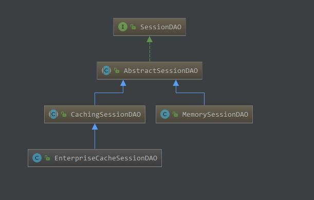

## Shiro标签
Shiro提供了JSTL 标签用于在JSP 页面进行权限控制，如根据登录用户显示相应的页面按钮  
* guest 标签：  
    用户没有身份验证时显示相应信息，即游客访问信息  
    ```jsp
    <shiro : guest>
        欢迎游客访问，<a href="login.jsp">登录</a>
    </shiro : guest>
    ```
* user 标签：  
    用户已经经过认证/记住我登录后显示相应的信息  
    ```jsp
    <shiro : user>
        欢迎[<shiro :  principal/>]登录，<a href="logout.jsp">退出</a>
    </shiro : user>
    ```  
* authenticated 标签：  
    用户已经身份验证通过，即Subject.login登录成功，`不是记住我登录的`  
    ```jsp
    <shiro : authenticated>
        用户[<shiro :  principal/>]身份已验证通过
    </shiro : authenticated>
    ```  
* notAuthenticated标签：  
    用户未进行身份验证，即没有调用Subject.login进行登录，包括记住我自动登录的也属于未进行身份验证  
    ```jsp
    <shiro : notAuthenticated>
        未进行身份验证（包括记住我）
    </shiro : notAuthenticated>
    ```
* principal标签：  
    显示用户身份信息，默认调用Subject.getPrincipal() 获取，即Primary Principal  
    ```jsp
    <shiro : principal property="username" />
    ```
* hasRole标签：  
    如果当前Subject 有角色将显示body 体内容  
    ```jsp
    <shiro : hasRole name="admin">
        用户[<shiro :  principal/>]拥有角色admin
    </shiro : hasRole>
    ```
* hasAnyRoles标签：  
    如果当前Subject有任意一个角色（或的关系）将显示body体内容  
    ```jsp
    <shiro : hasAnyRoles name="admin, user">
        用户[<shiro :  principal/>]拥有角色admin 或user
    </shiro : hasAnyRoles>
    ```
* lacksRole：  
    如果当前Subject 没有角色将显示body 体内容  
    ```jsp
    <shiro : lacksRole name="admin">
        用户[<shiro :  principal/>]没有角色admin
    </shiro : lacksRole>
    ```
* hasPermission：  
    如果当前Subject 有权限将显示body 体内容  
    ```jsp
    <shiro : hasPermission name="user:create">
        用户[<shiro :  principal/>]拥有权限user:create
    </shiro : hasPermission>
    ```
* lacksPermission：  
    如果当前Subject没有权限将显示body体内容  
    ```jsp
    <shiro : lacksPermission name="user:create">
        用户[<shiro :  principal/>]没有权限user:create
    </shiro : lacksPermission>
    ```
## 权限注解
* @RequiresAuthentication：  
    表示当前Subject已经通过login 进行了身份验证；即Subject. isAuthenticated() 返回true  
* @RequiresUser：  
    表示当前Subject 已经身份验证或者通过记住我登录的  
* @RequiresGuest：  
    表示当前Subject没有身份验证或通过记住我登录过，即是游客身份  
* @RequiresRoles(value={"admin", "user"}, logical= Logical.AND)：  
    表示当前Subject 需要角色admin 和user  
* @RequiresPermissions(value={"user:a", "user:b"}, logical= Logical.OR)：  
    表示当前Subject 需要权限user:a或user:b  

如果Service层使用了`@Transactional`事务注解，再使用权限注解，是无法生效的。  
因为不能作用在对象的代理的代理之上  
## 从数据表中初始化资源和权限  
之前我们将页面的访问权限配置在spring配置文件中shiroFilter的filterChainDefinitions属性  
但是当受保护的资源及权限数量多的情况下一条一条配置并不方便，并且阅读spring其他模块的配置也不方便  
最好的方式还是将这些内容存放在数据库中，通过sql来查找  
通过配置文件可以看出配置文件filterChainDefinitions，配置内容封装到了filterChainDefinitionMap中，是一个linkedHashMap  

所以可以改造
```xml
<bean id="shiroFilter" class="org.apache.shiro.spring.web.ShiroFilterFactoryBean">
    <property name="securityManager" ref="securityManager"/>
    <property name="loginUrl" value="/s/login"/>
    <property name="successUrl" value="/s/index"/>
    <property name="unauthorizedUrl" value="/s/unauthorized"/>

    <!-- 配置filterChainDefinitionMap -->
    <property name="filterChainDefinitionMap" ref="filterChainDefinitionMap"/>

    <!-- 注释掉filterChainDefinitions-->
    <!-- <property name="filterChainDefinitions">
        <value>
            /favicon.ico = anon
            /logo.png = anon
            /shiro.css = anon
            /s/login = anon
            # allow WebStart to pull the jars for the swing app:
            /*.jar = anon
            # protected using SecureRemoteInvocationExecutor
            /remoting/** = anon
            # everything else requires authentication:
            /** = authc
        </value>
    </property> -->
</bean>

<!-- 配置一个bean，该bean实际上是一个Map 通过实例工厂方法的方式 -->
<bean id="filterChainDefinitionMap" factory-bean="filterChainDefinitionMapBuilder" factory-mathod="buildFilterChainDefinitionMap"></bean>

<!-- 配置实例工厂类 -->
    <bean id="filterChainDefinitionMapBuilder" class="xxx.shiro.factory.FilterChainDefinitionMapBuilder" />
```
实例工厂类 FilterChainDefinitionMapBuilder  
```java
package xxx.shiro.factory;

public class FilterChainDefinitionMapBuilder {
    public LinkedHashMap<String, String> buildFilterChainDefinitionMap() {
        LinkedHashMap<String, String> map = new LinkedHashMap<>();

        // 和在配置文件中一样，添加资源和权限是有顺序的  
        map.put("/login.jsp","anon");
        map.put("/**","authc");

        return map;
    }
}
```
## 会话管理  
Shiro提供了完整的企业级会话管理功能  
不依赖于底层容器（如web容器tomcat），不管JavaSE还是JavaEE环境都可以使用  
提供了`会话管理`、`会话事件监听`、`会话存储/持久化`、`容器无关的集群`、`失效/过期支持`、`对Web 的透明支持`、`SSO单点登录的支持`等特性  
### 会话相关的API  
* Subject.getSession()  
    即可获取会话；其等价于Subject.getSession(true)  
    即如果当前没有创建Session 对象会创建一个  
    Subject.getSession(false)，如果当前没有创建Session 则返回null  
* session.getId()  
    获取当前会话的唯一标识  
* session.getHost()  
    获取当前Subject的主机地址  
* session.getTimeout() & session.setTimeout(毫秒)  
    获取/设置当前Session的过期时间  
* session.getStartTimestamp() & session.getLastAccessTime()  
    获取会话的启动时间及最后访问时间  
    如果是JavaSE应用需要自己定期调用session.touch() 去更新最后访问时间  
    如果是Web 应用，每次进入ShiroFilter都会自动调用session.touch() 来更新最后访问时间  
* session.touch() & session.stop()  
    更新会话最后访问时间及销毁会话  
    当Subject.logout()时会自动调用stop 方法来销毁会话  
    如果在web中，调用HttpSession.invalidate() 也会自动调用ShiroSession.stop方法进行销毁Shiro的会话  
* session.setAttribute(key, val) & session.getAttribute(key) & session.removeAttribute(key)  
    设置/获取/删除会话属性  
    在整个会话范围内都可以对这些属性进行操作  

#### 会话监听器
* 会话监听器用于监听会话创建、过期及停止事件  
    SessionListener三个方法  
    > onStart(Session) : void  
    > onStop(Session) : void  
    > onExpiration(Session) : void  

<span style="border-bottom:2px dashed red;">shiro的session和http session是非常类似的，使用时如何选择呢？</span>  
在controller层还是使用http session  
在service层就可以调用SecurityUtils.getSubject().getSession()来获取之前无法拿到的session内容  
这是开发中比较常用的方式  
### SessionDao
  
SessionDao可以将session取入数据库中，并进行增、删、改、查的操作  

* AbstractSessionDAO提供了SessionDAO的基础实现，如生成会话ID等  
* CachingSessionDAO提供了对开发者透明的会话缓存的功能，需要设置相应的CacheManager  
* MemorySessionDAO直接在内存中进行会话维护  
* EnterpriseCacheSessionDAO提供了缓存功能的会话维护，默认情况下使用MapCache实现，内部使用ConcurrentHashMap保存缓存的会话  
#### 配置示例  
```xml
<!-- 再把sessionManager 配置给securityManager-->

<!-- Session ID生成器 -->
<bean id="sessionIdGenerator" class="org.apache.shiro.session.mgt.eis.JavaUuidSessionIdGenerator"/>

<!-- Session Dao.继承EnterpriseCacheSessionDAO -->
<bean id="sessionDao" class="xxx.shiro.realms.MySessionDao">
    <property name="activeSessionsCacheName" value="shiro-activeSessionCache" />
    <property name="sessionIdGenerator" ref="sessionIdGenerator" />
</bean>

<!-- 会话管理器 -->
<bean id="sessionManager" class="org.apache.shiro.session.mgt.DefaultSessionManager">
    <property name="globalSessionTimeout" value="1800000" />
    <property name="deleteInvalidSessions" value="true" />
    <property name="sessionValidationSchedulerEnabled" value="true" />
    <property name="sessionDao" ref="sessionDao" />
</bean>

<cache name="shiro-activeSessionCache" maxEntriesLocalHeap="10000" 
overflowToDisk="false"
eternal="false"
diskPersistent="false"
timeToLiveSeconds="0"
timeToIdleSeconds="0"
statistics="true"/>
```
数据表  
```sql
create table sessions(
    id varchar(200),
    session varchar(2000),
    constraint pk_sessions primary key(id)
) charset=utf8 ENGINE=InnoDB;
```
Session Dao
```java
@Autovired
private JdbcTemplate jdbcTemplate = null;

@override
protected Serializable doCreate(Session session) {
    Serializable sessionId = generateSessionId(session);
    assignSessionId(session, sessionId);

    String sql = "insert into sessions(id, session) values(?,?)";

    jdbcTemplate.update(sql, sessionId, SerializableUtils.serialize(session));

    return session.getId();
}

protected void doUpdate(Session session) {
    ...
    }

protected void doDelete(Session session) {
    ...
}
```
SerializableUtils
```java
public static string serialize(Session session) {
    try {
        ByteArrayOutPutStream bos = new ByteArrayOutPutStream();
        ObjectOutputStream oos = new ObjectOutputStream(bos);

        oos.writeObject(session);
        return Base64.encodeToString(bos.toByteArray());
    } catch (Exception e) {
        throw new RuntimeException("serialize session error", e);
    }
}
```
#### 会话验证
* Shiro提供了会话验证调度器，用于定期的验证会话是否已过期，如果过期将停止会话  
* 出于性能考虑，一般情况下都是获取会话时来验证会话是否过期并停止会话的  
    但是如在web 环境中，如果用户不主动退出是不知道会话是否过期的  
    因此需要定期的检测会话是否过期，Shiro提供了会话验证调度器SessionValidationScheduler
* Shiro也提供了使用Quartz会话验证调度器：QuartzSessionValidationScheduler  
## 缓存
* CacheManagerAware接口  
    Shiro内部相应的组件（DefaultSecurityManager）会自动检测相应的对象（如Realm）是否实现了CacheManagerAware并自动注入相应的CacheManager  
* Realm 缓存  
    Shiro提供了CachingRealm，其实现了CacheManagerAware接口，提供了缓存的一些基础实现  
    AuthenticatingRealm及AuthorizingRealm也分别提供了对AuthenticationInfo和AuthorizationInfo信息的缓存  
* Session 缓存  
    如SecurityManager实现了SessionSecurityManager，其会判断SessionManager是否实现了CacheManagerAware接口，如果实现了会把CacheManager设置给它  
    SessionManager也会判断相应的SessionDAO（如继承自CachingSessionDAO）是否实现了CacheManagerAware，如果实现了会把CacheManager设置给它  
    设置了缓存的SessionManager，查询时会先查缓存，如果找不到才查数据库  
## RememberMe  
### 概述  
Shiro提供了记住我（RememberMe）的功能，比如访问如淘宝等一些网站时，关闭了浏览器，下次再打开时还是能记住你是谁，下次访问时无需再登录即可访问，基本流程如下：  
* 1、首先在登录页面选中RememberMe然后登录成功  
    如果是浏览器登录，一般会把RememberMe的Cookie 写到客户端并保存下来  
* 2、关闭浏览器再重新打开，会发现浏览器还是记住你的  
* 3、访问一般的网页服务器端还是知道你是谁，且能正常访问  
* 4、但是比如我们访问淘宝时，如果要查看我的订单或进行支付时，此时`还是需要再进行身份认证的`，以确保当前用户还是你  
### 认证和记住我
* subject.isAuthenticated() 表示用户进行了身份验证登录的，即使有Subject.login进行了登录  
* subject.isRemembered()：表示用户是通过记住我登录的，此时可能并不是真正的你（如你的朋友使用你的电脑，或者你的cookie 被窃取）在访问的  
* 两者二选一，即subject.isAuthenticated()==true，则subject.isRemembered()==false；反之一样  
### 建议
* 访问`一般网页`：如个人在主页之类的，我们使用user 拦截器即可，user 拦截器只要用户登录(isRemembered() || isAuthenticated())过即可访问成功  
* 访问`特殊网页`：如我的订单，提交订单页面，我们使用authc拦截器即可，authc拦截器会判断用户是否是通过Subject.login（isAuthenticated()==true）登录的，如果是才放行，否则会跳转到登录页面叫你重新登录  
### 实现
* 如果要自己做RememeberMe，需要在登录之前这样创建Token  
    UsernamePasswordToken(用户名，密码，是否记住我)，且调用UsernamePasswordToken的：`token.setRememberMe(true);` 方法  
### 配置
```xml
<bean id="rememberMeCookie" class="org.apache.shiro.web.servlet.SimpleCookie">
    <Constructor-arg value="rememberMe"/>
    <property name="httpOnly" value="true" />
    <!-- 过期时间30天 -->
    <property name="maxAge" value="2592000" />
</bean>

<!-- rememberMe管理器 -->
<bean id="rememberMeManager" class="org.apache.shiro.web.mgt.CookieRememberMeManager">
    <property name="cipherKey" value="#{T(org.apache.shiro.codec.Base64).decode('4AvVhmFLUs0KTA3Kprsdag==')}"/>
    <property name="cookie" ref="rememberMeCookie"/>  
</bean>
```
