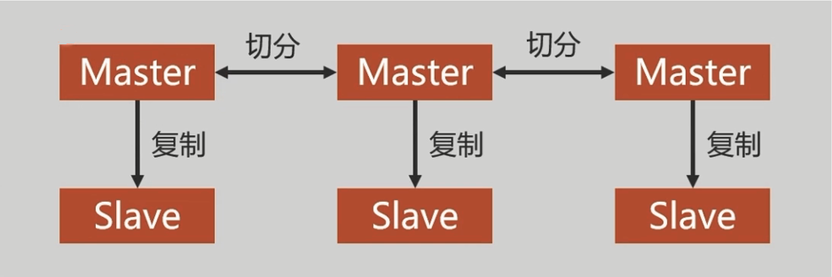

## Redis集群介绍  
### Redis目前的集群方案  
1. RedisCluster：官方推荐，没有中心节点  
2. Codis：中间件产品，存在中心节点  
3. Twemproxy：中间件产品，存在中心节点  
### RedisCluster
* 无中心节点，客户端与redis节点直连，不需要中间代理层  
* 数据可以被分片存储（切分存储，同PXC节点不同，每个节点存储的数据是不同的）
* 管理方便，后续可自行增加或摘除节点  

Redis集群示意图  
1[Redis集群示意图](Redis集群示意图.png)  

### 主从同步  
* Redis集群中的数据库复制是通过主从同步来实现的  
* 主节点（Master）把数据分发给从节点（Slave）  
* 主从同步的好处在于高可用，Redis节点有冗余设计  

Redis集群数据由于是切分存储的，所以如果节点宕机，该节点部分数据如果没有冗余设计就会直接丢失  
如果配置了主从节点，主节点宕机，从节点继续开展业务，不影响系统使用  

### Redis集群高可用  
* Redis集群中应该包含奇数个Master，至少应该有3个Master  
    因为Redis集群和PXC集群都有`选举机制`，当集群中大部分节点宕机（超过一半节点数量的节点宕机），剩余的节点是无法进行选举，再次组成新集群的。
* Redis集群中每个Master都应该有slave  
  

### 为什么PXC需要配置负载均衡，而Redis集群可以不配置  
因为前后端分离项目中，后端项目如果使用spring架构，spring程序就实现了负载均衡  

### 配置RedisCluster集群  
#### 安装Redis镜像  
* 导入本地Redis镜像文件，运行Redis容器  
    ```
    docker pull yyyyttttwwww/redis
    docker run -it -d --name redis1 -p 5001:6379 --net=net2 --ip 172.19.0.2 redis bash  
    ```
* 创建并进入容器后配置redis的配置文件，开启集群功能（默认是关闭的），路径 /usr/redis/redis.conf  
    ```
    daemonize yes #以后台进程运行  
    cluster-enabled yes #开启集群  
    cluster-config-file nodes.conf #集群配置文件
    cluster-node-timeout 15000 #超时时间
    appendonly yes #开启AOF模式
    ```
* 启动redis  
    ```
    cd /usr/redis/src  
    ./redis-server ../redis.conf
    ```
依次类推创建其他redis节点  
##### 安装redis-trib.rb  
redis自带创建集群的工具，就是redis-trib，通过它可以创建RedisCluster集群  
但是操作redis-trib指令较多，可以借助写好的脚本文件创建集群  
* redis-trib是基于Ruby的Redis集群命令行工具  
```
cp /usr/redis/src/redis-trib.rb /usr/redis/cluster/  
cd /usr/redis/cluster  
apt-get install ruby  
apt-get install rubygems  
gem install redis 
```
#### 创建Redis集群  
* 利用redis-trib.rb创建Redis集群  
```
在docker 任意一redis容器中执行
./redis-trib.rb create --replicas 1 
172.19.0.2:6379 172.19.0.3:6379 
172.19.0.4:6379 172.19.0.5:6379 
172.19.0.6:6379 172.19.0.7:6379 
```
--replicas 1 参数表示为每个主节点创建一个从节点   

通过客户端连接redis集群  
进入任意redis容器 /usr/redis/src/redis-cli -c (-c 表示连接RedisCluster)  
写入一条数据  set a 10  

模拟宕机写入数据的redis节点，应该由其slave节点顶替宕机的节点继续工作  

`exit` 退出redis客户端  重新连接redis集群  
通过`cluster nodes`查看各个节点状态，可以看到宕机节点的slave节点会自动升级为Master节点  
宕机节点恢复重新连接后，查看状态，会发现之前宕机的master节点，自动降级为slave节点  