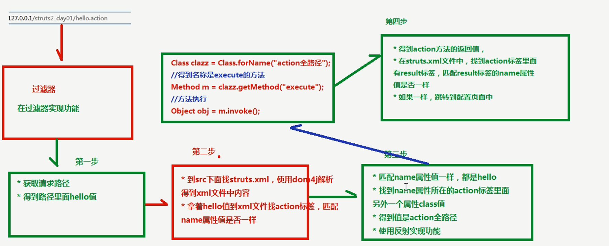

## Struts2概述
1. struts2框架应用javaee三层结构中web层框架  
2. struts2框架在struts1和webwork基础之上发展全新的框架  
3. struts2解决问题：功能越多，创建的servlet越多。造成维护特别不方便  
## Struts2框架入门  
1. 导入jar包  
2. 创建action（也是普通class）  
    ```java
    package me.test.action;

    public class HelloAction {

        /*
        * (1) 每次访问servlet时候，都会执行service方法
        * 		写类继承HttpServlet，重写类里面的方法
        * 		在web.xml中配置servlet访问路径
        * 
        * (2)  1 每次访问action时候，默认执行名称为execute方法
        * 		2 配置action访问路径
        */
        public String execute() {
            return "ok";
        }
    }
    ```
3. 配置action类访问路径  
    （1）创建struts2核心配置文件  
    核心配置文件名称和位置是固定的  
    位置必须在src下面，名称 struts.xml  
    （2）引入dtd约束，到实例程序的struts.xml中找  
    ```xml
    <!DOCTYPE struts PUBLIC
            "-//Apache Software Foundation//DTD Struts Configuration 2.5//EN"
            "http://struts.apache.org/dtds/struts-2.5.dtd">
    ```
    （3）action配置  
    ```xml
    <?xml version="1.0" encoding="UTF-8"?>
    <!DOCTYPE struts PUBLIC
                "-//Apache Software Foundation//DTD Struts Configuration 2.5//EN"
                "http://struts.apache.org/dtds/struts-2.5.dtd">
    <struts>
        <package name="hellpdemo" extends="struts-default" namespace="/">
        <!-- name:访问的名称 -->
        <action name="hello" class="me.test.action.HelloAction">
            <!-- 配置方法的返回值到页面 -->
            <result name="ok">/hello.jsp</result>
        </action>
        </package>	
    </struts>
    ```
4. 在web.xml中配置struts2过滤器  
    ```xml
    <!-- struts2 2.3版本以下，2.5版本不成功-->
    <filter>
        <filter-name>struts2</filter-name>
        <filter-class>org.apache.struts2.dispatcher.ng.filter.StrutsPrepareAndExecuteFilter</filter-class>
    </filter>

    <filter-mapping>
        <filter-name>struts2</filter-name>
        <url-pattern>/*</url-pattern>
    </filter-mapping>
    ```
    访问：http://localhost:8080/struts2/hello.action 就会跳转到 hello.jsp并显示其内容
## struts2执行过程  

### 查看StrutsPrepareAndExecuteFilter过滤器源代码 
    过滤器在服务器启动时候创建，创建过滤器时候执行init方法  
    在init方法中主要加载配置文件  
    包含用户自己创建的配置文件和struts2自带配置文件  
    ** struts.xml  
    ** web.xml  
## Struts2配置  
### Struts2的核心配置文件  
    名称和位置固定的:在src下面，名称 struts.xml  
    在配置文件中主要三个标签 package、action、result，标签里面的属性  
* <h2>标签package</h2>  
    类似于代码包，区别不同的action，要配置action，必须首先写package标签，在package里面才能配置action  
    
    **package标签属性**  
    （1）name属性  
    - name属性值跟功能本身没有关系的  
    - 在一个配置文件中可以写多个package标签，name属性值不能相同的

    （2）extends属性:extends="struts-default"  
    - 属性值固定的，struts-default  
    - 写了这个属性之后，在package里面配置的类才具有action功能  

    （3）namespace属性:namespace="/"
    - namespace属性值和action标签里面的name属性值构成访问路径，默认就是/  
* <h2>标签action</h2>   
    action标签配置action访问路径  
    
    **action标签属性**  
    （1）name属性  
    - namespace属性值和action标签里面的name属性值构成访问路径  
    - 在package标签里面可以写多个action标签，但是action的name属性值不能相同的  

    （2）class属性  
    - action全路径  

    （3）method属性
    - 比如在action里面默认执行的方法execute方法，但是在action里面写其他的方法  
    - 让action里面多个方法执行，使用method进行配置  
* <h2>标签result</h2> 
    根据action的方法返回值，配置到不同的路径里面  

    **result标签属性**  
    （1）name属性  
    - 和方法返回值一样  
    ```xml
    <!-- 配置方法的返回值到页面 -->
    <result name="ok">/hello.jsp</result>
    ```
    
    （2）type属性
    - 配置如何到路径中（转发或者重定向）  
    - type属性默认值 做转发操作(转发请求一次，地址栏不变)  
### Struts2常量配置
1. struts2框架，帮我们实现一部分功能，struts2里面有常量，在常量里面封装一部分功能
2. struts2默认的常量位置（记住）  
    struts2-core-2.3.34.jar/org/apache/struts2/default.properties  
3. 修改struts2默认常量值  
    （1）常用的方式  
    - 在struts.xml中进行配置  
    ```xml
    <struts>
        <constant name="struts.i18n.encoding" value="UTF-8"></constant>  
    </struts>
    ```
    （2）还有两种方式（了解）  
    - 在src下面创建 struts.properties，进行修改  
    - 在web.xml进行配置  
4. 介绍最常用常量  
    （1）表单提交数据到action里面，在action可以获取表单提交数据  
    （2）表单提交数据有中文，有乱码问题，解决：
    - post提交直接设置编码  
    - get提交做编码转换  
    （3）如果在action获取表单通过 **post**方式提交中文，中文乱码问题帮解决了，不需要自己处理问题  
## 分模块开发
    单独写配置文件，把配置文件引入到核心配置文件中  
    不同人员开发模块不同，新建自己的xml配置文件  
    最后在Struts.xml文件中引入各自的配置文件即可  
```xml
<!-- 引入hello.xml -->
<include file="me/test/action/hello.xml"></include> //file的值为引入文件的路径
```
## Action编写方式
action编写有三种方式  

1. 创建普通类，这个不继承任何类，不实现任何接口  
    入门案例的HelloAction就是这种方式  
2. 创建类，实现接口 Action  
    ```java
    package me.test.action;

    import com.opensymphony.xwork2.Action;

    public class ActionDemo1 implements Action {

        @Override
        public String execute() throws Exception {
            // TODO Auto-generated method stub
            return SUCCESS;
        }
    }
    ```
    常量返回值：NONE、SUCCESS、ERROR、INPUT  
    实现Action接口时，接口中的方法必须要实现，用不用都要实现，这种方式一般不用  
3. 创建类，继承类 ActionSupport（一般使用）  
    ActionSupport类实现了Action  
    也能用里面的常量  
## 访问action的方法（重点）
* 有三种方式实现  
    1. 使用action标签的method属性，在这个属性里面写执行的action的方法名称  
    2. 使用通配符方式实现  
    3. 动态访问实现（基本不用）  
* 演示错误  
    （1）如果action方法有返回值，在配置文件中没有配置，出现错误404  
    （2）在action里面的方法有返回值，如果有返回值时候类型必须是String  
    （3）action里面的方法可以没有返回值，没有返回值时候，在result标签不需要配置  
    - 第一种 把执行方法写成void类型  
    - 第二种 方法有返回值，返回 "none"  
### 使用action标签method属性  
    ```xml
    <struts>
        <package name="demo" extends="struts-default" namespace="/">
        <!-- name:访问的名称  method:执行的action里面的方法的名称-->
        <action name="addAction" class="me.test.action.BookAction" method="add"></action>
        <action name="updateAction" class="me.test.action.BookAction" method="update"></action>
        </package>	
    </struts>
    ```
    **缺陷**：action每个方法都需要配置，如果action里面有多个方法，配置很多的action  
### 使用通配符实现（重点）  
    在action标签里面name属性，name属性值里面写 符号【*】  

    关于\* 的理解： 表示匹配任意内容  
        比如访问hello，\* 可以匹配到  
        比如访问add，\* 也可以匹配到  

```xml
<struts>
    <package name="demo" extends="struts-default" namespace="/">
    <!-- 
            name属性值里面写符号 * 
            (1)执行action里面的add方法，访问book_add，使用book_*可以匹配到，*相当于变成add  
            (2)执行action里面的update方法，访问book_update，使用book_*可以匹配到，*相当于变成update  
            
            上面两个路径使用book_*可以匹配到
            method属性写入*的值，用{1}表示第一个*的值
        -->
        <action name="book_*" class="me.test.action.BookAction" method="{1}"></action>
    </package>	
</struts>
```
## 结果页面配置
result标签配置action方法的返回值到不同的路径里面
### 全局结果页面
    先准备两个Action，BookAction和OrdersAction  
    创建两个action，执行默认的方法execute方法，让两个action的方法都返回success，返回success之后，配置到同一个页面里面  
*   （1）如果多个action，方法里面返回值相同的，到页面也是相同的，这个时候可以使用全局结果页面配置  
    ```xml
    <package name="demo" extends="struts-default" namespace="/">
        <action name="book" class="me.test.action.BookAction">
            <result name="success">/hello.jsp</result>
        </action>

        <action name="order" class="me.test.action.OrderAction">
            <result name="success">/hello.jsp</result>
        </action>
    </package>
    ```
* （2）在package标签里面配置
    ```xml
    <package name="demo" extends="struts-default" namespace="/">
        <!-- 全局结果页面配置 -->
        <global-results>
            <result name="success">/hello.jsp</result>
        </global-results>
        <action name="book" class="me.test.action.BookAction"></action>
        <action name="order" class="me.test.action.OrderAction"></action>
    </package>	
    ```
### 局部结果页面
    ```xml
    <global-results>
        <result name="success">/hello.jsp</result>
    </global-results>
    <action name="order" class="me.test.action.OrderAction">
        <result name="success">/hello.jsp</result>
    </action>
    ```
    相对于\<global-results\>标签里的result是全局结果页面，action里的result就是局部结果页面  

    既配置全局页面，也配置了局部页面，最终执行时以 **局部配置**为准  
### Result标签的type属性
    result标签里面除了name属性之外，还有一个属性 type属性  
    **type属性**：如何到路径里面（转发还是重定向）  

* type属性值  
    （1）默认值，做转发操作，值是 dispatcher  
    （2）做重定向操作，值是 redirect  
    ```xml
    <result name="success" type="dispatcher">/hello.jsp</result> //转发
    <result name="success" type="redirect">/hello.jsp</result> //重定向
    ```

    上面两个值dispatcher、redirect，这两个值一般针对到页面中配置，而如果配置到其他的action页面  
    （1）**chain**：转发到action，一般不用，缓存问题  
    （2）**redirectAction**：重定向到action  
    ```xml
    <result name="success" type="chain">order</result> //order为其他的action名称（name值）
    <result name="success" type="redirectAction">order</result>
    ```