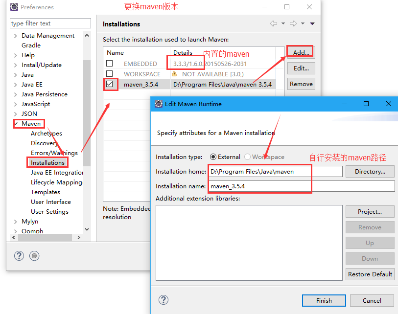

## maven常用命令
* clean 清理：mvn clean 
    将项目根目录下target目录清理掉  
* compile：编译  
将项目中.java文件编译为.class文件  
* test：单元测试  
单元测试类名有要求：XxxxTest.java  
将项目根目录下src/test/java目录下的单元测试类都会执行  
* package：打包  
web project --> war包  
java project --> jar包  
将项目打包，打包到项目根目录下target目录  
* install：安装  
打包到本地仓库  
解决本地多个项目共用一个jar包  

* maven项目的生命周期  
在maven中存在“三套”生命周期，每一套生命周期相互独立，互不影响  
在一套生命周期内，执行后面的命令前面的操作会自动执行  
    CleanLifeCycle：清理生命周期  
    Clean  
    defaultLiftCycle：默认生命周期  
    compile --> test --> package --> install --> deploy  
    siteLifeCycle：站点生命周期  
    site  
## maven整合web项目案例  
1. 配置eclipse的m2e插件（ee自带）  
2. 需要配置maven程序  
    
3. maven->UserSettings:指定本地仓库位置，使用UserSettings的位置为maven安装目录\conf\Settings.xml  
    设置UserSettings即可，会覆盖GlobalSettings  
4. 构建索引  
    Eclipse：window-> show view -> other:搜索Maven repositories -> Local repositories右键 rebuild index  
## maven整合servlet
* 缺失web.xml  拷贝一个其他web项目或手动创建一个  
* 修改maven默认编译jdk  
    pom.xml中更改  
    ```xml
    <build>
    <plugins>
    <!-- 设置编译版本为1.8 -->
    <plugin>
    <groupId>org.apache.maven.plugins</groupId>
    <artifactId>maven-compiler-plugin</artifactId>
    <configuration>
    <source>1.8</source>
    <target>1.8</target>
    <encoding>UTF-8</encoding>
    </configuration>
    </plugin>
    </plugins>
    </build>
    ```
    然后：项目上右键 -> maven -> update Project  
* 创建servlet报错，缺失jar包  
    添加依赖  
## 依赖范围  
|依赖范围|对于编译classpath有效|对于测试classpath有效|classpath有效|例子|  
|:-:|:-:|:-:|:-:|:-:|
|compile|Y|Y|Y|spring-core|  
|test|-|Y|-|JUnit|  
|provided|Y|Y|-|servlet-api|  
|runtime|-|Y|Y|JDBC驱动|  
|system|Y|Y|-|本地的，Maven仓库之外的类库|  
添加依赖范围：默认是compile  
provided：运行部署后不需要  
如果将servlet-api.jar设置为compile，打包后包含servlet-api.jar，war包部署到tomcat中存在servlet-api.jar包冲突，导致运行失败  
解决：  
在添加依赖界面，选中相应jar包，修改properties，scope选择provided，保存即可  

如果使用到tomcat自带jar包，一定要将依赖范围设置为provided  
servlet-api.jar  
jsp-api.jar  
## 整合struts2  
导入核心包，自动导入部分依赖包  
