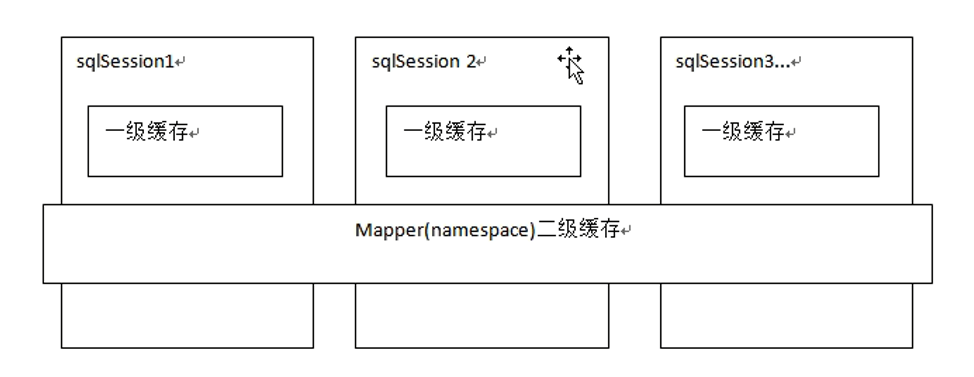
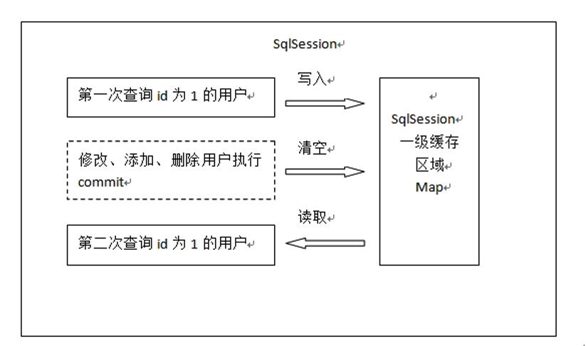
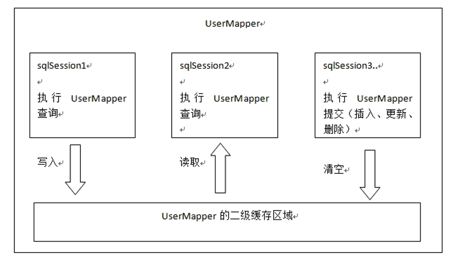

## 一对一查询
*   需求(查询所有订单信息，关联查询创建订单的用户信息)  
    查询所有订单信息，关联查询创建订单的用户信息  
    注意：因为一个订单信息只会是一个人下的订单，所以从查询订单信息出发关联查询用户信息为一对一查询。  
    如果从用户信息出发查询用户下的订单信息则为一对多查询，因为一个用户可以下多个订单。  
### 方法一：resultType
使用resultType，定义订单信息po类，此po类中包括了订单信息和用户信息：  
*   sql语句  
    确定查询的主表：订单表  
    确定查询的关联表：用户表  
    关联查询使用内链接？还是外链接？  
    由于orders表中有一个外键（user_id），通过外键关联查询用户表只能查询出一条记录，可以使用内链接  
    ```sql
    SELECT
        orders.*,
        USER.username,
        USER.sex,
        USER.address
    FROM
        orders,
        USER
    WHERE orders.user_id = user.id
    ```
*   创建pojo  
    将上边sql查询的结果映射到pojo中，pojo中必须包括所有查询列名(字段)  
    原始的Orders.java不能映射全部字段，需要新创建的pojo  
    创建一个pojo继承包括查询字段较多的po类  
    OrdersMapperCustom extends Order  
*   mapper.xml  
    ```xml
    <mapper namespace="me.test.mybatis.mapper.OrdersMapperCustom">
        <!-- 查询订单关联查询用户 -->
        <select id="findOrdersUser" resultType="me.test.mybatis.po.OrdersCustom">
            SELECT 
                orders.*,
                USER.username,
                USER.sex,
                USER.address
            FROM
                orders,
                USER
            WHERE orders.user_id = user.id
        </select>
    </mapper>
    ```
*   mapper.java  
    ```java
    public interface OrdersMapperCustom {
        //查询订单关联查询用户
        public List<OrdersCustom> findOrdersUser();
    }
    ```
*   测试代码  
    ```java
    public void testFindOrdersUser() {
        SqlSession sqlSession = sqlSessionFactory.openSession();

        //创建代理对象
        OrdersMapperCustom ordersMapperCustom = sqlSession.getMapper(OrderMapperCustom.class);

        //调用Mapper的方法
        List<OrdersCustom> list = ordersMapperCustom.findOrdersUser();
    }
    ```
### 方法二：resultMap
使用resultMap，定义专门的resultMap用于映射一对一查询结果  
*   sql语句  
    同resultType实现的sql  
*   使用resultMap映射的思路  
    使用resultMap将查询结果中的订单信息映射到Orders对象中，在orders类中添加User属性，将关联查询出来的用户信息映射到orders对象中的user属性中  
*   需要Orders类中添加user属性  
    在Orders类中加入User属性，user属性中用于存储关联查询的用户信息，因为订单关联查询用户是一对一关系，所以这里使用单个User对象存储关联查询的用户信息  
    ```java
    public class Orders {
        //添加用户属性
        private User user;
    }
*   mapper.xml  
    ```xml
    <!-- 订单查询关联用户的resultMap
    将整个查询结果映射到me.test.mybatis.po.Orders中 -->
    <resultMap type="me.test.mybatis.po.Orders" id="OrdersUserResultMap">
        <!-- 配置映射的订单信息 -->
        <!-- id：指定查询列中的唯一标识，订单信息中的唯一标识，如果有多个列组成唯一标识，配置多个id
            column:订单信息的唯一标识
            property:订单信息的唯一标识列所映射到orders中哪个属性 -->
        <id column="id" property="id"/>
        <result column="user_id" property="userId"/>
        <result column="number" property="number"/>
        <result column="createtime" property="createtime"/>
        <result column="note" property="note"/>
        
        <!-- 配置映射关联的用户信息 -->
        <!-- association:用于映射关联查询单个对象的信息
        property：将要关联查询的用户信息映射到orders中哪个属性 -->
        <association property="user" javaType="me.test.mybatis.po.User">
            <!-- id:关联查询用户的唯一标识
                column：指定唯一标识用户信息的列
                javaType：映射到user的哪个属性 -->
                <id column="user_id" property="id"/>
                <result column="username" property="username"/>
                <result column="sex" property="sex"/>
                <result column="address" property="address"/>
        </association>
    </resultMap>
    ```
    association：表示进行关联查询单条记录  
    property：表示关联查询的结果存储在cn.itcast.mybatis.po.Orders的user属性中  
    javaType：表示关联查询的结果类型  
    \<id column="user_id" property="id" />：查询结果的user_id列对应关联对象的id属性，这里是\<id/>表示user_id是关联查询对象的唯一标识  
    \<result column="username"  property="username"/>：查询结果的username列对应关联对象的username属性  
*   statement定义  
    ```xml
    <!-- 查询订单关联查询用户信息，使用resultMap -->
    <select id="findOrdersUserResultMap" resultMap="OrdersUserResultMap">
        SELECT 
            orders.*,
            USER.username,
            USER.sex,
            USER.address
        FROM
            orders,
            USER
        WHERE orders.user_id = user.id
    </select>
    ```
*   mapper.java  
    ```java
    //查询订单关联查询用户使用resultMap
    public List<Orders> findOrdersUserResultMap();
    ```
*   测试代码  
    ```java
    public void testFindOrdersUserResultMap() {
        SqlSession sqlSession = sqlSessionFactory.openSession();

        //创建代理对象
        OrdersMapperCustom ordersMapperCustom = sqlSession.getMapper(OrderMapperCustom.class);

        //调用Mapper的方法
        List<Orders> list = ordersMapperCustom.findOrdersUserResultMap();
    }
    ```
### resultType和resultMap实现一对一查询小结
    实现一对一查询：  
        resultType：使用resultType实现较为简单，如果pojo中没有包括查询出来的列名，需要增加列名对应的属性，即可完成映射  
        如果没有查询结果的特殊要求建议使用resultType  
        resultMap：需要单独定义resultMap，实现有点麻烦，如果对查询结果有特殊的要求，使用resultMap可以完成将关联查询映射pojo的属性中  
        resultMap可以实现延迟加载，resultType无法实现延迟加载  
## 一对多查询
*   需求(查询订单及订单明细的信息)  
    查询订单及订单明细的信息  
*   sql语句  
    确定主查询表：订单表  
    确定关联查询表：订单明细表  
    在一对一查询基础上添加订单明细表关联即可  
    ```sql
    SELECT 
        orders.*,
        USER.username,
        USER.sex,
        USER.address,
        orderdetail.id orderdetail_id,
        orderdetail.items_id,
        orderdetail.items_num,
        orderdetail.orders_id
    FROM
        orders,
        USER,
        orderdetail
    WHERE orders.user_id = user.id AND orderdetail.orders_id=orders.id
    ```
*   分析  
    使用resultType将上边的查询结果映射到pojo中，订单信息的就是重复  
    要求：  
    对orders映射不能出现重复记录  
    在orders.java类中添加List\<orderDetail> orderDetails属性  
    最终会将订单信息映射到orders中，订单所对应的订单明细映射到orders中的orderDetails属性中  
*   在orders中添加list订单明细属性  
    ```java
    public class Orders {
        //添加用户属性
        private List<Orderdetails> ordertails;
    }
    ```
*   mapper.xml  
    ```xml
    <!-- 查询订单关联查询用户及订单明细，使用resultMap -->
    <select id="findOrdersAndOrderDetailResultMap" resultMap="OrdersAndOrderDetailResultMap">
        SELECT 
            orders.*,
            USER.username,
            USER.sex,
            USER.address，
            orderdetail.items_id,
            orderdetail.items_num,
            orderdetail.orders_id
        FROM
            orders,
            USER,
            orderdetail
        WHERE orders.user_id = user.id AND orderdetail.orders_id=orders.id
    </select>
    ```
*   resultMap定义  
    ```xml
    <!-- 订单及订单明细resultMap
        使用extends继承，不用再在此处配置订单信息和用户信息的映射
     -->
    <resultMap type="me.test.mybatis.po.Orders" id="OrdersAndOrderDetailResultMap" extends="OrdersUserResultMap">
        <!-- 订单信息 -->
        <!-- 用户信息 -->
        <!-- 使用extends继承，不用再在此处配置订单信息和用户信息的映射 -->
        
        <!-- 订单明细信息
        一个订单关联查询出了多条明细，要使用collection进行映射
        collection：将关联查询到多条记录映射到集合对象中
        property:将关联查询到多条记录映射到me.test.mybatis.po.Orders哪个属性
        ofType:指定映射到list集合属性中pojo的类型
        -->
        <collection property="orderdetails" ofType="me.test.mybatis.po.Orderdetail">
            <!-- id:订单明细唯一标识
            property：要将订单明细的唯一标识映射到me.test.mybatis.po.Orders哪个属性 -->
            <id column="orderdetail_id" property="id"/>
            <result column="orders_id" property="ordersId"/>
            <result column="items_id" property="iteansId"/>
            <result column="items_num" property="itemsNum"/>
        </collection>
    </resultMap>
     ```
    collection部分定义了查询订单明细信息  
    collection：表示关联查询结果集  
    property="orderdetails"：关联查询的结果集存储在cn.itcast.mybatis.po.Orders上哪个属性  
    ofType="cn.itcast.mybatis.po.Orderdetail"：指定关联查询的结果集中的对象类型即List中的对象类型  
    \<id />及\<result/>的意义同一对一查询。
*   mapper.java  
*   测试代码  
*   小结  
    mybatis使用resultMap的collection对关联查询的多条记录映射到一个list集合属性中  
    使用resultType实现：
    将订单明细映射到orders中的orderdetails中，需要自己处理，使用双重循环遍历，去掉重复记录，将订单明细放在orderdetails中  
## 多对多查询
*   需求(查询用户及用户购买商品信息)  
    查询用户及用户购买商品信息  
*   sql语句  
    查询主表是：用户表  
    关联表：由于用户和商品没有直接关联，通过订单和订单明细进行关联，所以关联表:orders、orderdetail、items
    ```sql
    SELECT 
        orders.*,
        USER.username,
        USER.sex,
        USER.address,
        orderdetail.id orderdetail_id,
        orderdetail.items_id,
        orderdetail.items_num,
        orderdetail.orders_id,
        items.name items_name,
        items.detail items_detail,
        items.price items_price
    FROM
        orders,
        USER,
        orderdetail,
        items
    WHERE orders.user_id = user.id 
    AND orderdetail.orders_id=orders.id 
    AND orderdetail.items_id = items.id
    ```
*   映射思路  
    将用户信息映射到user中  
    在user类中添加订单列表属性List<Orders> orderslist，将用户创建的订单映射到orderslist  
    在Orders中添加订单明细列表属性List<OrderDetail>orderdetials，将订单的明细映射到orderdetials  
    在OrderDetail中添加Items属性，将订单明细所对应的商品映射到Items  
*   mapper.xml  
    ```xml
    <!-- 查询用户及购买的商品信息，使用resultMap -->
    <select id="findUserAndItemsResultMap" resultMap="UserAndItemsResultMap">
        SELECT 
	        orders.*,
	        USER.username,
	        USER.sex,
	        USER.address,
	        orderdetail.id orderdetail_id,
	        orderdetail.items_id,
	        orderdetail.items_num,
	        orderdetail.orders_id,
	        items.name items_name,
	        items.detail items_detail,
	        items.price items_price
	    FROM
	        orders,
	        USER,
	        orderdetail,
	        items
	    WHERE orders.user_id = user.id 
	    AND orderdetail.orders_id=orders.id 
	    AND orderdetail.items_id = items.id
    </select>
    ```
*   resultMap定义  
    需要关联查询映射的信息是：订单、订单明细、商品信息  
    订单：一个用户对应多个订单，使用collection映射到用户对象的订单列表属性中  
    订单明细：一个订单对应多个明细，使用collection映射到订单对象中的明细属性中  
    商品信息：一个订单明细对应一个商品，使用association映射到订单明细对象的商品属性中  
    ```xml
    <!-- 订单信息
        一个用户对应多个订单，使用collection映射
        property：将关联查询到多条记录映射到 me.test.mybatis.po.User哪个属性
        ofType：指定映射到list集合属性中pojo的类型-->
        <collection property="ordersList" ofType="me.test.mybatis.po.Orders">
            <id column="id" property="userId"/>
            <result column="user_id" property="userId"/>
            <result column="number" property="number"/>
            <result column="createtime" property="createtime"/>
            <result column="note" property="note"/>
            
            <!-- 订单明细，一个订单包括多个明细 -->
            <collection property="orderdetails" ofType="me.test.mybatis.po.Orderdetail">
            <result column="orders_id" property="ordersId"/>
            <result column="items_id" property="itemsId"/>
            <result column="items_num" property="itemsNum"/>
            <!-- 商品信息，一个订单明细对应一个商品 -->
            <association property="items" javaType="me.test.mybatis.po.Items">
                <id column="items_id" property="id"/>
                <result column="items_name" property="name"/>
                <result column="items_detail" property="detail"/>
                <result column="items_price" property="price"/>
            </association>           
        </collection>
    </resultMap>
    ```
*   mapper.java  
    ```java
    //查询用户购买商品信息
    public List<User> findUserAndItemsResultMap();
    ```
*   测试代码  
*   多对多查询总结  
    将查询用户购买的商品信息明细清单，（用户名、用户地址、购买商品名称、购买商品时间、购买商品数量）  
    针对上边的需求就使用resultType将查询到的记录映射到一个扩展的pojo中，很简单实现明细清单的功能  

    一对多是多对多的特例，如下需求：
    查询用户购买的商品信息，用户和商品的关系是多对多关系  
    需求1：  
    查询字段：用户账号、用户名称、用户性别、商品名称、商品价格(最常见)  
    企业开发中常见明细列表，用户购买商品明细列表  
    使用resultType将上边查询列映射到pojo输出  
 
    需求2：  
    查询字段：用户账号、用户名称、购买商品数量、商品明细（鼠标移动到上面后显示明细）  
    使用resultMap将用户购买的商品明细列表映射到user对象中  

总结：  
使用resultMap是针对那些对查询结果映射有特殊要求的功能，比如特殊要求映射成list中包括多个list  
## resultMap总结
*   resultType：  
    作用：将查询结果按照sql列名pojo属性名一致性映射到pojo中  
    场合：  
    常见一些明细记录的展示，比如用户购买商品明细，将关联查询信息全部展示在页面时，此时可直接使用resultType将每一条记录映射到pojo中，在前端页面遍历list（list中是pojo）即可  
*   resultMap：
    使用association和collection完成一对一和一对多高级映射（对结果有特殊的映射要求）  
    
    association：  
    作用：将关联查询信息映射到一个pojo对象中  
    场合：
    为了方便查询关联信息可以使用association将关联订单信息映射为用户对象的pojo属性中  
    比如：查询订单及关联用户信息  
    使用resultType无法将查询结果映射到pojo对象的pojo属性中，根据对结果集查询遍历的需要选择使用resultType还是resultMap  
    
    collection：  
    作用：将关联查询信息映射到一个list集合中  
    场合：  
    为了方便查询遍历关联信息可以使用collection将关联信息映射到list集合中  
    比如：查询用户权限范围模块及模块下的菜单，可使用collection将模块映射到模块list中，将菜单列表映射到模块对象的菜单list属性中，这样的作的目的也是方便对查询结果集进行遍历查询  
　　如果使用resultType无法将查询结果映射到list集合中  
## 延迟加载
### 什么是延迟加载
需要查询关联信息时，使用mybatis延迟加载特性可有效的减少数据库压力，首次查询只查询主要信息，关联信息等用户获取时再加载  

resultMap可以实现高级映射（使用association、collection实现一对一及一对多映射），**association、collection**具备延迟加载功能。

需求：  
如果查询订单并且关联查询用户信息。如果先查询订单信息即可满足要求，当我们需要查询用户信息时再查询用户信息。把对用户信息的按需去查询就是延迟加载  
延迟加载：先从单表查询、需要时再从关联表去关联查询，大大提高数据库性能，因为查询单表要比关联查询多张表速度要快  
### 使用association实现延迟加载
需求(查询订单并且关联查询用户信息)  
查询订单并且关联查询用户信息  
默认只查询订单信息，当需要查询用户信息时再去查询用户信息  
*   mapper.xml  
    需要定义两个mapper的方法对应的statement  
    （1）只查询订单信息  
    SELECT * FROM orders  
    在查询订单的statement中使用association去延迟加载（执行）下边的satatement(关联查询用户信息)  
    ```xml
    <!-- 查询订单关联查询用户，用户信息需要延迟加载 -->
    <select id="findOrdersUserLazyLoading" resultMap="OrdersUserLazyLoadingResultMap">
        select * from orders
    </select>
    ```
    （2）关联查询用户信息  
    通过上边查询到的订单信息中user_id去关联查询用户信息  
    使用UserMapper.xml中的findUserById  
    ```xml
    <select id="findUserById"  parameterType="int" resultMap="user">
        select * from user where id=#{value}
    </select>
    ```
    上边先去执行findOrdersUserLazyLoading，当需要去查询用户的时候再去执行findUserById，通过resultMap的定义将延迟加载执行配置起来  
*   延迟加载resultMap  
    使用association中的select指定延迟加载去执行的statement的id  
    ```xml
    <!-- 延迟加载的resultMap -->
    <resultMap type="me.test.mybatis.po.Orders" id="OrdersUserLazyLoadingResultMap">
        <!-- 对订单信息进行映射配置 -->
        <id column="id" property="id"/>
        <result column="user_id" property="userId"/>
        <result column="number" property="number"/>
        <result column="createtime" property="createtime"/>
        <result column="note" property="note"/>
        <!-- 实现对用户信息进行延迟加载
            select:指定延迟加载需要执行的statement的id（是根据user_id查询用户信息的statement）
            要使用userMapper.xml中findUserById完成根据用户id（user_id）用户信息的查询，如果findUserById不在本mapper中需要前边加namespace
            column：订单信息中关联用户信息查询的列，是user_id
            关联查询的sql理解为：
            select orders.*,
                (select username from user where orders.user_id=user.id) username,
                (select sex from user where orders.user_id=user.id) sex
            from orders
         -->
         <association property="user" javaType="me.test.mybatis.po.User" select="me.test.mybatis.mapper.UserMapper.findUserById" column="user_id">
         </association>
    </resultMap>
    ```
*   mapper.java  
    ```java
    //查询订单关联查询用户，用户信息是延迟加载的
    public List<Orders> findOrdersUserLazyLoading();
    ```
*   测试  
    （1）测试思路：  
    执行上边mapper方法（findOrdersUserLazyLoading），内部去调用me.test.mybatis.mapper.OrdersMapperCustom中的findOrdersUserLazyLoading只查询orders信息（单表）  
    在程序中去遍历上一步骤查询出的List<Orders>，当我们调用Orders中的getUser方法时，开始进行延迟加载  
    延迟加载，去调用UserMapper.xml中findUserbyId这个方法获取用户信息  

*   延迟加载配置  
    mybatis默认没有开启延迟加载，需要在SqlMapConfig.xml中setting配置  
    在mybatis核心配置文件中配置：lazyLoadingEnabled、aggressiveLazyLoading  
    |设置项|描述|允许值|默认值|
    |:-:|:-|:-:|:-:|
    |lazyLoadingEnabled|全局性设置懒加载。如果设为‘false’，则所有相关联的都会被初始化加载|true \| false|false|
    |aggressiveLazyLoading|当设置为‘true’的时候，懒加载的对象可能被任何懒属性全部加载。否则，每个属性都按需加载|true \| false|true|
    
    在SqlMapConfig.xml中配置  
    ```xml
    <!-- 全局参数配置，需要时再配置 -->
    <settings>
        <!-- 打开延迟加载的开关 -->
        <setting name="lazyLoadingEnabled" value="true"/>
        <!-- 将积极加载改为消极加载即按需加载 -->
        <setting name="aggressiveLazyLoading" value="false"/>
    </settings>
    ```
*   测试代码
*   延迟加载思考  
    不使用mybatis提供的association及collection中的延迟加载功能，如何实现延迟加载？  
    实现方法如下：  
    针对订单和用户两个表定义两个mapper方法：  
    （1）查询订单列表  
    （2）根据用户id查询用户信息  
    实现思路：  
    先去查询第一个mapper方法，获取订单信息列表  
    在程序中（service），按需去调用第二个mapper方法去查询用户信息  

    延迟加载作用：  
    当需要查询关联信息时再去数据库查询，默认不去关联查询，提高数据库性能  
    只有使用resultMap支持延迟加载设置  
    场合：  
    当只有部分记录需要关联查询其它信息时，此时可按需延迟加载，需要关联查询时再向数据库发出sql，以提高数据库性能。  
    当全部需要关联查询信息时，此时不用延迟加载，直接将关联查询信息全部返回即可，可使用resultType或resultMap完成映射  
    总之：  
    使用延迟加载方法，先去查询简单的sql（最好单表，也可以关联查询），再去按需要加载关联查询的其它信息  
## 查询缓存
### 什么是查询缓存
mybatis提供查询缓存，用于减轻数据压力，提高数据库性能  
mybaits提供一级缓存，和二级缓存  

一级缓存是SqlSession级别的缓存。在操作数据库时需要构造 sqlSession对象，在对象中有一个数据结构（HashMap）用于存储缓存数据。不同的sqlSession之间的缓存数据区域（HashMap）是互相不影响的。  
Mybatis一级缓存的作用域是同一个SqlSession，在同一个sqlSession中两次执行相同的sql语句，第一次执行完毕会将数据库中查询的数据写到缓存（内存），第二次会从缓存中获取数据将不再从数据库查询，从而提高查询效率  
当一个sqlSession结束后该sqlSession中的一级缓存也就不存在了。Mybatis默认开启一级缓存  

二级缓存是mapper级别的缓存，多个SqlSession去操作同一个Mapper的sql语句，多个SqlSession可以共用二级缓存，二级缓存是跨SqlSession的  
Mybatis二级缓存是多个SqlSession共享的，其作用域是mapper的同一个namespace，不同的sqlSession两次执行相同namespace下的sql语句且向sql中传递参数也相同即最终执行相同的sql语句，第一次执行完毕会将数据库中查询的数据写到缓存（内存），第二次会从缓存中获取数据将不再从数据库查询，从而提高查询效率  
Mybatis默认没有开启二级缓存需要在setting全局参数中配置开启二级缓存  


为什么要用缓存？  
如果缓存中有数据就不用从数据库中获取，大大提高系统性能  
### 一级缓存
*   一级缓存工作原理  
    下图是根据id查询用户的一级缓存图解：  
    
    第一次发起查询用户id为1的用户信息，先去找缓存中是否有id为1的用户信息，如果没有，从数据库查询用户信息  
    得到用户信息，将用户信息存储到一级缓存中  

    如果sqlSession去执行commit操作（执行插入、更新、删除），清空SqlSession中的一级缓存，这样做的目的为了让缓存中存储的是最新的信息，避免脏读  

    第二次发起查询用户id为1的用户信息，先去找缓存中是否有id为1的用户信息，缓存中有，直接从缓存中获取用户信息  
 
    一级缓存区域是根据SqlSession为单位划分的，每次查询会先从缓存区域找，如果找不到从数据库查询，查询到数据将数据写入缓存  
    Mybatis内部存储缓存使用一个HashMap，key为hashCode+sqlId+Sql语句。value为从查询出来映射生成的java对象  
    sqlSession执行insert、update、delete等操作commit提交后会清空缓存区域  
*   一级缓存测试  
    mybatis默认支持一级缓存，不需要在配置文件去配置  
*   一级缓存应用  
    正式开发，是将mybatis和spring进行整合开发，事务控制在service中  
    一个service方法中包括 很多mapper方法调用  
    ```
    service{
    　　//开始执行时，开启事务，创建SqlSession对象

    　　//第一次调用mapper的方法findUserById(1)

    　　//第二次调用mapper的方法findUserById(1)，从一级缓存中取数据

    　　//方法结束，sqlSession关闭
    }
    ```
    如果是执行两次service调用查询相同的用户信息，就不走一级缓存，因为第一个service方法结束，sqlSession就关闭，一级缓存就清空  
### 二级缓存
*   原理  
    下图是多个sqlSession请求UserMapper的二级缓存图解  
      
    首先开启mybatis的二级缓存  
    sqlSession1去查询用户id为1的用户信息，查询到用户信息会将查询数据存储到二级缓存中  
    如果SqlSession3去执行相同 mapper下sql，执行commit提交，清空该 mapper下的二级缓存区域的数据  
    sqlSession2去查询用户id为1的用户信息，去缓存中找是否存在数据，如果存在直接从缓存中取出数据  

二级缓存区域是根据mapper的namespace划分的，相同namespace的mapper查询数据放在同一个区域，如果使用mapper代理方法每个mapper的namespace都不同，此时可以理解为二级缓存区域是根据mapper划分  

每次查询会先从缓存区域找，如果找不到从数据库查询，查询到数据将数据写入缓存  

Mybatis内部存储缓存使用一个HashMap，key为hashCode+sqlId+Sql语句。value为从查询出来映射生成的java对象  
sqlSession执行insert、update、delete等操作commit提交后会清空缓存区域  

 

*   二级缓存与一级缓存区别  
    二级缓存的范围更大，多个sqlSession可以共享一个UserMapper的二级缓存区域  
    UserMapper有一个二级缓存区域（按namespace分） ，其它mapper也有自己的二级缓存区域（按namespace分）  
    每一个namespace的mapper都有一个二缓存区域，两个mapper的namespace如果相同，这两个mapper执行sql查询到数据将存在相同 的二级缓存区域中  
*   开启二级缓存  
    mybaits的二级缓存是mapper范围级别，除了在SqlMapConfig.xml设置二级缓存的总开关，还要在具体的mapper.xml中开启二级缓存  
    在核心配置文件SqlMapConfig.xml中加入  
    ```xml
    <!-- 开启二级缓存 -->
    <setting name="cacheEnabled" value="true"/>
    ```  
    ||描述|允许值|默认值|
    |:-:|:-:|:-:|:-:|
    |cacheEnabled|对在此配置文件下的所有cache 进行全局性开/关设置|true \| false|true|
    在UserMapper.xml中开启二缓存，UserMapper.xml下的sql执行完成会存储到它的缓存区域（HashMap）  
    ```xml
    <!-- 开启本mapperd的namespace下的二级缓存 -->
    <cache />
    ```  
*   调用pojo类实现序列化接口  
    二级缓存需要查询结果映射的pojo对象实现java.io.Serializable接口实现序列化和反序列化操作，注意如果存在父类、成员pojo都需要实现序列化接口  
    为了将缓存数据取出执行反序列化操作，因为二级缓存数据存储介质多种多样，不一定在内存  
*   测试
*   useCache配置禁用二级缓存  
    在statement中设置useCache=false可以禁用当前select语句的二级缓存，即每次查询都会发出sql去查询，默认情况是true，即该sql使用二级缓存  
    ```xml
    <select id="findOrderListResultMap" resultMap="ordersUserMap" useCache="false">
    ```
    总结：针对每次查询都需要最新的数据sql，要设置成useCache=false，禁用二级缓存  
*   刷新缓存（就是清空缓存）  
    在mapper的同一个namespace中，如果有其它insert、update、delete操作数据后需要刷新缓存，如果不执行刷新缓存会出现脏读  
    设置statement配置中的flushCache="true" 属性，默认情况下为true即刷新缓存，如果改成false则不会刷新。使用缓存时如果手动修改数据库表中的查询数据会出现脏读  
    如下：  
    ```xml
    <insert id="insertUser" parameterType="cn.itcast.mybatis.po.User" flushCache="true">
    ```
    总结：一般下执行完commit操作都需要刷新缓存，flushCache=true表示刷新缓存，这样可以避免数据库脏读  
*   Mybatis Cache参数  
    flushInterval（刷新间隔）可以被设置为任意的正整数，而且它们代表一个合理的毫秒形式的时间段。默认情况是不设置，也就是没有刷新间隔，缓存仅仅调用语句时刷新  
    size（引用数目）可以被设置为任意正整数，要记住你缓存的对象数目和你运行环境的可用内存资源数目。默认值是1024  
    readOnly（只读）属性可以被设置为true或false。只读的缓存会给所有调用者返回缓存对象的相同实例。因此这些对象不能被修改。这提供了很重要的性能优势。可读写的缓存会返回缓存对象的拷贝（通过序列化）。这会慢一些，但是安全，因此默认是false  
    如下例子：  
    ```xml
    <cache  eviction="FIFO"  flushInterval="60000"  size="512"  readOnly="true"/>
    ```
    这个更高级的配置创建了一个 FIFO 缓存,并每隔 60 秒刷新,存数结果对象或列表的 512 个引用,而且返回的对象被认为是只读的,因此在不同线程中的调用者之间修改它们会导致冲突。可用的收回策略有, 默认的是 LRU:  
    1. LRU – 最近最少使用的:移除最长时间不被使用的对象  
    2. FIFO – 先进先出:按对象进入缓存的顺序来移除它们  
    3. SOFT – 软引用:移除基于垃圾回收器状态和软引用规则的对象  
    4. WEAK – 弱引用:更积极地移除基于垃圾收集器状态和弱引用规则的对象  
### mybatis整合ehcache 
EhCache 是一个纯Java的进程内缓存框架，是一种广泛使用的开源Java分布式缓存，具有快速、精干等特点，是Hibernate中默认的CacheProvider  
#### 分布缓存
    系统为了提高系统并发，性能、一般对系统进行分布式部署（集群部署方式）  
    不使用分布缓存，缓存的数据在各个服务器单独存储，不方便系统开发。所以要使用分布式缓存对缓存数据进行集中管理  
    mybatis无法实现分布式缓存，需要和其它分布式缓存框架进行整合  
#### 整合方法(掌握)
mybatis提供了一个二级缓存cache接口，如果要实现自己的缓存逻辑，实现cache接口开发即可  
*   以ehcache为例  
    mybatis和ehcache整合，mybatis和ehcache整合包中提供了一个cache接口的实现类  
    通过实现Cache接口可以实现mybatis缓存数据通过其它缓存数据库整合，mybatis的特长是sql操作，缓存数据的管理不是mybatis的特长，为了提高缓存的性能将mybatis和第三方的缓存数据库整合，比如ehcache、memcache、redis等  
    mybatis默认实现cache类是PerpetualCache  

    第一步：加入ehcache包  
    mybatis-ehcache-xxx.jar和ehcache-core-xxx.jar  
    第二步：开启ehcache缓存  
    配置mapper中cache中的type为ehcache对cache接口的实现类型  
    ```xml
        <!-- 开启本mapperd的namespace下的二级缓存 
        type:指定cache接口的实现类，mybatis默认使用PerpetualCache
        要和ehcache整合，需要配置type为ehcache实现cache接口的类型 -->
        <cache type="org.mybatis.caches.ehcache.EhcacheCache">
            <!-- 根据需求调整缓存参数 -->
            <property name="timeToIdleSeconds" value="3600"/>
            <property name="timeToLiveSeconds" value="3600"/>
            <!-- 同ehcache参数maxElementsInMemory-->
            <property name="maxEntriesLocalHeap" value="1000"/>
            <!-- 同ehcache参数maxElementsOnDisk-->
            <property name="maxEntriesLocalDisk" value="10000000"/>
            <property name="memoryStoreEvictionPolicy" value="LRU"/>
        </cache>
    ```
    第三步：加入ehcache的配置文件  
    在classpath下配置ehcache.xml  
    ```xml
    <ehcache xmlns:xsi="..." xsi:..>
        <diskStore path=""/>
        <defaultCache
            maxElementsInMemoru=""
            ...
        >
        </defaultCache>
    </ehcache>
    ```
    ```
    属性说明:
        diskStore：指定数据在磁盘中的存储位置。
        defaultCache：当借助CacheManager.add("demoCache")创建Cache时，EhCache便会采用<defalutCache/>指定的的管理策略  

        以下属性是必须的：  
        maxElementsInMemory - 在内存中缓存的element的最大数目  
        maxElementsOnDisk - 在磁盘上缓存的element的最大数目，若是0表示无穷大  
        eternal - 设定缓存的elements是否永远不过期。如果为true，则缓存的数据始终有效，如果为false那么还要根据timeToIdleSeconds，timeToLiveSeconds判断  
        overflowToDisk - 设定当内存缓存溢出的时候是否将过期的element缓存到磁盘上  

        以下属性是可选的：  
        timeToIdleSeconds - 当缓存在EhCache中的数据前后两次访问的时间超过timeToIdleSeconds的属性取值时，这些数据便会删除，默认值是0,也就是可闲置时间无穷大  
        timeToLiveSeconds - 缓存element的有效生命期，默认是0.,也就是element存活时间无穷大  
        diskSpoolBufferSizeMB 这个参数设置DiskStore(磁盘缓存)的缓存区大小.默认是30MB.每个Cache都应该有自己的一个缓冲区  
        diskPersistent - 在VM重启的时候是否启用磁盘保存EhCache中的数据，默认是false  
        diskExpiryThreadIntervalSeconds - 磁盘缓存的清理线程运行间隔，默认是120秒。每个120s，相应的线程会进行一次EhCache中数据的清理工作  
        memoryStoreEvictionPolicy - 当内存缓存达到最大，有新的element加入的时候， 移除缓存中element的策略。默认是LRU（最近最少使用），可选的有LFU（最不常使用）和FIFO（先进先出  
    ```
*   二级缓存应用场景
    对于访问多的查询请求且用户对查询结果实时性要求不高，此时可采用mybatis二级缓存技术降低数据库访问量，提高访问速度，业务场景比如：耗时较高的统计分析sql、电话账单查询sql等  
    实现方法如下：通过设置刷新间隔时间，由mybatis每隔一段时间自动清空缓存，根据数据变化频率设置缓存刷新间隔flushInterval，比如设置为30分钟、60分钟、24小时等，根据需求而定  
*   二级缓存局限性  
    mybatis二级缓存对细粒度的数据级别的缓存实现不好  
    比如如下需求：对商品信息进行缓存，由于商品信息查询访问量大，但是要求用户每次都能查询最新的商品信息，此时如果使用mybatis的二级缓存就无法实现当一个商品变化时只刷新该商品的缓存信息而不刷新其它商品的信息，因为mybaits的二级缓存区域以mapper为单位划分，当一个商品信息变化会将所有商品信息的缓存数据全部清空  
    解决此类问题需要在业务层根据需求对数据有针对性缓存  