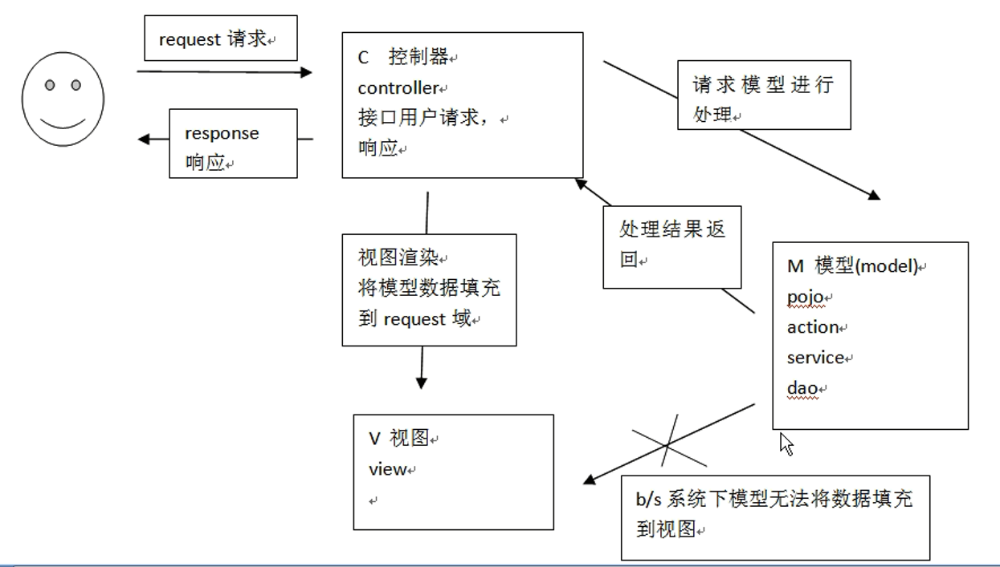
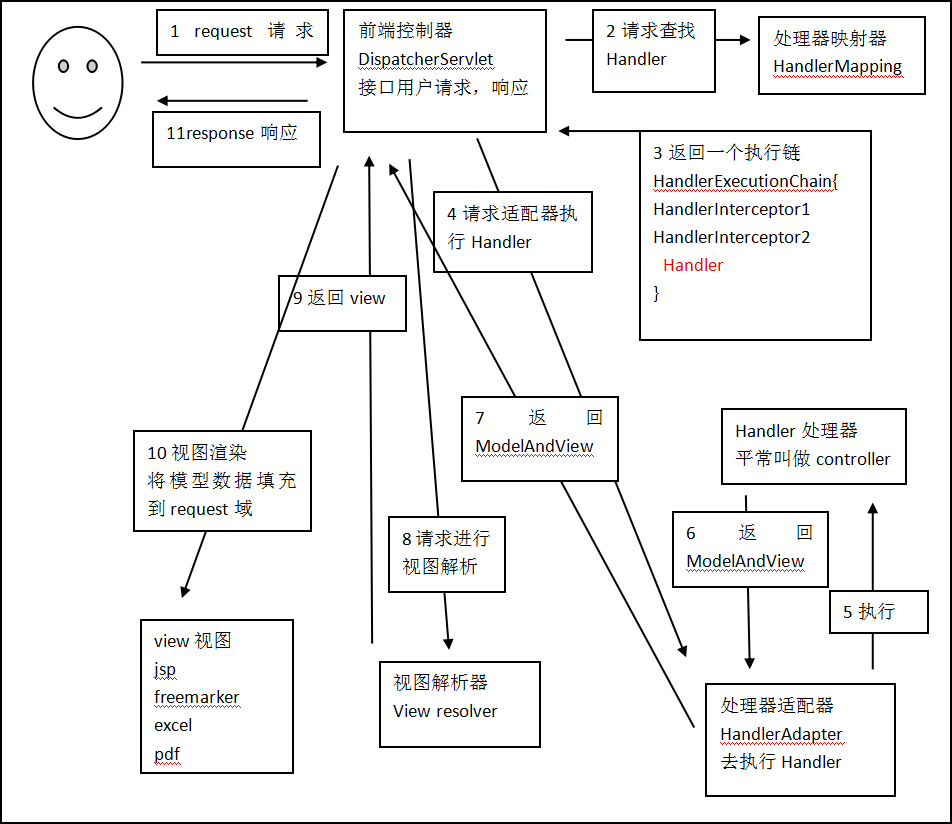

## springmvc框架
### 什么是springmvc
springmvc是spring框架的一个模块，springmvc和spring无需通过中间整合层进行整合  
springmvc是一个基于mvc的web框架  
### mvc在b/s系统 下的应用
mvc是一个设计模式，mvc在b/s系统下的应用  

1.  用户发起request请求至控制器(Controller),控制器接收用户请求的数据，委托给模型进行处理  
2. 控制器通过模型(Model)处理数据并得到处理结果。模型通常是指业务逻辑
3.  模型处理结果返回给控制器  
4.  控制器将模型数据在视图(View)中展示  
    web中模型无法将数据直接在视图上显示，需要通过控制器完成。如果在C/S应用中模型是可以将数据在视图中展示的  
5.  控制器将视图response响应给用户  
    通过视图展示给用户要的数据或处理结果  
### Spring web mvc框架

*   架构流程  
    第一步：发起请求到前端控制器(DispatcherServlet)  

    第二步：前端控制器请求HandlerMapping查找 Handler  
    可以根据xml配置、注解进行查找  
    
    第三步：处理器映射器HandlerMapping向前端控制器返回Handler  
    
    第四步：前端控制器调用处理器适配器去执行Handler  
    
    第五步：处理器适配器去执行Handler  
    
    第六步：Handler执行完成给适配器返回ModelAndView  
    \
    第七步：处理器适配器向前端控制器返回ModelAndView  
    ModelAndView是springmvc框架的一个底层对象，包括 Model和view

    第八步：前端控制器请求视图解析器去进行视图解析  
    根据逻辑视图名解析成真正的视图(jsp)

    第九步：视图解析器向前端控制器返回View  

    第十步：前端控制器进行视图渲染  
    视图渲染将模型数据(在ModelAndView对象中)填充到request域  

    第十一步：前端控制器向用户响应结果  


1.  用户发送请求至前端控制器DispatcherServlet  
2.  DispatcherServlet收到请求调用HandlerMapping处理器映射器  
3.  处理器映射器根据请求url找到具体的处理器，生成处理器对象及处理器拦截器(如果有则生成)一并返回给DispatcherServlet  
4.  DispatcherServlet通过HandlerAdapter处理器适配器调用处理器  
5.  执行处理器(Controller，也叫后端控制器)  
6.  Controller执行完成返回ModelAndView  
7.  HandlerAdapter将controller执行结果ModelAndView返回给DispatcherServlet  
8.  DispatcherServlet将ModelAndView传给ViewReslover视图解析器  
9.  ViewReslover解析后返回具体View  
10.  DispatcherServlet对View进行渲染视图（即将模型数据填充至视图中）  
11.  DispatcherServlet响应用户  

*   组件说明
1.  前端控制器DispatcherServlet（不需要程序员开发）  
    作用接收请求，响应结果，相当于转发器，中央处理器  
    有了DispatcherServlet减少了其它组件之间的耦合度  
2.  处理器映射器HandlerMapping(不需要程序员开发)  
    作用：根据请求的url查找Handler  
3.  处理器适配器HandlerAdapter  
    作用：按照特定规则（HandlerAdapter要求的规则）去执行Handler  
4.  处理器Handler(需要程序员开发)  
    注意：编写Handler时按照HandlerAdapter的要求去做，这样适配器才可以去正确执行Handler  
5.  视图解析器View resolver(不需要程序员开发)  
    作用：进行视图解析，根据逻辑视图名解析成真正的视图（view）  
6.  视图View(需要程序员开发jsp)  
    View是一个接口，实现类支持不同的View类型（jsp、freemarker、pdf...）  

    以下组件通常使用框架提供实现：  
    【1】DispatcherServlet：前端控制器  
    用户请求到达前端控制器，它就相当于mvc模式中的c，dispatcherServlet是整个流程控制的中心，由它调用其它组件处理用户的请求，dispatcherServlet的存在降低了组件之间的耦合性  

    【2】HandlerMapping：处理器映射器  
    HandlerMapping负责根据用户请求找到Handler即处理器，springmvc提供了不同的映射器实现不同的映射方式，例如：配置文件方式，实现接口方式，注解方式等  

    【3】Handler：处理器  
    Handler 是继DispatcherServlet前端控制器的后端控制器，在DispatcherServlet的控制下Handler对具体的用户请求进行处理  
    由于Handler涉及到具体的用户业务请求，所以一般情况需要程序员根据业务需求开发Handler  

    【4】HandlAdapter：处理器适配器  
    通过HandlerAdapter对处理器进行执行，这是适配器模式的应用，通过扩展适配器可以对更多类型的处理器进行执行  

    【5】View Resolver：视图解析器  
    View Resolver负责将处理结果生成View视图，View Resolver首先根据逻辑视图名解析成物理视图名即具体的页面地址，再生成View视图对象，最后对View进行渲染将处理结果通过页面展示给用户  
    springmvc框架提供了很多的View视图类型，包括：jstlView、freemarkerView、pdfView等  
    一般情况下需要通过页面标签或页面模版技术将模型数据通过页面展示给用户，需要由程序员根据业务需求开发具体的页面  
## 入门程序
### 需求
    功能需求：商品列表查询  
### 环境准备
数据库环境  
java环境  
springmvc版本：需要spring3.2所有jar（一定包括spring-webmvc-3.2.0.RELEASE.jar）  
### 配置前端控制器
在WEB-INF\web.xml中配置前端控制器  
```xml
<!--springmvc前端控制器-->
<servlet>
    <servlet-name>springmvc</servlet-name>
    <servlet-class>org.springframework.web.servlet.DispatcherServlet</servlet-class>
    <!--contextConfigLocation配置springmvc加载的配置文件（配置处理器映射器，适配器等等）
    如果不配置contextConfigLocation，默认加载的是/WEB-INF/servlet名称-servlet.xml(springmvc-servlet.xml)-->
    <init-param>
        <param-name>contextConfigLocation</param-name>
        <param-value>classpath:springmvc.xml</param-value>
    </init-param>
</servlet>
<servlet-mapping>
    <servlet-name>springmvc</servlet-name>
    <!-- 第一种：*.action,访问以.action结尾 由DispatcherServlet进行解析
    第二种： /,所以访问的地址都有DispatcherServlet进行解析,对于静态文件的解析需要配置不让DispatcherServlet进行解析
            使用这种方式可以实现RESTful风格的url
    第三种：/*,这样配置不对，使用这种配置，最终都要转发到一个jsp页面时，
            仍然会由DispatcherServlet解析jsp地址，不能根据jsp页面找到handler，会报错-->
    <url-pattern>*.action</url-pattern>
</servlet-mapping>
```
*   Servlet拦截方式  
    1. 拦截固定后缀的url，比如设置为 *.do、*.action， 例如：/user/add.action  
    此方法最简单，不会导致静态资源（jpg,js,css）被拦截  

    2. 拦截所有，设置为/，例如：/user/add  /user/add.action  
    此方法可以实现REST风格的url，很多互联网类型的应用使用这种方式  
    但是此方法会导致静态文件（jpg,js,css）被拦截后不能正常显示。需要特殊处理  

    3. 拦截所有，设置为/*，此设置方法错误，因为请求到Action，当action转到jsp时再次被拦截，提示不能根据jsp路径mapping成功  
### 配置处理器适配器
在classpath下的springmvc.xml中配置处理器适配器  
```xml
<!-- 处理器适配器 所有处理器适配器都实现 HandlerAdapter接口 -->
<bean class="org.springframework.web.servlet.mvc.SimpleControllerHandlerAdapter" />
```
SimpleControllerHandlerAdapter：即简单控制器处理适配器  
所有实现了org.springframework.web.servlet.mvc.Controller 接口的Bean作为Springmvc的后端控制器  
通过查看源代码  
```java
public class SimpleControllerHandlerAdapter implements HandlerAdapter {
    public SimpleControllerHandlerAdapter() {
    }

    public boolean supports(Object handler) {
        return handler instanceof Controller;
    }
}
```
此适配器能执行实现 Controller接口的Handler  
```java
//Controller源码
public interface Controller {
    ModelAndView handleRequest(HttpServletRequest var1, HttpServletResponse var2) throws Exception;
}

返回ModelAndView对象
```
### 开发Handler
需要实现 controller接口，才能由org.springframework.web.servlet.mvc.SimpleControllerHandlerAdapter适配器执行  
1.  把逆向工程生成的pojo对象拷过来用  
2.  
```java
public class ItemsController1 implements Controller {

	@Override
	public ModelAndView handleRequest(HttpServletRequest request,
			HttpServletResponse response) throws Exception {		
		//调用service查找 数据库，查询商品列表，这里使用静态数据模拟
		List<Items> itemsList = new ArrayList<Items>();
		//向list中填充静态数据
		Items items_1 = new Items();
		items_1.setName("联想笔记本");
		items_1.setPrice(6000f);
		items_1.setDetail("ThinkPad T430 联想笔记本电脑！");
		
		Items items_2 = new Items();
		items_2.setName("苹果手机");
		items_2.setPrice(5000f);
		items_2.setDetail("iphone6苹果手机！");
		
		itemsList.add(items_1);
		itemsList.add(items_2);
		//返回ModelAndView
		ModelAndView modelAndView =  new ModelAndView();
		//相当 于request的setAttribut，在jsp页面中通过itemsList取数据
		modelAndView.addObject("itemsList", itemsList);
		
		//指定视图
		modelAndView.setViewName("/WEB-INF/jsp/items/itemsList.jsp");

		return modelAndView;
	}
}
```
org.springframework.web.servlet.mvc.Controller：处理器必须实现Controller 接口  
ModelAndView：包含了模型数据及逻辑视图名  
### 视图编写
/WEB-INF下创建jsp等显示页面  
### 配置Handler
将编写Handler在spring容器加载  
```xml
<!-- 配置Handler -->
<bean name="/queryItems_test.action" class="cn.itcast.ssm.controller.ItemsController1" />
```
name="/queryItems.action"：前边配置的处理器映射器为BeanNameUrlHandlerMapping，如果请求的URL 为“上下文/queryItems.action”将会成功映射到ItemsController1控制器
### 配置处理器映射器
在classpath下的springmvc.xml中配置处理器映射器  
```xml
<!-- 处理器映射器 将bean的name作为url进行查找 ，需要在配置Handler时指定beanname（就是url） 
	所有的映射器都实现 HandlerMapping接口。
	-->
<bean class="org.springframework.web.servlet.handler.BeanNameUrlHandlerMapping" />
```
BeanNameUrlHandlerMapping：表示将定义的Bean名字作为请求的url，需要将编写的controller在spring容器中进行配置，且指定bean的name为请求的url，且必须以.action结尾  
### 配置视图解析器
需要配置解析jsp的视图解析器  
```xml
<!-- 视图解析器
	解析jsp解析，默认使用jstl标签，classpath下的得有jstl的包
	 -->
	<bean
		class="org.springframework.web.servlet.view.InternalResourceViewResolver">\

        <!-- 配置jsp路径的前缀 -->
		<property name="prefix" value="/WEB-INF/jsp/"/>
		<!-- 配置jsp路径的后缀 -->
		<property name="suffix" value=".jsp"/>
	</bean>
```
*   如果视图解析器配置前缀和后缀，handle程序中不用指定前缀和后缀  
    ```java
    //指定视图
    //下边的路径，如果在视图解析器中配置jsp路径的前缀和jsp路径的后缀，修改为
    原来的代码：modelAndView.setViewName("/WEB-INF/jsp/items/itemsList.jsp");
    //上边的路径配置可以不在程序中指定jsp路径的前缀和jsp路径的后缀
    modelAndView.setViewName("items/itemsList");
    ```
### 部署调试
## 非注解的处理器映射器和适配器
### 非注解的处理器映射器
*   HandlerMapping处理器映射器  
    HandlerMapping 负责根据request请求找到对应的Handler处理器及Interceptor拦截器，将它们封装在HandlerExecutionChain 对象中给前端控制器返回  

*   BeanNameUrlHandlerMapping  
    BeanNameUrl处理器映射器，根据请求的url与spring容器中定义的bean的name进行匹配，从而从spring容器中找到bean实例  
    处理器映射器：  
    org.springframework.web.servlet.handler.BeanNameUrlHandlerMapping  
    ```xml
    <!--beanName Url映射器 -->
    <bean class="org.springframework.web.servlet.handler.BeanNameUrlHandlerMapping"/>
    ```

*   SimpleUrlHandlerMapping  
    simpleUrlHandlerMapping是BeanNameUrlHandlerMapping的增强版本，它可以将url和处理器bean的id进行统一映射配置  
    ```xml
    <!-- 配置Handler -->
	<bean id="itemsController1" name="/queryItems_test.action" class="cn.itcast.ssm.controller.ItemsController1" />
	<!-- 配置另外一个Handler -->
	<bean id="itemsController2" class="cn.itcast.ssm.controller.ItemsController2" />

    <!--简单url映射  -->
	<bean class="org.springframework.web.servlet.handler.SimpleUrlHandlerMapping">
		<property name="mappings">
			<props>
				<!-- 对itemsController1进行url映射，url是/queryItems1.action -->
				<prop key="/queryItems1.action">itemsController1</prop>
				<prop key="/queryItems2.action">itemsController1</prop>
				<prop key="/queryItems3.action">itemsController2</prop>
			</props>
		</property>
	</bean>
    ```
    配置后多个地址都会映射到itemsController1  
    **结论**：多个映射器可以并存，前端控制器判断url能让哪些映射器映射，就让正确的映射器处理  
### 非注解的处理器适配器
*   HandlerAdapter处理器适配器  
    HandlerAdapter会根据适配器接口对后端控制器进行包装（适配），包装后即可对处理器进行执行，通过扩展处理器适配器可以执行多种类型的处理器，这里使用了适配器设计模式    
1. SimpleControllerHandlerAdapter  
    SimpleControllerHandlerAdapter简单控制器处理器适配器，所有实现了org.springframework.web.servlet.mvc.Controller 接口的Bean通过此适配器进行适配、执行  
    适配器配置如下  
    ```xml
    <!-- 处理器适配器 所有处理器适配器都实现 HandlerAdapter接口 -->
    <bean class="org.springframework.web.servlet.mvc.SimpleControllerHandlerAdapter" />
    ```
    org.springframework.web.servlet.mvc.SimpleControllerHandlerAdapter  
    要求编写的Handler实现 Controller接口  
2. HttpRequestHandlerAdapter  
    HttpRequestHandlerAdapter，http请求处理器适配器，所有实现了org.springframework.web.HttpRequestHandler 接口的Bean通过此适配器进行适配、执行  
    适配器配置如下：  
    ```xml
    <!-- 另一个非注解的适配器 -->
    <bean class="org.springframework.web.servlet.mvc.HttpRequestHandlerAdapter"/>
    ```
    org.springframework.web.servlet.mvc.HttpRequestHandlerAdapter  
    
    要求编写的Handler实现 HttpRequestHandler接口  
    ```java
    public class ItemsController2 implements HttpRequestHandler {

	@Override
	public void handleRequest(HttpServletRequest request,
			HttpServletResponse response) throws ServletException, IOException {
		//调用service查找 数据库，查询商品列表，这里使用静态数据模拟
		List<Items> itemsList = new ArrayList<Items>();
		//向list中填充静态数据
		
		Items items_1 = new Items();
		items_1.setName("联想笔记本");
		items_1.setPrice(6000f);
		items_1.setDetail("ThinkPad T430 联想笔记本电脑！");
		
		Items items_2 = new Items();
		items_2.setName("苹果手机");
		items_2.setPrice(5000f);
		items_2.setDetail("iphone6苹果手机！");
		
		itemsList.add(items_1);
		itemsList.add(items_2);
		//设置模型数据
		request.setAttribute("itemsList", itemsList);
		//设置转发的视图
		request.getRequestDispatcher("/WEB-INF/jsp/items/itemsList.jsp").forward(request, response);
		
		//使用此方法可以通过修改response，设置响应的数据格式，比如响应json数据
        /*
		response.setCharacterEncoding("utf-8");
		response.setContentType("application/json;charset=utf-8");
		response.getWriter().write("json串");*/	
        }
    }
    ```
    配置handle后部署访问成功，说明多个映射器和适配器可以并存  
## DispatcherSerlvet.properties  
DispathcerServlet作为springmvc的中央调度器存在，DispatcherServlet创建时会默认从DispatcherServlet.properties文件加载springmvc所用的各各组件，如果在springmvc.xml中配置了组件则以springmvc.xml中配置的为准，DispatcherServlet的存在降低了springmvc各各组件之间的耦合度  

spring-webmvc-4.3.8.RELEASE.jar!/org.springframework.web.servlet/DispatcherServlet.properties  
前端控制器从上边的文件中加载处理映射器、适配器、视图解析器等组件，如果不在springmvc.xml中配置，使用默认加载的  
## 注解的处理器映射器和适配器
在spring3.1之前使用org.springframework.web.servlet.mvc.annotation.DefaultAnnotationHandlerMapping注解映射器  
在spring3.1之后使用org.springframework.web.servlet.mvc.method.annotation.RequestMappingHandlerMapping注解映射器  

在spring3.1之前使用org.springframework.web.servlet.mvc.annotation.AnnotationMethodHandlerAdapter注解适配器  
在spring3.1之后使用org.springframework.web.servlet.mvc.method.annotation.RequestMappingHandlerAdapter注解适配器  
### 配置注解映射器和适配器
在此以注解映射器和注解适配器为学习举例  
*   RequestMappingHandlerMapping  
    注解式处理器映射器，对类中标记@ResquestMapping的方法进行映射，根据ResquestMapping定义的url匹配ResquestMapping标记的方法，匹配成功返回HandlerMethod对象给前端控制器，HandlerMethod对象中封装url对应的方法Method  
    从spring3.1版本开始，废除了DefaultAnnotationHandlerMapping的使用，推荐使用RequestMappingHandlerMapping完成注解式处理器映射  
    配置如下：  
    ```xml
    <!--注解映射器 -->
    <bean class="org.springframework.web.servlet.mvc.method.annotation.RequestMappingHandlerMapping"/>
    ```
    注解描述：  
    @RequestMapping：定义请求url到处理器功能方法的映射  
*   RequestMappingHandlerAdapter  
    注解式处理器适配器，对标记@ResquestMapping的方法进行适配  
    从spring3.1版本开始，废除了AnnotationMethodHandlerAdapter的使用，推荐使用RequestMappingHandlerAdapter完成注解式处理器适配  
    配置如下：  
    ```xml
    <!--注解适配器 -->
    <bean class="org.springframework.web.servlet.mvc.method.annotation.RequestMappingHandlerAdapter"/>
    ```
*   \<mvc:annotation-driven>  
    springmvc使用\<mvc:annotation-driven>自动加载RequestMappingHandlerMapping和RequestMappingHandlerAdapter，可用在springmvc.xml配置文件中使用\<mvc:annotation-driven>替代注解处理器和适配器的配置  
```xml
<!--注解映射器 -->
<bean class="org.springframework.web.servlet.mvc.method.annotation.RequestMappingHandlerMapping"/>
<!--注解适配器 -->
<bean class="org.springframework.web.servlet.mvc.method.annotation.RequestMappingHandlerAdapter"/>

<!-- 使用 mvc:annotation-driven代替上边注解映射器和注解适配器配置
mvc:annotation-driven默认加载很多的参数绑定方法，
比如json转换解析器就默认加载了，如果使用mvc:annotation-driven不用配置上边的RequestMappingHandlerMapping和RequestMappingHandlerAdapter
实际开发时使用mvc:annotation-driven
    -->
<!-- <mvc:annotation-driven></mvc:annotation-driven> -->
```
### 开发注解Handler
使用注解的映射器和注解的适配器。（注解的映射器和注解的适配器必须配对使用）  
```java
import java.util.ArrayList;
import java.util.List;

import org.springframework.stereotype.Controller;
import org.springframework.web.bind.annotation.RequestMapping;
import org.springframework.web.servlet.ModelAndView;

import me.test.ssm.po.Items;
/**
注解开发Handler
 */
//使用Controller标识 它是一个控制器
@Controller
public class ItemsController3 {
	
    //商品查询列表
    //@RequestMapping实现 对queryItems方法和url进行映射，一个方法对应一个url
    //一般建议将url和方法写成一样
    @RequestMapping("/queryItems")
    public ModelAndView queryItems()throws Exception{
    
    //调用service查找 数据库，查询商品列表，这里使用静态数据模拟
    List<Items> itemsList = new ArrayList<Items>();
    //向list中填充静态数据
    
    Items items_1 = new Items();
    items_1.setName("联想笔记本");
    items_1.setPrice(6000f);
    items_1.setDetail("ThinkPad T430 联想笔记本电脑！");
    
    Items items_2 = new Items();
    items_2.setName("苹果手机");
    items_2.setPrice(5000f);
    items_2.setDetail("iphone6苹果手机！");
    
    itemsList.add(items_1);
    itemsList.add(items_2);
    
    //返回ModelAndView
    ModelAndView modelAndView =  new ModelAndView();
    //相当 于request的setAttribut，在jsp页面中通过itemsList取数据
    modelAndView.addObject("itemsList", itemsList);
    
    //指定视图
    modelAndView.setViewName("/WEB-INF/jsp/items/itemsList.jsp");
    
    return modelAndView;
    }
    //定义其它的方法
    //商品添加
    //商品修改
}
```
*   在spring容器中加载Handler  
    ```xml
    <!-- 对于注解的Handler可以单个配置
	实际开发中建议使用组件扫描

    <bean class="cn.itcast.ssm.controller.ItemsController3" />  不再表明id，因为就在注解中

    可以扫描controller、service、...
	这里让扫描controller，指定controller的包
	 -->
	<context:component-scan base-package="cn.itcast.ssm.controller"></context:component-scan>
    ```
### 部署调试
## 前端控制器源码分析（了解）
通过前端控制器源码分析springmvc的执行过程  
```java
第一步：前端控制器接收请求
调用doDiapatch  
protected void doDispatch(HttpServletRequest request, HttpServletResponse response) throws Exception {
        HttpServletRequest processedRequest = request;
        HandlerExecutionChain mappedHandler = null;
        boolean multipartRequestParsed = false;
        WebAsyncManager asyncManager = WebAsyncUtils.getAsyncManager(request);


第二步：前端控制器调用处理器映射器查找 Handler  
mappedHandler = this.getHandler(processedRequest);

protected HandlerExecutionChain getHandler(HttpServletRequest request) throws Exception {
        Iterator var2 = this.handlerMappings.iterator();

        HandlerExecutionChain handler;
        do {
            if (!var2.hasNext()) {
                return null;
            }

            HandlerMapping hm = (HandlerMapping)var2.next();
            if (this.logger.isTraceEnabled()) {
                this.logger.trace("Testing handler map [" + hm + "] in DispatcherServlet with name '" + this.getServletName() + "'");
            }

            handler = hm.getHandler(request);
        } while(handler == null);

        return handler;
    }


第三步：调用处理器适配器执行Handler，得到执行结果ModelAndView
在doDiapatch方法中
mv = ha.handle(processedRequest, response, mappedHandler.getHandler());


第四步：视图渲染，将model数据填充到request域
视图解析，得到view
protected void render(ModelAndView mv, HttpServletRequest request, HttpServletResponse response) throws Exception {
    view = this.resolveViewName(mv.getViewName(), mv.getModelInternal(), locale, request);

    调用view的渲染方法，将model数据填充到request域
    渲染方法：
    view.render(mv.getModelInternal(), request, response);
```
## 入门程序小结
通过入门程序理解springmvc前端控制器、处理器映射器、处理器适配器、视图解析器用法  

*   前端控制器配置：  
    第一种：*.action，访问以.action结尾 由DispatcherServlet进行解析  
    第二种：/，所以访问的地址都由DispatcherServlet进行解析，对于静态文件的解析需要配置不让DispatcherServlet进行解析  
  	使用此种方式可以实现 RESTful风格的url  

*   处理器映射器：  
    非注解处理器映射器（了解）  
    注解的处理器映射器（掌握）  
	对标记@Controller类中标识有@RequestMapping的方法进行映射。在@RequestMapping里边定义映射的url。使用注解的映射器不用在xml中配置url和Handler的映射关系  
*   处理器适配器：  
    非注解处理器适配器（了解）  
    注解的处理器适配器（掌握）  
	注解处理器适配器和注解的处理器映射器是配对使用。理解为不能使用非注解映射器进行映射  
*   \<mvc:annotation-driven></mvc:annotation-driven>可以代替下边的配置：
    ```xml
	<!--注解映射器 -->
	<bean class="org.springframework.web.servlet.mvc.method.annotation.RequestMappingHandlerMapping"/>
	<!--注解适配器 -->
	<bean class="org.springframework.web.servlet.mvc.method.annotation.RequestMappingHandlerAdapter"/>
    ```
    实际开发使用：mvc:annotation-driven  
