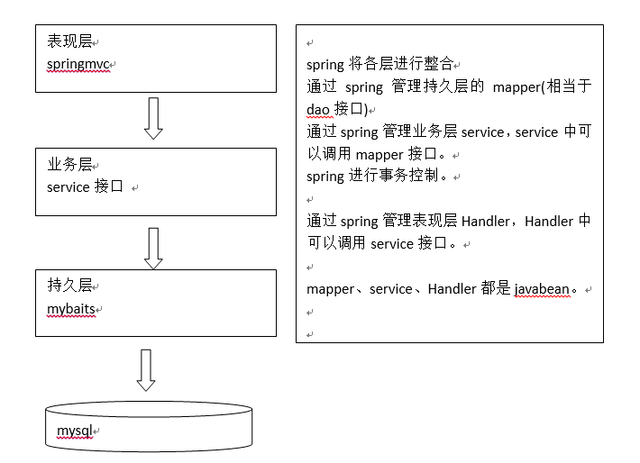

# springmvc和mybatis整合
## 需求
使用springmvc和mybatis完成商品列表查询  
## 整合思路
springmvc+mybaits的系统架构：  
  
*   第一步：整合dao层  
	mybatis和spring整合，通过spring管理mapper接口  
	使用mapper的扫描器自动扫描mapper接口在spring中进行注册  
*   第二步：整合service层  
	通过spring管理 service接口  
	使用配置方式将service接口配置在spring配置文件中  
	实现事务控制  
*   第三步：整合springmvc  
	由于springmvc是spring的模块，不需要整合  
## 准备环境
数据库环境  
java环境  
spring全部jar包  
mybatis的jar包  
mybatis和spring整合包  
第三方依赖包  
## 整合dao
pring管理SqlSessionFactory、mapper  
### db.properties  
### log4j.properties
### sqlMapConfig.xml
```xml
<?xml version="1.0" encoding="UTF-8"?>
<!DOCTYPE configuration
        PUBLIC "-//mybatis.org//DTD Config 3.0//EN"
        "http://mybatis.org/dtd/mybatis-3-config.dtd">
<configuration>

    <!-- 全局setting，根据需要添加-->
    
    <!-- 别名定义 -->
    <typeAliases>
        <!-- 批量别名定义
            指定包名,mybatis自动扫描包中的po类,自动定义别名,别名就是类名(首字母大写或小写都可以)
        -->
        <package name="me.test.ssmtest.po"/>

    </typeAliases>

    <!-- 加载映射文件,由spring使用mapper扫描后就不要加载了 -->
    <!--<mappers>
        &lt;!&ndash; 批量加载mapper
            指定mapper接口的包名，mybatis自动扫描包下边所有mapper接口进行加载
            遵循一些规范：需要将mapper接口类名和mapper.xml映射文件名称保持一致，且在一个目录中
            上边规范的前提是：使用的是mapper代理方法
        &ndash;&gt;
        <package name="me.test.ssmtest.mapper"/>
    </mappers>-->
</configuration>
```
### applicationContext-dao.xml  
配置数据源、事务管理，SqlSessionFactory、mapper扫描器  
```xml
<?xml version="1.0" encoding="UTF-8"?>
<beans xmlns="http://www.springframework.org/schema/beans"
    xmlns:xsi="http://www.w3.org/2001/XMLSchema-instance" xmlns:mvc="http://www.springframework.org/schema/mvc"
    xmlns:context="http://www.springframework.org/schema/context"
    xmlns:aop="http://www.springframework.org/schema/aop" xmlns:tx="http://www.springframework.org/schema/tx"
    xsi:schemaLocation="http://www.springframework.org/schema/beans
        http://www.springframework.org/schema/beans/spring-beans-3.2.xsd
        http://www.springframework.org/schema/mvc
        http://www.springframework.org/schema/mvc/spring-mvc-3.2.xsd
        http://www.springframework.org/schema/context
        http://www.springframework.org/schema/context/spring-context-3.2.xsd
        http://www.springframework.org/schema/aop
        http://www.springframework.org/schema/aop/spring-aop-3.2.xsd
        http://www.springframework.org/schema/tx
        http://www.springframework.org/schema/tx/spring-tx-3.2.xsd ">

    <!-- 加载配置文件 -->
    <context:property-placeholder location="classpath:db.properties"/>

    <!-- 配置C3P0连接池 -->
    <bean id="dataSource" class="com.mchange.v2.c3p0.ComboPooledDataSource" destroy-method="close">
        <property name="driverClass" value="${jdbc.driverClass}"/>
        <property name="jdbcUrl" value="${jdbc.url}"/>
        <property name="user" value="${jdbc.username}"/>
        <property name="password" value="${jdbc.password}"/>
    </bean>
    <!-- sqlSessionFactory -->
    <bean id="sqlSessionFactory" class="org.mybatis.spring.SqlSessionFactoryBean">
        <!-- 加载mybatis的配置文件 -->
        <property name="configLocation" value="classpath:mybatis/SqlMapConfig.xml"/>
        <!-- 数据源dataSource，因为要与数据库打交道 -->
        <property name="dataSource" ref="dataSource"/>
    </bean>
    <!-- mapper批量扫描，从mapper包中扫描出mapper接口，自动创建代理对象并且在spring容器中注册
        遵循规范：将mapper.java和mapper.xml映射文件名称保持一致,且在一个目录中
        自动扫描出来的mapper的bean的id为mapper类型（首字母小写）-->
    <bean class="org.mybatis.spring.mapper.MapperScannerConfigurer">
        <!-- 指定扫描的包名
            如果扫描多个包，每个包中间使用半角逗号分隔-->
        <property name="basePackage" value="me.test.ssmtest.mapper"/>
        <property name="sqlSessionFactoryBeanName" value="sqlSessionFactory"/>
    </bean>
</beans>
```
### 逆向工程生成po类及mapper(单表增删改查)
将生成的文件拷贝至工程中
### 手动定义商品查询mapper
针对综合查询mapper，一般情况会有关联查询，建议自定义mapper  
*   ItemsMapperCustom.xml  
    sql语句：
    ```sql
    SELECT * FROM items  WHERE items.name LIKE '%笔记本%';
    ```
    ```xml
    <?xml version="1.0" encoding="UTF-8"?>
    <!DOCTYPE mapper PUBLIC "-//mybatis.org//DTD Mapper 3.0//EN" "http://mybatis.org/dtd/mybatis-3-mapper.dtd">
    <mapper namespace="me.test.ssm.mapper.IteamsMapperCustom">

        <!-- 定义商品查询的sql片段，就是商品查询条件 -->
        <sql id="query_items_where">
            <!-- 使用动态sql，通过if判断，满足条件进行sql拼接
                商品查询条件通过ItemsQueryVo包装对象 中itemsCustom属性传递
            -->
            <if test="itemCustom!=null">
                <if test="itemCustom.name!=null and　itemCustom.name!=＇＇">
                    items.name LIKE '%${itemCustom.name}%'
                </if>
            </if>
        </sql>

        <!--商品列表查询
        parameterType传入包装对象（包装了查询条件）
        rusultType建议使用扩展对象,Item对象可能无法满足所有查询字段
        -->
        <select id="findItemsList" parameterType="me.test.ssmtest.po.ItemsQueryVo" resultMap="ItemsMapperCustom"
                resultType="me.test.ssmtest.po.ItemsCustom">
            SELECT * FROM items
            <where>
                <include refid="query_items_where"/>
            </where>
        </select>
    </mapper>
    ```
*   ItemsMapperCustom.java  
    ```java
    package me.test.ssmtest.mapper;

    import me.test.ssmtest.po.ItemsCustom;
    import me.test.ssmtest.po.ItemsQueryVo;

    import java.util.List;

    //自定义商品查询
    public interface ItemsMapperCustom {
        //商品的查询列表
        public List<ItemsCustom> findItemsList(ItemsQueryVo itemsQueryVo) throws Exception;
    }
    ```
## 整合service
让spring管理service接口,对Service进行事务控制  
*   定义service接口  
    ```java
    public interface ItemsService {
    //商品查询列表
    public List<ItemsCustom> findItemsList(ItemsQueryVo itemsQueryVo) throws Exception;
    }
    ```
    实现类  
    ```java
    public class ItemsServiceImpl implements ItemsService{

        @Autowired
        private ItemsMapperCustom itemsMapperCustom;
        @Override
        public List<ItemsCustom> findItemsList(ItemsQueryVo itemsQueryVo) throws Exception {
            //通过itemscustom查询数据库
            return itemsMapperCustom.findItemsList(itemsQueryVo);
        }
    }
    ```
*   在spring容器配置service(applicationContext-service.xml)  
    创建applicationContext-service.xml，文件中配置service  
    ```xml
    <?xml version="1.0" encoding="UTF-8"?>
    <beans xmlns="http://www.springframework.org/schema/beans"
        xmlns:xsi="http://www.w3.org/2001/XMLSchema-instance"
        xsi:schemaLocation="http://www.springframework.org/schema/beans
            http://www.springframework.org/schema/beans/spring-beans-3.2.xsd
            ">
        <!-- 商品管理的service -->
        <bean id="itemsService" class="me.test.ssmtest.service.impl.ItemsServiceImpl"/>
    </beans>
    ```
*   事务控制(applicationContext-transaction.xml)  
    在applicationContext-transaction.xml中使用spring声明式事务控制方法  
    ```xml
    <?xml version="1.0" encoding="UTF-8"?>
    <beans xmlns="http://www.springframework.org/schema/beans"
        xmlns:xsi="http://www.w3.org/2001/XMLSchema-instance"
        xmlns:aop="http://www.springframework.org/schema/aop" xmlns:tx="http://www.springframework.org/schema/tx"
        xsi:schemaLocation="http://www.springframework.org/schema/beans
            http://www.springframework.org/schema/beans/spring-beans-3.2.xsd
            http://www.springframework.org/schema/aop
            http://www.springframework.org/schema/aop/spring-aop-3.2.xsd
            http://www.springframework.org/schema/tx
            http://www.springframework.org/schema/tx/spring-tx-3.2.xsd ">

        <!-- 配置事务管理器
        对mybatis操作数据库事务控制，spring使用jdbc的事务控制类-->
        <bean id="transactionManager" class="org.springframework.jdbc.datasource.DataSourceTransactionManager">
            <!-- 数据源
            dataSource在applicationContext-dao.xml中配置了
            -->
            <property name="dataSource" ref="dataSource"/>
        </bean>

        <!-- 配置事务增强:通知 -->
        <tx:advice id="txAdvice" transaction-manager="transactionManager">
            <tx:attributes>
                <!-- 设置进行事务操作的方法匹配规则：传播行为 -->
                <tx:method name="save*" propagation="REQUIRED"/>
                <tx:method name="update*" propagation="REQUIRED"/>
                <tx:method name="insert*" propagation="REQUIRED"/>
                <tx:method name="delete*" propagation="REQUIRED"/>
                <tx:method name="find*" propagation="SUPPORTS" read-only="true"/>
                <tx:method name="get*" propagation="SUPPORTS" read-only="true"/>
                <tx:method name="select*" propagation="SUPPORTS" read-only="true"/>
            </tx:attributes>
        </tx:advice>

        <!-- 配置切面 -->
        <aop:config>
            <!-- 配置切入点 me.test.ssmtest.service.impl.*+.*(..)
                * me.test.ssmtest.service.impl.*+.*(..)
                    *：表示方法的作用域，*表示所有
                    me.test.ssmtest.service.impl.*：表示me.test.ssmtest.service.impl下的任何包
                    me.test.ssmtest.service.impl.*+：表示me.test.ssmtest.service.impl下的任何包及其子包
                    *(..)：*表示任何方法，(..)表示方法的任何参数
            -->
            <aop:pointcut id="pointcut" expression="execution(* me.test.ssmtest.service.impl.*+.*(..))"/>
            <!-- 适配切入点和事务增强 和aop:aspect用法差别不大，aop:advisor主要用在事务管理-->
            <aop:advisor advice-ref="txAdvice" pointcut-ref="pointcut"/>
        </aop:config>
    </beans>
    ```
## 整合springmvc    