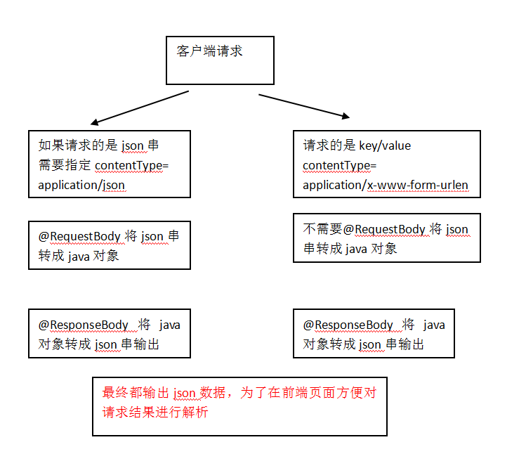

## 异常处理器
springmvc在处理请求过程中出现异常信息交由异常处理器进行处理，自定义异常处理器可以实现一个系统的异常处理逻辑  
### 异常处理思路  
系统中异常包括两类：预期异常和运行时异常RuntimeException，前者通过捕获异常从而获取异常信息，后者主要通过规范代码开发、测试通过手段减少运行时异常的发生  

系统的dao、service、controller出现都通过throws Exception向上抛出，最后由springmvc前端控制器交由异常处理器进行异常处理，如下图：  

springmvc提供全局异常处理器（一个系统只有一个异常处理器）进行统一异常处理  
### 自定义异常类
为了区别不同的异常通常根据异常类型自定义异常类，这里我们创建一个自定义系统异常，如果controller、service、dao抛出此类异常说明是系统预期处理的异常信息  
对不同的异常类型定义异常类，继承Exception
```java
//系统 自定义异常类，针对预期的异常，需要在程序中抛出此类的异常
public class CustomException extends Exception {
	
	//异常信息
	public String message;
	
	public CustomException(String message){
		super(message);
		this.message = message;
	}

	public String getMessage() {
		return message;
	}

	public void setMessage(String message) {
		this.message = message;
	}
}
```
### 全局异常处理器
思路：  
系统遇到异常，在程序中手动抛出，dao抛给service、service给controller、controller抛给前端控制器，前端控制器调用全局异常处理器  

全局异常处理器处理思路：  
1. 解析出异常类型  
2.  如果该异常类型是系统自定义的异常，直接取出异常信息，在错误页面展示  
    如果该异常类型不是系统自定义的异常，构造一个自定义的异常类型（信息为“未知错误”）  

springmvc提供一个HandlerExceptionResolver接口  
CustomExceptionResolver.java
```java
package me.test.ssmtest.exception;

import javax.servlet.http.HttpServletRequest;
import javax.servlet.http.HttpServletResponse;

import org.springframework.web.servlet.HandlerExceptionResolver;
import org.springframework.web.servlet.ModelAndView;
/**
 * 全局异常处理器
 */
public class CustomExceptionResolver implements HandlerExceptionResolver{  
    /**
     * ex 系统抛出的异常
     */
    @Override
    public ModelAndView resolveException(HttpServletRequest request,
            HttpServletResponse response, Object handler, Exception ex) {

    //Handler就是处理器适配器要执行Handler对象（只有一个method）
        
//  //解析出异常类型
//  //如果该 异常类型是系统自定义的异常，直接取出异常信息，在错误页面展示
//        String message = null;
//        if(ex instanceof CustomException) {
//            message = ((CustomException)ex).getMessage();
//        }else {
//  //如果该 异常类型不是系统自定义的异常，构造一个自定义的异常类型（信息为“未知错误”）
//            message="未知错误";
//  }    
        //上边的代码变为
        CustomException customException = null;
        if(ex instanceof CustomException) {
            customException = (CustomException) ex;
        }else {
            customException = new CustomException("未知错误，请与系统管理员联系！");
        }
        //错误信息
        String message = customException.getMessage();
        
        ModelAndView modelAndView = new ModelAndView();
        //将错误信息传到页面
        modelAndView.addObject("message", message);
        
        //指定错误页面
        modelAndView.setViewName("error");
        return modelAndView;
    }
}
```
### 错误页面
```jsp
<title>错误提示</title>
</head>
<body>
    ${message }
</body>
</html>
```
### 在springmvc.xml配置全局异常处理器
```xml
<!-- 全局异常处理器
只要实现HandlerExceptionResolver接口就是全局异常处理器
    -->
<bean class="cn.itcast.ssm.exception.CustomExceptionResolver"></bean>
```
### 异常测试
如果与业务功能相关的异常，建议在service中抛出异常  
与业务功能没有关系的异常，建议在controller中抛出  
## 上传图片
### 需求
在修改商品页面，添加上传商品图片功能  
### springmvc中对多部件类型解析
在页面form中提交enctype="multipart/form-data"的数据时，需要springmvc对multipart类型的数据进行解析  
```jsp
<form id="itemForm" action="${pageContext.request.contextPath }/items/editItemsSubmit.action" method="post" enctype="multipart/form-data">
```
在springmvc.xml中配置multipart类型解析器  
```xml
<!-- 文件上传 -->
<bean id="multipartResolver"
    class="org.springframework.web.multipart.commons.CommonsMultipartResolver">
    <!-- 设置上传文件的最大尺寸为5MB -->
    <property name="maxUploadSize">
        <value>5242880</value>
    </property>
</bean>
```
### 加入上传图片的jar
CommonsMultipartResolver解析器依赖commons-fileupload和commons-io，加入如下jar包：  
commons-fileupload-xxx.jar  
commons-io-xxx.jar  
### 创建图片虚拟目录存储图片
1.  图形界面配置  
2.  直接修改tomcat的配置：
    在[tomcat安装目录]/conf/server.xml文件，添加虚拟目录 ：  
    ```xml
    <Context docBase="xxxx" path="/pic" reloadable="false"/>
    注意：在图片虚拟目录 中，一定将图片目录分级创建（提高i/o性能），一般我们采用按日期(年、月、日)进行分级创建  
### 上传图片代码
*   页面
    ```jsp
    <td>商品图片</td>
    <td>
        <c:if test="${items.pic !=null}">
            
            <br/>
        </c:if>
        <input type="file"  name="items_pic"/> 
    </td>
    ```
*   controller方法  
    修改：商品修改controller方法  
    ```java
    / 商品信息修改提交
	// 在需要校验的pojo前边添加@Validated，在需要校验的pojo后边添加BindingResult
	// bindingResult接收校验出错信息
	// 注意：@Validated和BindingResult bindingResult是配对出现，并且形参顺序是固定的（一前一后）。
	// value={ValidGroup1.class}指定使用ValidGroup1分组的 校验
	// @ModelAttribute可以指定pojo回显到页面在request中的key
	@RequestMapping("/editItemsSubmit")
	public String editItemsSubmit(
        Model model,
        HttpServletRequest request,
        Integer id,
        @ModelAttribute("items") @Validated(value = { ValidGroup1.class }) ItemsCustom itemsCustom,
        BindingResult bindingResult,
        MultipartFile items_pic//接收商品图片
        ) throws Exception {
        //原始名称
		String originalFilename = items_pic.getOriginalFilename();
		//上传图片
		if(items_pic!=null && originalFilename!=null && originalFilename.length()>0){
			
        //存储图片的物理路径
        String pic_path = "xxx";
        
        //新的图片名称
        String newFileName = UUID.randomUUID() + originalFilename.substring(originalFilename.lastIndexOf("."));
        //新图片
        File newFile = new File(pic_path+newFileName);
        
        //将内存中的数据写入磁盘
        items_pic.transferTo(newFile);
        
        //将新图片名称写到itemsCustom中
        itemsCustom.setPic(newFileName);	
		}
        // 调用service更新商品信息，页面需要将商品信息传到此方法
		itemsService.updateItems(id, itemsCustom);
        //页面转发
        return "forward:queryItems.action";
    }
    ```
### 访问测试
## springmvc实现json数据交互
### 为什么要进行json数据交互
json数据格式在接口调用中、html页面中较常用，json格式比较简单，解析还比较方便  
比如：webservice接口，传输json数据  
### @RequestBody
作用：  
@RequestBody注解用于读取http请求的内容(字符串)，通过springmvc提供的HttpMessageConverter接口将读到的内容转换为json、xml等格式的数据并绑定到controller方法的参数上  

本例子应用：  
@RequestBody注解实现接收http请求的json数据，将json数据转换为java对象  
### @ResponseBody
作用：  
该注解用于将Controller的方法返回的对象，通过HttpMessageConverter接口转换为指定格式的数据如：json,xml等，通过Response响应给客户端  

本例子应用：  
@ResponseBody注解实现将controller方法返回对象转换为json响应给客户端  
### springmvc进行json交互

1.  请求json、输出json，要求请求的是json串，所以在前端页面中需要将请求的内容转成json串，不太方便  
2.  请求key/value、输出json。此方法比较常用  
### 环境准备
*   加载json转的jar包
    springmvc中默认使用MappingJacksonHttpMessageConverter对json数据进行转换（@requestBody和@responseBody使用下边的包进行json转换），如下:  
    jackson-core-asl-xxx.jar  
    jackson-mapper-asl-xxx.jar  
*   配置json转换器  
    在注解适配器中加入messageConverters  
    ```xml
    <!--注解适配器 -->
    <bean class="org.springframework.web.servlet.mvc.method.annotation.RequestMappingHandlerAdapter">
        <property name="messageConverters">
        <list>
        <bean class="org.springframework.http.converter.json.MappingJacksonHttpMessageConverter"></bean>
        </list>
        </property>
    </bean>
    ```
    **注意**：如果使用\<mvc:annotation-driven /> 则不用定义上边的内容  
### json交互测试
*   输入json串，输出是json串  
    （1）jsp页面：使用jquery的ajax提交json串，对输出的json结果进行解析  
    ```jsp
    <script type="text/javascript" src="${pageContext.request.contextPath }/js/jquery-1.4.4.min.js"></script>
    <script type="text/javascript">
    //请求json，输出是json
    function requestJson(){
        $.ajax({
            type:'post',
            url:'${pageContext.request.contextPath }/requestJson.action',
            contentType:'application/json;charset=utf-8',
            //数据格式是json串，商品信息
            data:'{"name":"手机","price":999}',
            success:function(data){//返回json结果
                alert(data);
            }    
        });
    }
    </script>
    ```
    （2）controller  
    ```java
    // json交互测试
    @Controller
    public class JsonTest {
        
        //请求json串(商品信息)，输出json(商品信息)
        //@RequestBody将请求的商品信息的json串转成itemsCustom对象
        //@ResponseBody将itemsCustom转成json输出
        @RequestMapping("/requestJson")
        public @ResponseBody ItemsCustom requestJson(@RequestBody ItemsCustom itemsCustom){
            
            //@ResponseBody将itemsCustom转成json输出
            return itemsCustom;
        }
    ```
    （3）测试结果：浏览器查看网络请求及返回内容  
*   输入key/value，输出是json串  
    表单默认请求application/x-www-form-urlencoded格式的数据即key/value，通常有post和get两种方法，响应json数据是为了方便客户端处理，实现如下：
    （1）jsp页面：使用jquery的ajax提交key/value串，对输出的json结果进行解析  
    ```jsp
    <script type="text/javascript">
    //请求key/value，输出是json
    function responseJson(){
        $.ajax({
            type:'post',
            url:'${pageContext.request.contextPath }/responseJson.action',
            //请求是key/value这里不需要指定contentType，因为默认就 是key/value类型
            //contentType:'application/json;charset=utf-8',
            //数据格式是json串，商品信息
            data:'name=手机&price=999',
            success:function(data){//返回json结果
                alert(data.name);
            }
        });
    </script>
    <body>
    <input type="button" onclick="requestJson()" value="请求json，输出是json"/>
    <input type="button" onclick="responseJson()" value="请求key/value，输出是json"/>
    </body>
    ```
    从上边的js代码看出，已去掉ContentType的定义，ContentType默认为：application/x-www-form-urlencoded格式  
    （2）controller  
    ```java
    //请求key/value，输出json
	@RequestMapping("/responseJson")
	public @ResponseBody ItemsCustom responseJson(ItemsCustom itemsCustom){		
		//@ResponseBody将itemsCustom转成json输出
		return itemsCustom;
	}
    ```
    （3）测试结果：浏览器查看网络请求及返回内容  
## springmvc对RESTful支持
### 什么是RESTful
RESTful架构，就是目前最流行的一种互联网软件架构。它结构清晰、符合标准、易于理解、扩展方便，所以正得到越来越多网站的采用  
RESTful（即Representational State Transfer的缩写）其实是一个开发理念，是对http的很好的诠释  
1.   对url进行规范，写RESTful格式的url  
    非REST的url：http://...../queryItems.action?id=001&type=T01  
    REST的url风格：http://..../items/001  
    特点：url简洁，将参数通过url传到服务端  
2.  http的方法规范  
    不管是删除、添加、更新。。使用url是一致的，如果进行删除，需要设置http的方法为delete，同理添加。。。  
    后台controller方法：判断http方法，如果是delete执行删除，如果是post执行添加  
3.  对http的contentType规范  
    请求时指定contentType，要json数据，设置成json格式的type  
### REST的例子
需求:    
RESTful方式实现商品信息查询，返回json数据  
### Controller(URL 模板模式映射)  
定义方法，进行url映射使用REST风格的url，将查询商品信息的id传入controller  
输出json使用@ResponseBody将java对象输出json  
```java
//查询商品信息，输出json
///itemsView/{id}里边的{id}表示占位符，通过@PathVariable获取占位符中的参数，
//如果占位符中的名称和形参名一致，在@PathVariable可以不指定名称
@RequestMapping("/itemsView/{id}")
public @ResponseBody ItemsCustom itemsView(@PathVariable("id") Integer id)throws Exception{
    //调用service查询商品信息
    ItemsCustom itemsCustom = itemsService.findItemsById(id);

    return itemsCustom; 
}
```
### REST方法的前端控制器配置
在web.xml配置：  
```xml
<!-- springmvc前端控制器，rest配置 -->
	<servlet>
		<servlet-name>springmvc_rest</servlet-name>
		<servlet-class>org.springframework.web.servlet.DispatcherServlet</servlet-class>
		<!-- contextConfigLocation配置springmvc加载的配置文件（配置处理器映射器、适配器等等） 如果不配置contextConfigLocation，默认加载的是/WEB-INF/servlet名称-serlvet.xml（springmvc-servlet.xml） -->
		<init-param>
			<param-name>contextConfigLocation</param-name>
			<param-value>classpath:spring/springmvc.xml</param-value>
		</init-param>
	</servlet>

	<servlet-mapping>
		<servlet-name>springmvc_rest</servlet-name>
		<url-pattern>/</url-pattern>
	</servlet-mapping>
```
### 对静态资源的解析
配置前端控制器的url-parttern中指定/，对静态资源的解析出现问题：404

如果在DispatcherServlet中设置url-pattern为 /则必须对静态资源进行访问处理  
spring mvc的\<mvc:resources mapping="" location="">实现对静态资源进行映射访问  

在springmvc.xml中添加静态资源解析方法
```xml
<!-- 静态资源解析
包括 ：js、css、img、..-->
<mvc:resources location="/js/" mapping="/js/**"/>
<mvc:resources location="/img/" mapping="/img/**"/>
```
## 拦截器
Spring Web MVC 的处理器拦截器类似于Servlet 开发中的过滤器Filter，用于对处理器进行预处理和后处理  
### 拦截器定义
定义拦截器，实现HandlerInterceptor接口。接口中提供三个方法  
```java
package me.test.ssmtest.interceptor;

import javax.servlet.http.HttpServletRequest;
import javax.servlet.http.HttpServletResponse;

import org.springframework.web.servlet.HandlerInterceptor;
import org.springframework.web.servlet.ModelAndView;

public class HandlerInterceptor1 implements HandlerInterceptor{
    
    //进入Handler方法之前执行
    //用于身份认证，身份授权
    //比如身份认证，认证不通过表示便是当前用户没有登录，需要此方法拦截不再向下执行
    @Override
    public boolean preHandle(HttpServletRequest request, HttpServletResponse response,
            Object handler) throws Exception {
        //return false表示拦截不向下执行
        //return true表示放行
        return false;
    }
    
    //进入Handler方法之后，返回modelAndView之前执行
    //应用场景从modelAndView出发，将公用的模型数据(比如菜单导航)在这里传到视图，也可以在这里统一指定视图
    @Override
    public void postHandle(HttpServletRequest request, HttpServletResponse response,
            Object handler, ModelAndView modelAndView) throws Exception {
        
    }
    
    //执行handler完成执行此方法
    //应用场景：统一异常处理，统一日志处理
    @Override
    public void afterCompletion(HttpServletRequest request,
            HttpServletResponse response, Object handler, Exception ex) throws Exception {
    }
}
```
### 拦截器配置
*   针对HandlerMapping配置  
    springmvc拦截器针对HandlerMapping进行拦截设置，如果在某个HandlerMapping中配置拦截，经过该 HandlerMapping映射成功的handler最终使用该拦截器  
    ```xml
    <!-- 处理器映射器中配置拦截器 -->
    <bean class="org.springframework.web.servlet.handler.BeanNameUrlHandlerMapping">
        <property name="interceptors">
            <list>
                <ref bean="handlerInterceptor1"/>
                <ref bean="handlerInterceptor2"/>
            </list>
        </property>
    </bean>
    <bean id="handlerInterceptor1" class="springmvc.intercapter.HandlerInterceptor1"/>
    <bean id="handlerInterceptor2" class="springmvc.intercapter.HandlerInterceptor2"/>
    ```
    一般不推荐使用  
*   类似全局的拦截器
    springmvc.xml中配置类似全局的拦截器，springmvc框架将配置的类似全局的拦截器注入到每个HandlerMapping中  
    ```xml
    <!--拦截器 -->
    <mvc:interceptors>
        <!--多个拦截器,顺序执行 -->
        <!-- 登陆认证拦截器 -->
        <mvc:interceptor>
            <mvc:mapping path="/**"/>
            <bean class="cn.itcast.ssm.interceptor.LoginInterceptor"></bean>
        </mvc:interceptor>
        <mvc:interceptor>
            <!-- /**表示所有url包括子url路径 -->
            <mvc:mapping path="/**"/>
            <bean class="cn.itcast.ssm.interceptor.HandlerInterceptor1"></bean>
        </mvc:interceptor>
        <mvc:interceptor>
            <mvc:mapping path="/**"/>
            <bean class="cn.itcast.ssm.interceptor.HandlerInterceptor2"></bean>
        </mvc:interceptor>
    </mvc:interceptors>
    ```
### 拦截测试
*   测试需求  
    测试多个拦截器各个方法执行时机  
*   编写两个拦截  
    HandlerInterceptor1和HandlerInterceptor2  
*   两个拦截器都放行  
    ```java
    public class HandlerInterceptor1 implements HandlerInterceptor{
    
    //进入Handler方法之前执行
    //用于身份认证，身份授权
    //比如身份认证，认证不通过表示便是当前用户没有登录，需要此方法拦截不再向下执行
    @Override
    public boolean preHandle(HttpServletRequest request, HttpServletResponse response,
            Object handler) throws Exception {
        //return false表示拦截不向下执行
        //return true表示放行
        return true;
    }
    ```
    执行结果：  
    HandlerInterceptor1...preHandle  
    HandlerInterceptor2...preHandle  

    HandlerInterceptor2...postHandle  
    HandlerInterceptor1...postHandle  

    HandlerInterceptor2...afterCompletion  
    HandlerInterceptor1...afterCompletion  
    **总结**：  
    preHandle方法按顺序执行，  
    postHandle和afterCompletion按拦截器配置的逆向顺序执行  
*   拦截器1放行，拦截器2不放行  
    HandlerInterceptor1...preHandle  
    HandlerInterceptor2...preHandle     
    HandlerInterceptor1...afterCompletion  

    **总结**：  
    拦截器1放行，拦截器2 preHandle才会执行  
    拦截器2 preHandle不放行，拦截器2 postHandle和afterCompletion不会执行  
    只要有一个拦截器不放行，postHandle不会执行  
*   拦截器1不放行，拦截器2不放行  
    HandlerInterceptor1...preHandle  

    **总结**：   
    拦截器1 preHandle不放行，postHandle和afterCompletion不会执行  
    拦截器1 preHandle不放行，拦截器2不执行  
*   小结  
    根据测试结果，对 拦截器应用  
    比如：统一日志处理拦截器，需要该拦截器preHandle一定要放行，且将它放在拦截器链接中第一个位置  
    比如：登陆认证拦截器，放在拦截器链接中第一个位置。权限校验拦截器，放在登陆认证拦截器之后（因为登陆通过后才校验权限）  
### 拦截器应用（实现登陆认证）
*   需求  
    1、用户请求url  
    2、拦截器进行拦截校验  

　　如果请求的url是公开地址（无需登陆即可访问的url），让放行  
    如果用户session 不存在跳转到登陆页面  
    如果用户session存在放行，继续操作  
*   登陆controller方法  
    LoginController.java  
    ```java
    @Controller
    public class LoginController {
        //登录
        @RequestMapping("/login")
        public String login(HttpSession session, String username, String password) {
            // 调用service进行用户身份验证
            // ...

            // 在session中保存用户身份信息
            session.setAttribute("username", username);
            //重定向到商品列表页面
            return "redirect:/items/queryItems.action";
        }
        // 退出
        @RequestMapping("/logout")
        public String logout(HttpSession session) throws Exception {

            // 清除session
            session.invalidate();

            // 重定向到商品列表页面
            return "redirect:/items/queryItems.action";
        }
    }
    ```
*   jsp页面实现登录和退出
*   登陆认证拦截实现  
    LoginInterceptor.java
    ```java
    package me.test.ssmtest.interceptor;

    import javax.servlet.http.HttpServletRequest;
    import javax.servlet.http.HttpServletResponse;
    import javax.servlet.http.HttpSession;

    import org.springframework.web.servlet.HandlerInterceptor;
    import org.springframework.web.servlet.ModelAndView;

    /**
    * 登录认证拦截器
    * @author yejin
    */
    public class LoginInterceptor implements HandlerInterceptor{
        
        //进入Handler方法之前执行
        //用于身份认证，身份授权
        //比如身份认证，认证不通过表示便是当前用户没有登录，需要此方法拦截不再向下执行
        @Override
        public boolean preHandle(HttpServletRequest request, HttpServletResponse response,
                Object handler) throws Exception {
            //获取请求的url
            String url = request.getRequestURI();
            //判断url是否是公开地址(实际使用时将公开地址配置在配置文件中)
            //这里公开地址是登录提交的地址
            if(url.indexOf("login.action")>=0) {
                //如果进行登录提交，放行
                return true;
            }
            
            //判断session
            HttpSession session = request.getSession();
            String username = (String) session.getAttribute("username");
            if(username != null) {
                //身份存在，放行
                return true;
            }
            
            //执行这里表示用户身份需要认证，跳转到登录页面
            request.getRequestDispatcher("/WEB-INF/jsp/login.jsp").forward(request, response);
            return false;
        }
        
        //进入Handler方法之后，返回modelAndView之前执行
        //应用场景从modelAndView出发，将公用的模型数据(比如菜单导航)在这里传到视图，也可以在这里统一指定视图
        @Override
        public void postHandle(HttpServletRequest request, HttpServletResponse response,
                Object handler, ModelAndView modelAndView) throws Exception {
            System.out.println("loginInterceptor.postHandle()");
        }
        
        //执行handler完成执行此方法
        //应用场景：统一异常处理，统一日志处理
        @Override
        public void afterCompletion(HttpServletRequest request,
                HttpServletResponse response, Object handler, Exception ex) throws Exception {
            System.out.println("loginInterceptor.afterCompletion()");
        }
    }
    ```
*   拦截器配置  
    ```xml
    <mvc:interceptors>
        <!--多个拦截器,顺序执行 -->
        <!-- 登陆认证拦截器 -->
        <mvc:interceptor>
            <!-- /**表示所有url包括子url路径 -->
            <mvc:mapping path="/**"/>
            <bean class="cn.itcast.ssm.interceptor.LoginInterceptor"></bean>
        </mvc:interceptor>
    </mvc:interceptors>
*   启动web服务器测试  
	