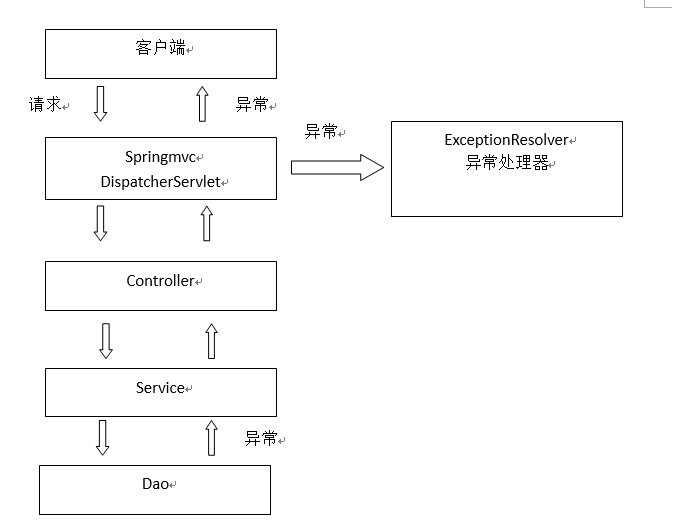

## 异常处理器
springmvc在处理请求过程中出现异常信息交由异常处理器进行处理，自定义异常处理器可以实现一个系统的异常处理逻辑  
### 异常处理思路  
系统中异常包括两类：预期异常和运行时异常RuntimeException，前者通过捕获异常从而获取异常信息，后者主要通过规范代码开发、测试通过手段减少运行时异常的发生  

系统的dao、service、controller出现都通过throws Exception向上抛出，最后由springmvc前端控制器交由异常处理器进行异常处理，如下图：  

springmvc提供全局异常处理器（一个系统只有一个异常处理器）进行统一异常处理  
### 自定义异常类
为了区别不同的异常通常根据异常类型自定义异常类，这里我们创建一个自定义系统异常，如果controller、service、dao抛出此类异常说明是系统预期处理的异常信息  
对不同的异常类型定义异常类，继承Exception
```java
//系统 自定义异常类，针对预期的异常，需要在程序中抛出此类的异常
public class CustomException extends Exception {
	
	//异常信息
	public String message;
	
	public CustomException(String message){
		super(message);
		this.message = message;
	}

	public String getMessage() {
		return message;
	}

	public void setMessage(String message) {
		this.message = message;
	}
}
```
### 全局异常处理器
思路：  
系统遇到异常，在程序中手动抛出，dao抛给service、service给controller、controller抛给前端控制器，前端控制器调用全局异常处理器  

全局异常处理器处理思路：  
1. 解析出异常类型  
2.  如果该异常类型是系统自定义的异常，直接取出异常信息，在错误页面展示  
    如果该异常类型不是系统自定义的异常，构造一个自定义的异常类型（信息为“未知错误”）  

springmvc提供一个HandlerExceptionResolver接口  
CustomExceptionResolver.java
```java
package me.test.ssmtest.exception;

import javax.servlet.http.HttpServletRequest;
import javax.servlet.http.HttpServletResponse;

import org.springframework.web.servlet.HandlerExceptionResolver;
import org.springframework.web.servlet.ModelAndView;
/**
 * 全局异常处理器
 */
public class CustomExceptionResolver implements HandlerExceptionResolver{  
    /**
     * ex 系统抛出的异常
     */
    @Override
    public ModelAndView resolveException(HttpServletRequest request,
            HttpServletResponse response, Object handler, Exception ex) {

    //Handler就是处理器适配器要执行Handler对象（只有一个method）
        
//  //解析出异常类型
//  //如果该 异常类型是系统自定义的异常，直接取出异常信息，在错误页面展示
//        String message = null;
//        if(ex instanceof CustomException) {
//            message = ((CustomException)ex).getMessage();
//        }else {
//  //如果该 异常类型不是系统自定义的异常，构造一个自定义的异常类型（信息为“未知错误”）
//            message="未知错误";
//  }    
        //上边的代码变为
        CustomException customException = null;
        if(ex instanceof CustomException) {
            customException = (CustomException) ex;
        }else {
            customException = new CustomException("未知错误，请与系统管理员联系！");
        }
        //错误信息
        String message = customException.getMessage();
        
        ModelAndView modelAndView = new ModelAndView();
        //将错误信息传到页面
        modelAndView.addObject("message", message);
        
        //指定错误页面
        modelAndView.setViewName("error");
        return modelAndView;
    }
}
```
### 错误页面
```jsp
<title>错误提示</title>
</head>
<body>
    ${message }
</body>
</html>
```
### 在springmvc.xml配置全局异常处理器
```xml
<!-- 全局异常处理器
只要实现HandlerExceptionResolver接口就是全局异常处理器
    -->
<bean class="cn.itcast.ssm.exception.CustomExceptionResolver"></bean>
```
### 异常测试
如果与业务功能相关的异常，建议在service中抛出异常  
与业务功能没有关系的异常，建议在controller中抛出  