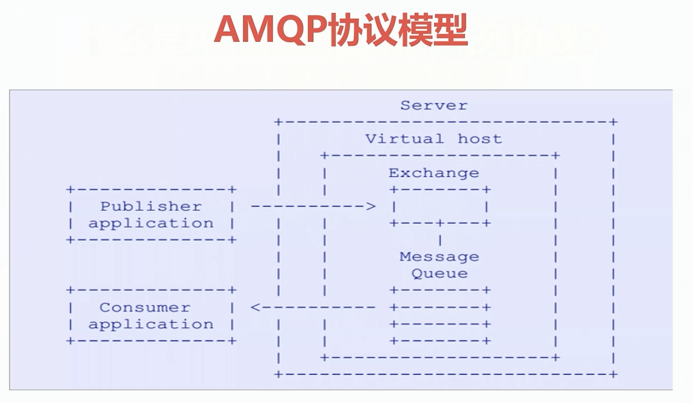
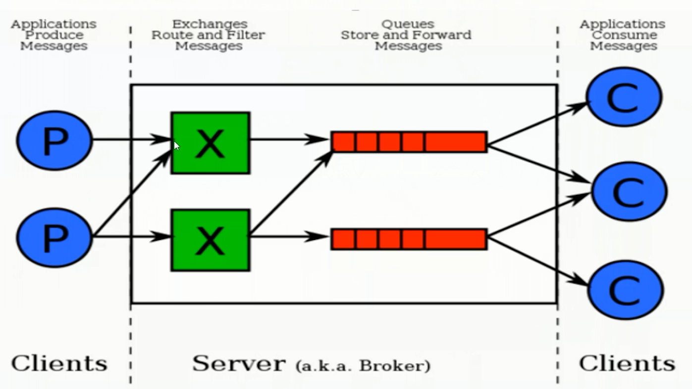
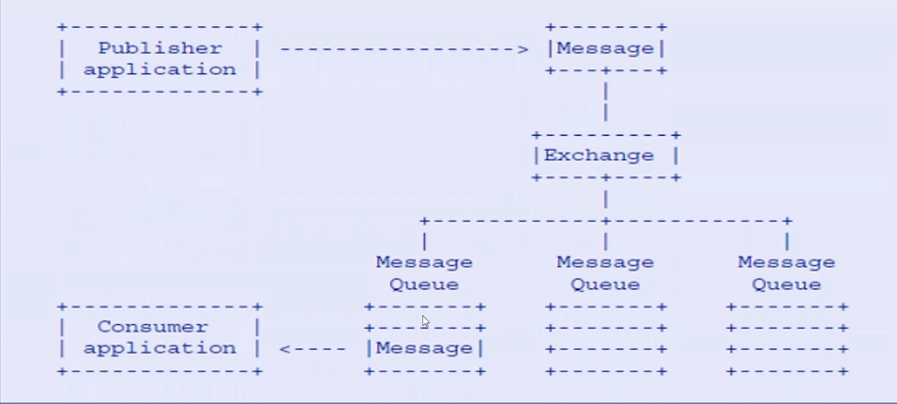

## RabbitMQ
`RabbitMQ`是一个开源的消息代理和队列服务器，用来通过普通协议在完全不同的应用之间共享数据，RabbitMQ是使用`Erlang`语言来编写的，并且RabbitMQ是基于`AMQP`协议的  
### 优点
- 生态成熟，大量企业应用  
- 开源、性能优秀，稳定性保障  
- 提供可靠性消息投递模式（confirm）、返回模式（return）  
- 与SpringAMQP完美整合、API丰富  
- 集群模式丰富，表达式配置、HA模式（高可用），镜像队列模型  
- 保证数据不丢失的前提做到高可靠性、可用性  
### RabbitMQ高性能的原因  
`Erlang语言`最初广泛应用在交换机领域的构架模式，这使得RabbitMQ在Broker之间进行数据交互的性能是非常优秀的  
Erlang的优点：`Erlang有着和原生Socket一样的延迟`  
### AMQP
全称：`Advanced Message Queuing Protocol`  
中文：高级消息队列协议  

定义：  
- 是具有现代特征的二级制协议  
- 是一个提供统一消息服务的应用层标准高级消息队列协议  
- 是应用层协议的一个开放标准，为面向消息的中间件设计  

  
#### AMQP核心概念
- `Server：`又称`Broker`，接受客户端的连接，实现AMQP实体服务  
- `Connection:`连接，应用程序与Broker的网络连接  
- `Channel:`网络信道，几乎所有的操作都在Channel中进行，Channel是进行消息读写的通道  
  客户端可建立多个Channel，每个Channel代表一个会话任务   
- `Message:`消息，服务器和应用程序之间传送的数据，由`Properties`和`Body`组成  
  `Properties`可以对消息进行修饰，比如消息的优先级、延迟等高级特性  
  `Body`则就是消息体内容  
- `Virtual host:`虚拟地址，用于进行逻辑隔离，最上层的消息路由  
  一个`Virtual Host`里面可以有多个`Exchange`和`Queue`  
  同一个Virtual Host里面`不能有`相同名称的Exchange或Queue  
- `Exchange:`交换机，接收消息，根据路由键转发消息到绑定的队列  
- `Binding:`Exchange和Queue之间的虚拟连接，binding中可以包含`routing key`  
- `Routing key:`一个路由规则，虚拟机可用它来确定如何路由一个特定消息  
- `Queue:`也称`Message Queue`，消息队列，保存消息并将它们转发给消费者  
### RabbitMQ整体架构  
  
  
### 安装和使用  
- 官网下载安装包  
- 安装必要的依赖环境(例如：Erlang)  
- 配置文件修改  

以CentOS7环境为例  
```
// 安装Erlang语言  
rpm -ivh erlang-XXX.centos.x86_64.rpm  
// 安装socat 密钥包 这是RabbitMQ的必要依赖  
rpm -ivh socat-xxx.rpm  
// 安装RabbitMQ Server  
rpm -ivh rabbitmq-server.rpm  

// 修改配置文件  
vim /usr/lib/rabbitmq/lib/rabbitmq_server-xxx/ebin/rabbit.app  
此文件格式是json  
修改端口号、密码等时将注释放开  
例如：loopback_users中的<<"guest">>，只保留guest  

服务启动和停止  
启动 rabbitmq-server start &  
验证是否启动成功  
lsof -i:5671(默认的rabbitmq端口号)  

停止 rabbitmqctl app_stop  

管理插件：rabbitmq-plugins enable rabbitmq_management  
访问地址：http://localhost:15672/ （管控台默认端口 15672）
输入用户名和密码 如果修改配置文件guest的话，都输入guest即可   
```
#### 命令行与管控台  
基础操作  
- rabbitmqctl stop_app : 关闭应用  
- rabbitmqctl start_app : 启动应用  
- rabbitmqctl status : 节点状态  
- rabbitmqctl add_user username password ：添加用户  
- rabbitmqctl list_users : 列出所有用户  
- rabbitmqctl delete_user username : 删除用户  
- rabbitmqctl clear_permissions -p vhostpath username : 清除用户权限 
- rabbitmqctl list_user_permissions username : 列出用户权限  
- rabbitmqctl change_password username newpassword : 修改密码  
- rabbitmqctl set_permissions -p vhostpath username ".*"".*"".*" : 设置用户权限  

- rabbitmqctl add_vhost vhostpath : 创建虚拟主机  
- rabbitmqctl list_vhosts : 列出所有虚拟主机  
- rabbitmqctl list_permissions -p vhostpath : 列出虚拟主机上所有权限  
- rabbitmqctl delete_vhost vhostpath : 删除虚拟主机  
- rabbitmqctl list_queues : 查看所有队列信息  
- rabbitmqctl -p vhostpath purge_queue blue : 清除队列里的消息  
高级操作  
- rabbitmqctl reset : 移除所有数据，要在rabbitmqctl stop_app之后使用  
- rabbitmqctl join_cluster \<clusternode> [--ram] : 组成集群命令 （--ram 可以指定存储模式 内存 --disk 磁盘） 
- rabbitmqctl cluster_status : 查看集群状态  
- rabbitmqctl change_cluster_node_type disc | ram : 修改集群节点的存储形式  
- rabbitmqctl forget_cluster_node [--offline] : 忘记节点（摘除节点）　
- rabbitmqctl rename_cluster_node oldnode1 newnode1 [oldnode2] [newnode2...] : 修改节点名称  
### 消息生产与消费  
- ConnectionFactory:获取连接工厂  
- Connection : 一个连接  
- Channel : 数据通信信道，可发送和接收消息  
- Queue : 具体的消息存储队列  
- Producr & Consumer 生产和消费者  

**生产者**
```java
package vip.proyi.rabbitmqtest.quickstart;

import com.rabbitmq.client.Channel;
import com.rabbitmq.client.Connection;
import com.rabbitmq.client.ConnectionFactory;

/**
 * 〈生产端〉
 * @author ProYI
 * @date 2019-04-16 16:06
 */

public class Procuder {
    public static void main(String[] args) throws Exception {
        // 1.创建一个ConnectionFactory
        ConnectionFactory connectionFactory = new ConnectionFactory();

        connectionFactory.setHost("127.0.0.1");
        connectionFactory.setPort(5672);
        connectionFactory.setVirtualHost("/");

        // 2.通过连接工厂创建连接
        Connection connection = connectionFactory.newConnection();

        // 3.通过connection创建一个Channel
        Channel channel = connection.createChannel();

        /**
         * 4.通过Channel发送数据
         *
         * exchange 交换机
         * routingKey
         * props
         * body
         */
        for (int i = 0; i < 5; i++) {
            String msg = "Hello RabbitMQ!";

            /**
             *
             * 生产者在发送消息时必须指定exchange
             * 如果exchange为空字符串时，会找到默认的<AMQP default>的exchange，此exchange路由规则：根据routingkey来判断队列中是否有相同名字的队列 有就将消息路由过去
             */
            channel.basicPublish("", "test1", null, msg.getBytes());
        }

        // 5.记得关闭相关的连接
        channel.close();
        connection.close();
    }
}
```
**消费者**
```java
package vip.proyi.rabbitmqtest.quickstart;

import com.rabbitmq.client.*;

/**
 * 〈消费端〉
 * @author ProYI
 * @date 2019-04-16 18:02
 */

public class Consumer {
    public static void main(String[] args) throws Exception {
        // 1.创建一个ConnectionFactory
        ConnectionFactory connectionFactory = new ConnectionFactory();

        connectionFactory.setHost("127.0.0.1");
        connectionFactory.setPort(5672);
        connectionFactory.setVirtualHost("/");

        // 2.通过连接工厂创建连接
        Connection connection = connectionFactory.newConnection();

        // 3.通过connection创建一个Channel
        Channel channel = connection.createChannel();

        /**
         * 4.声明（创建）一个队列
         * String Queue 队列名
         * boolean durable 是否持久化
         * boolean exclusive 独占 为true时该队列只有一个连接可以使用 比如在顺序消费时比较重要
         * autoDelete 当队列没有和任何exchange绑定，是否自动删除
         * arguments 扩展参数
         */
        String queueName = "test1";
        channel.queueDeclare(queueName, true, false, false, null);

        // 5.创建消费者
        QueueingConsumer queueingConsumer = new QueueingConsumer(channel);

        /**
         * 6.设置Channel
         * queue 指定消费的队列名
         * autoAck 是否自动签收 Procuder发送一条消息，Consumer端会立即返回一条Ack消息表示接收到消息
         * callback 具体的消费者对象
         */
        channel.basicConsume(queueName, true, queueingConsumer);

        /**
         * 7.获取消息
         * Delivery是RabbitMQ中相当于消息的对象  把消息内容，Channel，Props的封装对象
         */
        while (true) {
            QueueingConsumer.Delivery delivery = queueingConsumer.nextDelivery();
            String msg = new String(delivery.getBody());
            System.err.println("消费端：" + msg);

            //Envelope envelope = delivery.getEnvelope();
            // 消息签收和消息唯一性时经常使用
            //envelope.getDeliveryTag();
        }
    }
}
```
### Exchange 交换机  
接收消息，并根据路由键转发消息所绑定的队列  
#### 交换机属性  
- Name : 交换机名称  
- Type : 交换机类型 direct、topic、fanout、headers  
- Durability : 是否需要持久化，true为持久化  
- Auto Delete : 当最后一个绑定到Exchange上的队列删除后，自动删除该Exchange  
- Internal : 当前Exchange是否用于RabbitMQ内部使用，默认为False（99%的情况）  
- Arguments : 扩展参数，用于扩展AMQP协议自定义使用  
##### Direct Exchange
所有发送到`Direct Exchange`的消息被转发到`RouteKey`中指定的`Queue`  

**注意**:Direct模式可以使用RabbitMQ自带的Exchange：`default Exchange`，所以不需要将Exchange进行任何`绑定（binding）`操作，消息传递时，RouteKey必须完全匹配才会被队列接收，否则该消息会被抛弃  
##### Topic Exchange
- 所有发送到Topic Exchange的消息被转发到所有关心RouteKey中指定Topic的Queue上  
- Exchange将RouteKey和某Topic进行模糊匹配，此时队列需要绑定一个Topic  

**注意**:可以使用通配符进行模糊匹配  
```
符号"#" 匹配一个或多个词
符号"*" 只匹配一个词  

例如: "log.#" 能够匹配到 "log.info.oa"
      "log.*" 只会匹配到 "log.erro"
```
##### Fanout Exchange
- 不处理路由键，只需要简单的将队列绑定到交换机上  
- 发送到交换机的消息都会被转发到与该交换机绑定的所有队列上  
- Fanout交换机转发消息时最快的  
### Binding 绑定  
- Exchange和Exchange、Queue之间的连接关系  
- Binding中可以包含RoutingKey或者参数  
### Queue 消息队列  
消息队列，实际存储消息数据  
- Durability : 是否持久化，Durable:是，Transient:否  
- Auto delete : 如选yes，代表当最后一个监听被移除之后，该Queue会自动被删除  
### Message 消息
- 服务器和应用程序之间传送的数据  
- 本质上就是一段数据，由Properties和Payload（Body）组成  
- 常用属性: delivery mode (可以持久化，也可以内存级别的非持久化)、headers(自定义属性)  
- 其他属性: content_type、content_encoding、priority  
- correlation_id (常用于消息的唯一id)、reply_to、expiration、message_id  
- timestamp、type、user_id、app_id、cluster_id  
### Virtual host 虚拟主机  
- 虚拟地址，用于进行逻辑隔离，最上层的消息路由  
- 一个Virtual Host里面可以有若干个Exchange和Queue  
- 同一个Virtual Host里面不能有相同名称的Exchange或Queue  
