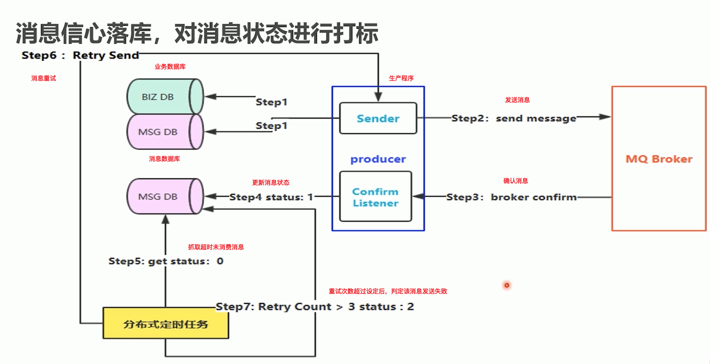
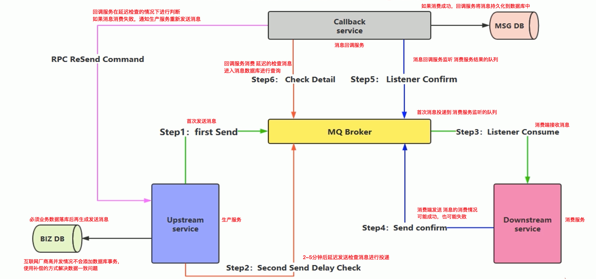
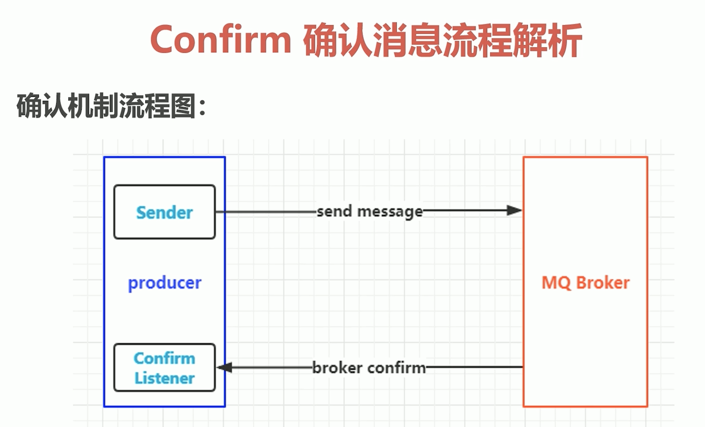
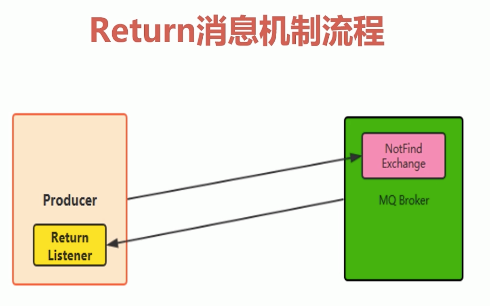

## RabbitMQ高级特性
1. <a href="#1">消息如何保障100%的投递成功？</a>  
2. <a href="#2">幂等性概念详解</a>  
3. <a href="#3">在海量订单产生的业务高峰期，如何避免消息的重复消费问题？</a> 
4. <a href="#4">Confirm确认消息、Return返回消息</a>
5. <a href="#5">自定义消费者</a>
6. <a href="#6">消息的ACK与重回队列</a>
7. <a href="#7">消息的限流</a>
8. <a href="#8">TTL消息</a>
9. <a href="#9">死信队列</a>

### <a name="#1">消息如何保障100%的投递成功？</a>
#### 什么是生产端的可靠性投递？
- 保障消息的成功发出  
- 保障MQ节点的成功接收  
- 发送端收到MQ节点（Broker）确认应答  
- 完善的消息进行补偿机制  
#### 生产端-可靠性投递
BAT/TMD互联网大厂的解决方案：  
- 消息落库，对消息状态进行打标  
  
此方法对数据库有两次数据操作，一次业务，一次消息  
- 消息的延迟投递，做二次确认，回调检查  
第一种投递方式，在高并发下，数据库可能有瓶颈  
  

### <a name="#2">幂等性</a>
#### 幂等性是什么？
借鉴数据库的乐观锁机制：  
执行一条更新库存的SQL语句  
```
update T_REPS set count = count - 1, 
version = version + 1 
where version = 1 

假设 count为库存数量，当count为1时，发生并发问题，count直接 -1 极有可能成为负数  

如何解决？加上版本号
在并发争抢时，因为先执行的SQL version+1成功，后执行的SQL通过where条件查询版本号后，无法执行减库存的操作
```

概括幂等性：对某一事物进行操作，操作可能执行n次，但是每次操作的结果是相同的  

### <a href="#3">在海量订单产生的业务高峰期，如何避免消息的重复消费问题？</a>  
消费端实现幂等性，就意味着，我们的消息永远不会消费多次，即使我们收到了多条一样的消息  
##### 业界主流的幂等性操作：  
- 唯一ID + 指纹码 机制，利用数据库主键去重  
- 利用Redis的原子性去实现  
##### 唯一ID + 指纹码 机制
唯一ID（全局唯一ID） + 指纹码（业务规则、时间戳、或者银行返回的唯一编号）机制，利用数据库主键去重。（为了保证此次操作绝对唯一）  
SELECT COUNT(1) FROM T_ORDER WHERE ID = 唯一ID + 指纹码（如果 result=0，执行insert操作，如果result=1，即已经有操作过的，不再处理）  
好处：实现简单  
坏处：高并发下有数据库写入的性能瓶颈  
解决方案：利用ID进行分库分表进行算法路由  
##### 利用Redis的原子特性实现
- 使用Redis进行幂等，需要考虑的问题  
1. 我们是否要进行数据落库，如果落库的话，关键解决问题是数据库和缓存如何做到原子性？  
2. 如果不进行落库，那么都存储到缓存中，数据可靠性问题、如何设置定时同步的策略？  

### <a href="#4">Confirm确认消息、Return返回消息</a>
#### Confirm 确认消息
理解Confirm消息确认机制：  
- 消息的确认，是指生产者投递消息后，如果Broker收到消息，则会给我们生产者一个应答  
- 生产者进行接收应答，用来确定这条消息是否正常的发送到Broker，这种方式也是消息的可靠性投递的核心保障  
  
#### 如何实现Confirm确认消息？
1. 在channel上开启确认模式：`channel.confirmSelect()`  
2. 在channel上添加监听：`addConfirmListener`，监听成功和失败的返回结果，根据具体的结果对消息进行重新发送、或记录日志等后续处理  
```java
// 生产端
// 1.创建Connectionfactory
    ConnectionFactory connectionFactory = new ConnectionFactory();
    connectionFactory.setHost("127.0.0.1");
    connectionFactory.setPort(5672);
    connectionFactory.setVirtualHost("/");

    // 2.获取Connection
    Connection connection = connectionFactory.newConnection();

    // 3.通过Connection创建一个新的Channel
    Channel channel = connection.createChannel();

    // 4. 指定我们的消息投递模式：消息的确认模式
    channel.confirmSelect();

    String exchangeName = "test_confirm_exchange";
    String routingKey = "confirm.save";

    // 5.发送一条消息
    String msg = "Hello RabbitMQ Send confirm message";
    channel.basicPublish(exchangeName, routingKey, null, msg.getBytes());

    // 6.添加一个确认监听
    channel.addConfirmListener(new ConfirmListener() {
        // 在成功时进入此方法
        @Override
        public void handleAck(long l, boolean b) throws IOException {
            // long deliveryTag 消息唯一的标签 boolean multiple 是否批量
            System.out.println("------no ack!-------");

        }

        // 在失败时进入此方法
        @Override
        public void handleNack(long l, boolean b) throws IOException {
            System.out.println("------ack!-------");
        }
    });
```
```java
// 消费端
// 1.创建Connectionfactory
    ConnectionFactory connectionFactory = new ConnectionFactory();
    connectionFactory.setHost("127.0.0.1");
    connectionFactory.setPort(5672);
    connectionFactory.setVirtualHost("/");

    // 2.获取Connection
    Connection connection = connectionFactory.newConnection();

    // 3.通过Connection创建一个新的Channel
    Channel channel = connection.createChannel();

    String exchangeName = "test_confirm_exchange";
    // confirm.# 可以匹配多个单词 confirm.* 只可以匹配一个单词
    String routingKey = "confirm.#";
    String queueName = "test_confirm_queue";

    // 4.声明交换机和队列 然后进行绑定设置，最后制定路由key
    channel.exchangeDeclare(exchangeName, "topic", true);
    channel.queueDeclare(queueName, true, false, false, null);
    channel.queueBind(queueName, exchangeName, routingKey);

    // 5.创建消费者
```
#### Return 消息机制
- Return Listener用于处理一些不可路由的消息  
- 消息生产者，通过指定一个`Exchange`和`RoutingKey`，把消息送达到某一个队列中去，然后消费者监听队列，进行消费处理操作  
- 但是在某些情况下，如果我们在发送消息的时候，当前的exchange不存在或者指定的路由key路由不到，这个时候如果我们需要监听这种不可达的消息，就要使用`Return Listener`  
  

基础API 配置项  
- Mandatory：如果为true，则监听器会接收到路由不可达的消息，然后进行后续处理，如果为false，那么Broker端自动删除该消息  
```java
// 生产端
// 1.创建Connectionfactory
    ConnectionFactory connectionFactory = new ConnectionFactory();
    connectionFactory.setHost("127.0.0.1");
    connectionFactory.setPort(5672);
    connectionFactory.setVirtualHost("/");

    // 2.获取Connection
    Connection connection = connectionFactory.newConnection();

    // 3.通过Connection创建一个新的Channel
    Channel channel = connection.createChannel();

    String exchangeName = "test_confirm_exchange";
    String routingKey = "return.save";

    // 5.发送一条消息
    String msg = "Hello RabbitMQ Send confirm message";
    channel.basicPublish(exchangeName, routingKey, null, msg.getBytes());

    // 6.添加一个return监听
    channel.addReturnListener(new ReturnListener() {
            /**
             * 当没有路由成功时
             * @param replayCode 响应码
             * @param replyText 响应文本
             * @param exchange
             * @param routingKey
             * @param basicProperties
             * @param body 实际的消息体内容
             * @throws IOException
             */
            @Override
            public void handleReturn(int replayCode, String replyText, String exchange, String routingKey, AMQP.BasicProperties basicProperties, byte[] body) throws IOException {
                System.out.println("----return -----");
            }
        });
```
### <a href="#5">自定义消费者</a>
消费端自定义监听  
```java
public class MyConsumer extends DefaultConsumer {
    public MyConsumer(Channel channel) {
        super(channel);
    }
    @override
    public void handleDelivery(String consumerTag, Envelope envelope, AMQP.BasicProperties properties, byte[] body) throws IOException {
        ...
    }
}
```
### <a href="#7">消息的限流</a>
消费端限流  
#### 什么是消费端限流？
假设场景：RabbitMQ服务器有上万条未处理的消息，随便打开一个消费者客户端，会出现下面情况：  
巨量的消息瞬间全部推送过来，但是单个客户端无法同时处理这么多数据  

RabbitMQ提供了一种`qos(服务质量保证)`功能，即`在非自动确认消息`的前提下，如果一定数目的消息（通过基于consume或者channel设置Qos的值）未被确认前，不进行消费新的消息  

> void BasicQos(uint prefetchSize, ushort prefetchCount, bool global);  

> uint prefetchSize 消息大小限制 一般设置为0，不做限制  

> ushort prefetchCount 一次最多能够处理多少条消息，一般设置为1 。会告诉RabbitMQ不要同时给一个消费者推送多于N个消息，即一旦有N个消息还没有ack，则该consumer将block掉，直到有消息ack  

> bool global 限流策略应用范围。true\false 是否将上面设置应用于channel，简单点就是上面限制是channel级别还是consumer级别

注意：  
prefetchSize和global这两项，RabbitMQ没有实现，暂不研究  
prefetchCount在`no_ack=false`的情况下生效，即在自动应答的情况下是不生效的  

#### 限流方式
1. 设置autoAck为false  
   channel.basicQos(0, 1, false);  
   channel.basicConsume(queueName, false, new MyConsumer(channel))  
2. 自定义监听  
   在重写的 handleDelivery()方法中设置 `不批量签收`  
   channel.basicAck(envelope.getDeliveryTag, false); 因为Qos设置处理为1  