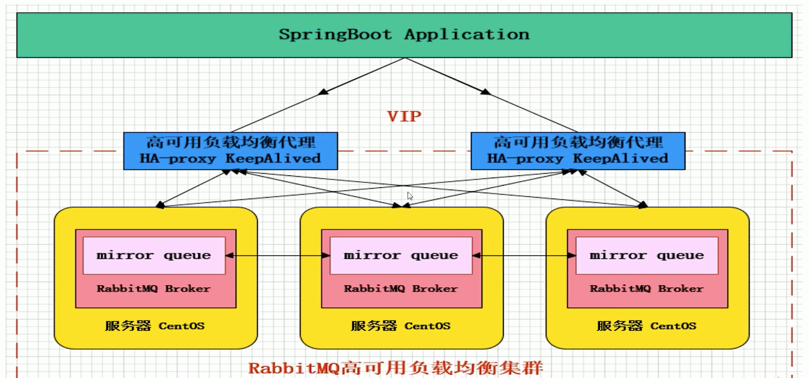

## RabbitMQ集群构架模式  
- 主备模式：实现RabbitMQ的高可用集群，一般在并发和数据量不高的情况下，这种模型非常的好用且简单。主备模式也称之为`Warren模式`  
  Warren（兔子窝），就是一个主/备方案，主节点挂掉，从节点提供服务  
  使用`HaProxy`实现主/备切换  
- 远程模式：远程模式可以实现双活的一种模式，简称`Shovel模式`，就是可以把消息进行不同数据中心的复制工作，跨地域的让两个mq集群互联  
  Shovel集群配置：  
  - 启动RabbitMQ插件，`rabbitmq-plugins enable amqp_client` `rabbitmq-plugins enable rabbitmq_shovel`  
  - 创建rabbitmq.config文件： touch /etc/rabbitmq/rabbitmq.config  
  - 添加配置  
  - 源服务器和目的地服务器都使用相同的配置rabbitmq.config文件  
- 镜像模式：经典的`Mirror镜像模式`，保证100%数据不丢失，实际中应用最多  
  镜像队列，目的是为了保证RabbitMQ数据的高可靠性解决方案，主要就是实现数据的同步，一般来讲2-3节点（ 100%数据可靠性一般是3节点）实现数据同步  
  
- 多活模式：是实现异地数据复制的主流模式  
  因为Shovel模式配置比较复杂，所以一般来说实现异地集群都是使用这种双活或者多活模型来实现的  
  这种模型需要依赖RabbitMQ的federation插件，可以实现持续的可靠的AMQP数据通信  
  
  - Federation插件是一个不需要构建Cluster，而在Brokers之间传输消息的高性能插件  
  - Federation插件可以在Brokers或者Cluster之间传输消息，连接的双方可以使用不同的users和virtual hosts  
  - 双方也可使用不版本不同的RabbitMQ和Erlang  
  - Federation插件使用AMQP协议通讯，可以接受不连续的传输  

  - Federation Exchange，可以看成DownStream从UpStream主动拉取消息，但不是拉取所有消息，必须是DownStream上已经明确定义Bindings关系的Exchange，也就是有实际物理Queue来接收消息，才会从Upstream拉取消息到DownStream  
  - 使用AMQP协议实施代理间通信，DownStream会将绑定关系组合在一起，绑定/解除绑定命令将发送到Upstream交换机  
  - 因此，Federation Exchange只接收具有订阅的消息  

5-8
    
 