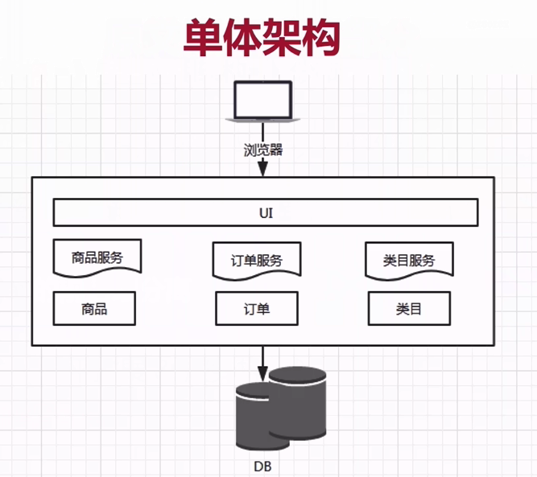
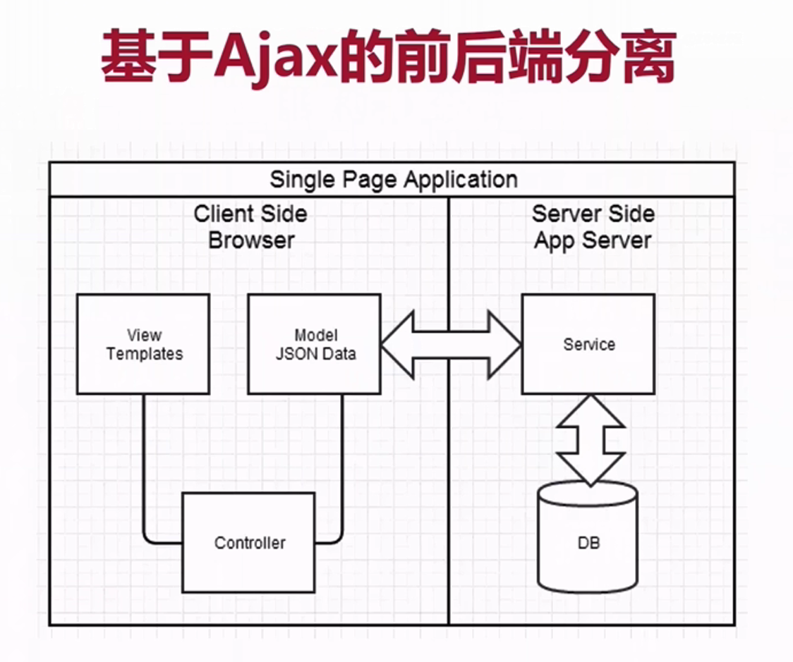
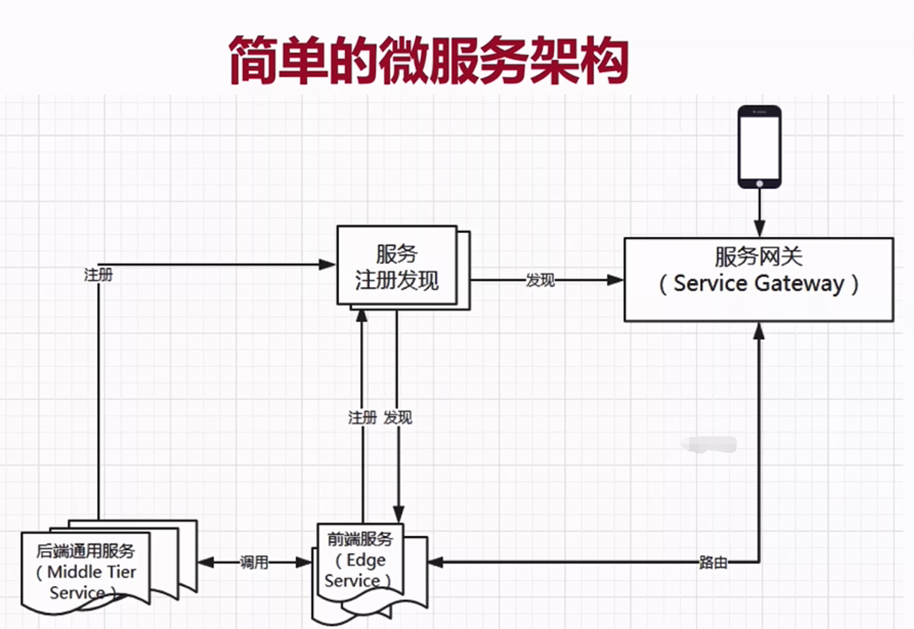
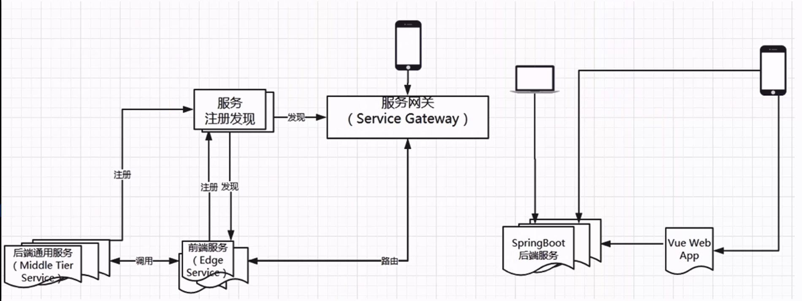

## 微服务
### 什么是微服务  
- 微服务是一种架构风格（没有强制性，没有固定模式）  

- 一系列微小的服务共同组成  
- 跑在自己的进程里  
- 每个服务为独立的业务开发  
- 独立部署  
- 分布式的管理  
### 常见构架
构建演进  
  
`单一应用架构` -> `垂直应用架构` -> `分布式服务架构` -> `流动计算架构`  
#### 单体架构  
  
- 所有功能都打包在一个war包中  
- 没有外部依赖（即一个服务依赖于另一个服务的实现）  
- 部署在一个web容器中  
- 所有服务共用一个DB  

单体架构的优点：  
> 容易测试  
> 容易部署  

单体架构的缺点：  
> 开发效率低（所有开发人员在同一个项目修改代码，容易造成冲突）  
> 代码维护难
> 部署不灵活（任何小的代码修改，需重新构建整个项目）  
> 稳定性不高（小问题都可能导致系统崩溃）
> 扩展性不够（无法满足高并发时的业务需求）
#### 基于Ajax的前后端分离  
  
#### 分布式  
旨在支持应用程序和服务的开发，可以利用物理架构 由`多个自治的处理元素`，`不共享主内存`，但通过`网络发送消息`合作  
微服务必然时分布式的  
##### `多个自治的处理元素`可以理解为`多节点`  
分布式是多节点的，集群也是多节点的，分布式和集群有什么区别？  
举例：  
厨房中两个厨师，一个洗菜、一个炒菜，他们做的事互不干扰，这种就叫做`分布式`  
如果两个都炒菜，那就是`集群`  
##### `不共享主内存`，但通过`网络发送消息`合作  
强调分布式节点中，各个节点是通过发送消息进行通信的，比如`Http`、`Rest接口`、`RPC`，这个在微服务中同样适用  
### 一个极简的微服务构架
  
### 微服务架构的基础框架/组件  
- 服务注册发现  
  > 微服务组件之间进行通信的组件(内部)  
  > 服务提供方在此组件注册，提供其服务地址等信息
  > 服务调用方在此组件上才能正确的发现服务
- 服务网关（Service Gateway）  
  - > 将服务暴露到外部(例如：手机、浏览器等用户端)  
  - > 服务的前端路由
  - > 服务网关是连接内外的大门  
  - > 服务网关会对外屏蔽后台服务的细节，比如后台程序升级而用户无感知变化
  - > 服务网关有路由功能，可以将外部的请求反向路由到某个微服务
  - > 可以在网关做限流和容错的功能，因为所有的请求都会经过网关（例如：控制流量、监控日志）  
  - > 提交服务的安全性。网关可以对请求进行控制（认证、授权、反爬虫）
- 后端通用服务（也称中间层服务 Middle Tier Service）  
- 前端服务（也称边缘服务 Edge Service） 
  - > 对后端服务做必要的`聚合`和`裁剪`后暴露给外部不同的设备  
  - > `聚合`就是对多个API逻辑进行聚合，从而减少客户端的请求数  
  - > `裁剪`和`聚合`相反，根据不同的需求，返回不同的数据（比如PC端返回数据详细，手机端请求只返回关键信息）
### 微服务治理  
  
两种方式：  
- 阿里系：  
  - > Dubbo  
  - > Zookeeper  
  - > SpringMVC or SpringBoot  
  - > ...  
- Spring Cloud:
  - > Spring Cloud Netflix Eureka  
  - > SpringBoot  
  - > ...
### Spring Cloud是什么
- Spring Cloud是一个开发工具集，包含了多个子项目  
  - > 利用SpringBoot的开发便利  
  - > 主要是基于对Netflix开源组件的进一步封装  
- Spring Cloud简化了`分布式开发`  