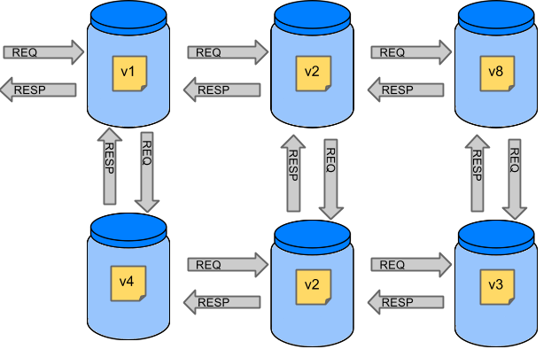
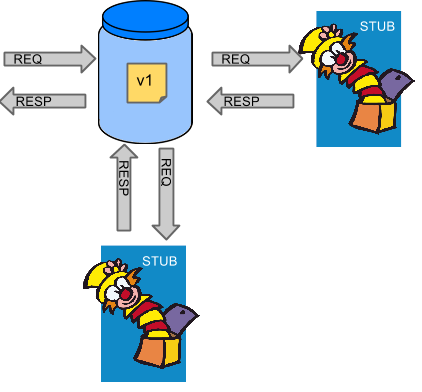

## CDC消费者驱动的契约测试
消费者驱动的契约测试（Consumer-Driven Contracts，简称CDC），是指从消费者业务实现的角度出发，驱动出契约，再基于契约，对提供者验证的一种测试方式  
## 为什么要做契约测试
假设我们有一个由多个微服务组成的系统  


如果我们想测试应用v1，我们可以做以下两件事之一  
1. 部署所有微服务并执行端到端测试  
2. 在单元/集成测试中模拟其他微服务  

两者都有其优点，但也有很多缺点  

- 部署所有微服务并执行端到端测试  
    优点：  
    - 模拟生产  
    - 测试服务之间的真实通信  
  
    缺点：  
    - 要测试一个微服务，我们必须部署6个微服务，几个数据库等  
    - 运行时间很长，稳定性差，容易失败  
    - 非常难以调试，依赖服务不受控制  
  
- 在单元/集成测试中模拟其他微服务  
    优点：  
    - 非常快速的反馈，简单易用  
    - 没有基础设施要求,如DB，网络等  

    缺点：  
    - 模拟不够真实  
    - 部分场景测试不到  
  
## 使用Spring Cloud Contract  
测试v1就不用启动其它服务  
  

## 契约测试（Contract）
### 契约测试步骤
Spring Cloud Contract契约测试大概分三个步骤  
1. producer提供服务的定好服务接口（即契约）  
2. 生成stub，并共享给消费方，可通过mvn install到maven库中  
3. consumer消费方引用契约服务，进行集成测试  

### Server/Producer 服务提供端
1. 构架引入  
   - 在pom.xml中加入jar包依赖，放入dependencies中
   ```xml
    <!--契约测试服务提供端依赖-->
    <dependency>
        <groupId>org.springframework.cloud</groupId>
        <artifactId>spring-cloud-starter-contract-verifier</artifactId>
        <scope>test</scope>
    </dependency>
   ```
   - 配置插件，放入plugins中
    ```xml
    <plugin>
        <groupId>org.springframework.cloud</groupId>
        <artifactId>spring-cloud-contract-maven-plugin</artifactId>
        <!-- Don't forget about this value !! -->
        <extensions>true</extensions>
        <configuration>
            <!-- MvcMockTest为生成本地测试案例的基类 每个人的基类路径可能不同，根据实际情况修改-->
            <baseClassForTests>com.inphase.imccp.device.restapi.MvcMockTest</baseClassForTests>
        </configuration>
    </plugin>
    ```
   - spring-cloud-contract-maven-plugin的使用介绍（插件的常用maven命令）
     `spring-cloud-contract:help`：帮助  
     `spring-cloud-contract:convert`：在`target/stubs`下，根据将契约生成mapping文件，用于打包jar文件，提供http服务，供consumer使用  
     `spring-cloud-contract:generateStubs`：生成stubs的jar包，用于分享给consumer使用  
     `spring-cloud-contract:generateTests`：基于contract生成服务契约的测试案例，服务实现了契约后，保证实现与契约一致  
     `spring-cloud-contract:run`：启动契约服务，将契约暴露为http server服务  
     `spring-cloud-contract:pushStubsToScm`：将契约放置在scm中管理  
     注：`Maven SCM`:![http://maven.apache.org/scm/index.html]  
2. 需求  
   producer服务需要提供一个对外的接口GET请求的接口，并且接收一个name的参数  
   如`GET` `/hello?name=zhangsan`  
   要求返回`{"code": "10000","message": "SUCCESS"}`  
3. 编写Controller  
4. 编写契约  
   在`src/test/resources/contracts/HelloController.groovy`中增加契约文件（可以有多种格式如groovy 、yaml、，这里采用groovy）  
   注意路径地址为 `src/test/resources/contracts`文件夹下，并不是 Junit的路径地址  
   ```groovy
    Contract.make {
        request {
            method 'GET'
            url('/hello') {
                queryParameters {
                    parameter("name", "zhangsan")
                }
            }

        }
        response {
            status 200
            body("""
            {
                "code": "10000",
                "message": "SUCCESS"
            }
            """)
            headers {
                header('Content-Type': 'application/json;charset=UTF-8')
            }
        }
    }
    ```
5. 生成stub jar文件  
   - 在项目目录下执行命令 `mvn spring-cloud-contract:convert`，会在target/stubs下生成相关json文件  ‘
    
   - 执行`mvn spring-cloud-contract:generateStubs`命令，会在target下生成stubs的jar包  
6. 接口实现并检验是否符合契约（服务提供者对自己定义的契约的一次自测检查）  
    - 提供一个测试基类（主要用于按照契约对接口生成测试案例，检验接口是否按契约实现）  
    注意：这个基类的地址就是配置在pom文件中plugin的configuration位置的地址  
    - 执行`mvn spring-cloud-contract:generateTests`命令，会在target/generated-test-sources/contracts目录下根据契约生成测试案例，用于服务提供方最后检验是否符合契约  
7. 安装stub到maven库中  
   可将plugin绑定到相关的phase上自动安装到maven库中  
   例如：  
   `mvn install:install-file -DgroupId=vip.proyi.test -DartifactId=producer -Dversion=0.0.1-SNAPSHOT -Dpackaging=jar -Dclassifier=stubs -Dfile=producer-0.0.1-SNAPSHOT-stubs.jar`  
   以上，将stub jar包分享给`consumer`，对方就要以在集成测试案例中使用了  
### Client/Consumer 服务调用端
1. 构架引入  
   jar包依赖，放入dependencies  
   ```xml
   <!--契约测试服务使用端必要依赖-->
    <dependency>
        <groupId>org.springframework.cloud</groupId>
        <artifactId>spring-cloud-starter-contract-stub-runner</artifactId>
        <scope>test</scope>
    </dependency>
   ```
2. 调用方代码
   消费方有接口`/use?name=xxx`，该接口调用了producer服务的`/hello?name=xxx`接口  
   根据微服务基础构架，web模块的`Controller`调用Client模块的future高可用层，再调用service层，再向下client层通过`feign`调用`producer服务`  
3. 测试案例编写  
   


