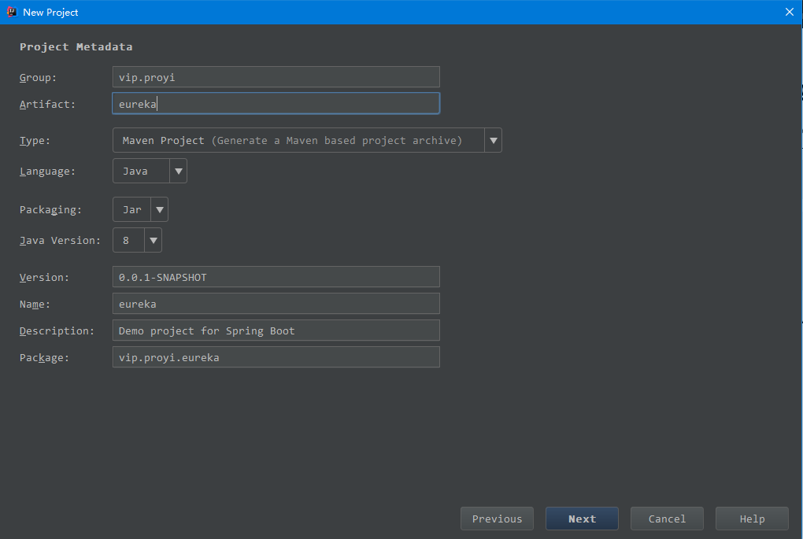
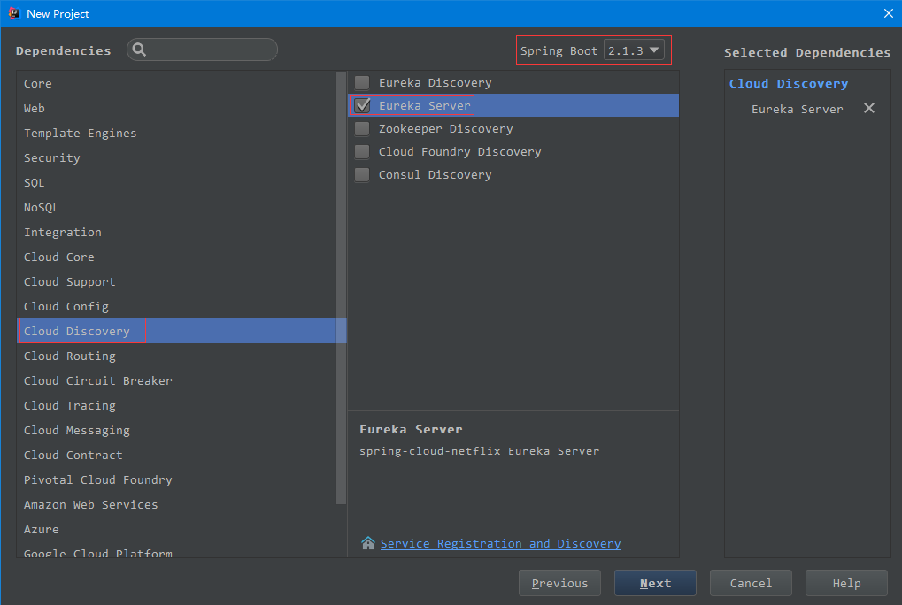
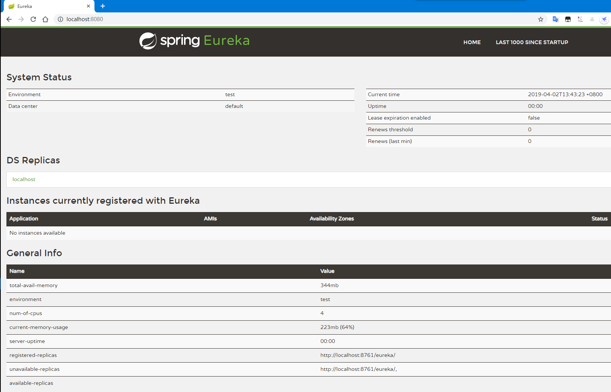
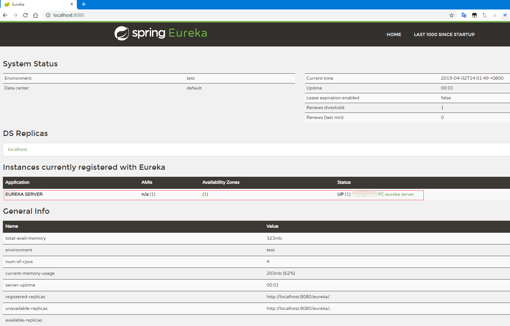
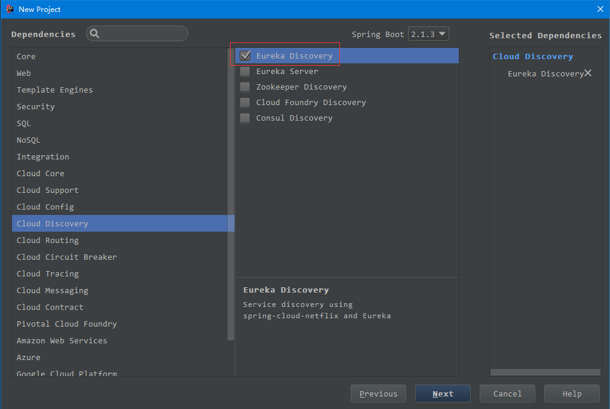
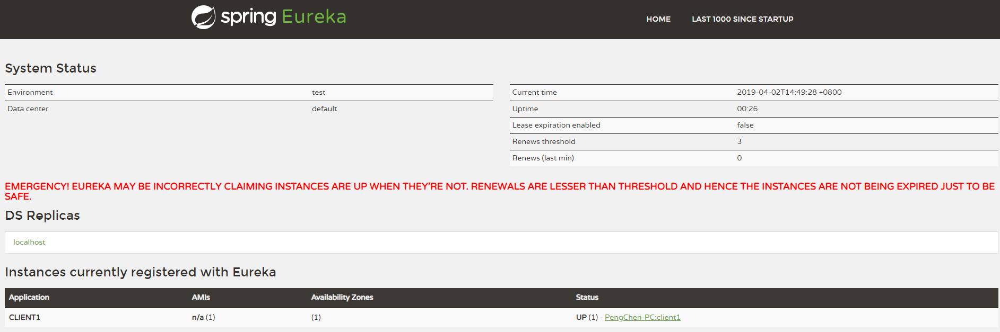
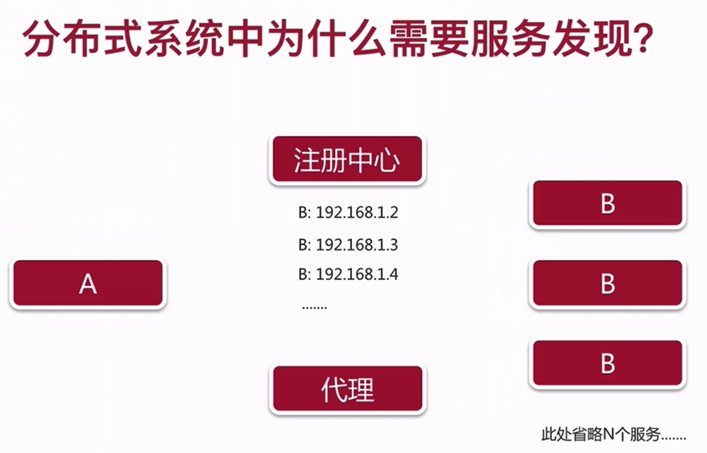

## Spring Cloud Eureka
- 基于Netflix Eureka的二次封装  
- 由两个组件组成：
    - > Eureka Server 注册中心  
    供服务注册的服务器
    - > Eureka Client 服务中心  
    用来简化和服务器的交互，作为轮询负载均衡器，提供服务的故障切换支持  
    系统中的其他微服务使用客户端连接到Eureka Server，并维持心跳连接，这样就可以监控系统中各个微服务是否正常运行  
### 注册中心（Eureka Server）  
  
  
Eureka Server和SpringBoot版本是有对应关系的，具体版本对应关系可以在[Spring官网](https://spring.io/projects)查找  
#### 项目启动
1. 项目创建后启动，在浏览器访问对应端口，跳转到错误页面  
需要先在启动类上添加`@EnableEurekaServer`注解，开启EurekaServer服务  
重新启动后即可看到注册中心管理页面  
  
2. 项目控制台一直在报错`Connection refused: connect`  
这是因为`@EnableEurekaServer`包含`@EnableDiscoveryClient`，它是一个服务端，同时也是一个客户端，而且没有配置它自己需要向哪个注册中心注册，就会一直去寻找注册中心  
在resources下的application.yml中配置，使用配置文件，将其向自己注册即可  
```yml
eureka:
  client:
    # eureka 注册中心地址
    service-url:
      defaultZone: http://localhost:8080/eureka/
    # 因为它本来就是注册中心，不想显示在注册中心的管理列表中
    register-with-eureka: false
spring:
  application:
    name: eureka server
```
  
最好还是使用其默认的端口，避免冲突
```yml
eureka:
  client:
    # eureka 注册中心地址
    service-url:
      defaultZone: http://localhost:8761/eureka/
    # 因为它本来就是注册中心，不想显示在注册中心的管理列表中
    register-with-eureka: false
spring:
  application:
    name: eureka server
server:
  port: 8761
```
进入项目的目录，利用maven打包成`jar/war`，然后可以不依赖IDE来启动项目，或后台运行  
```
打包命令 
mvn clean package  
进入 target目录,使用Java命令启动jar包  
java -jar target/eureka-0.0.1-SNAPSHOT.jar  

linux下后台运行  
nohup java -jar target/eureka-0.0.1-SNAPSHOT.jar > /dev/null 2>&1 &
```
### 服务注册（Eureka Client） 
  

1. 添加`@EnableEurekaClient`注解
2. pom.xml添加依赖(不添加此依赖，项目启动后会自动停止)
```xml
<dependency>
    <groupId>org.springframework.boot</groupId>
    <artifactId>spring-boot-starter-web</artifactId>
</dependency>
```
3. 修改配置文件  
```yml
eureka:
  client:
    service-url:
      defaultZone: http://localhost:8761/eureka/
  instance:
    # 自定义client列表上url跳转头
    hostname: clientName
spring:
  application:
    name: client1
```
   
因为server端和client之间使用心跳的机制，server端会不停的检查client是否还在线，存活。会在一定时间内统计出一个上线率，当上线比例低于某个值时，就会提出警告。这是Eureka的一种自我保护的模式  
在开发环境下可以其关闭（进入`Eureka Server`的配置文件）  
```yml
eureka:
  
  server:
    # 是否开启上线率低的警报，默认时true
    enable-self-preservation: false
```
### Eureka Server高可用  
启用多个Eureka Server节点  
并且向所有除了自己节点的Server注册中心注册  

client节点在配置文件中配置多个Server地址  
### 分布式系统为什么需要服务发现  
  
正在进行中的微服务的数量在分布式系统中是动态变化的，其他服务调用的时候得提前知道都有哪些系统在进行服务  

A服务从注册中心拿到B服务的地址列表，挑选一个B进行服务（轮询、哈希、负载均衡），这种方式叫做`客户端发现`，由A发起  

新角色`代理`，帮助A从众多可用的B服务中挑选一个，然后A再找B服务，这种方式叫做`服务端发现`
#### 服务发现的两种方式  
- 客户端发现 
  - Eureka  
- 服务端发现  
  - Nginx  
  - Zookeeper  
  - Kubernetes  
#### 为什么Eureka使用客户端发现  
这是Eureka开发时的权衡  
所有的服务均需要再注册中心注册，使用`@EnableEurekaClient`等注解  
不管时后端通用服务还是前端服务  
可是如果不是使用Java语言进行开发的服务呢？无法注册到Eureka

- 微服务的特点：`异构`   
  - 不同编程语言  
  - 不同类型的数据库  

不可能要求所有的服务都是由Java语言开发的  

- SpringCloud的服务调用方式  
  - REST or RPC ？  
  - REST

Eureka的服务端提供了较为完善的REST API  
Eureka支持将非Java语言提供的服务纳入到其服务治理体系当中，只需要其他语言实现Eureka的客户端程序  
比如：`Node.js的eureka-js-client`