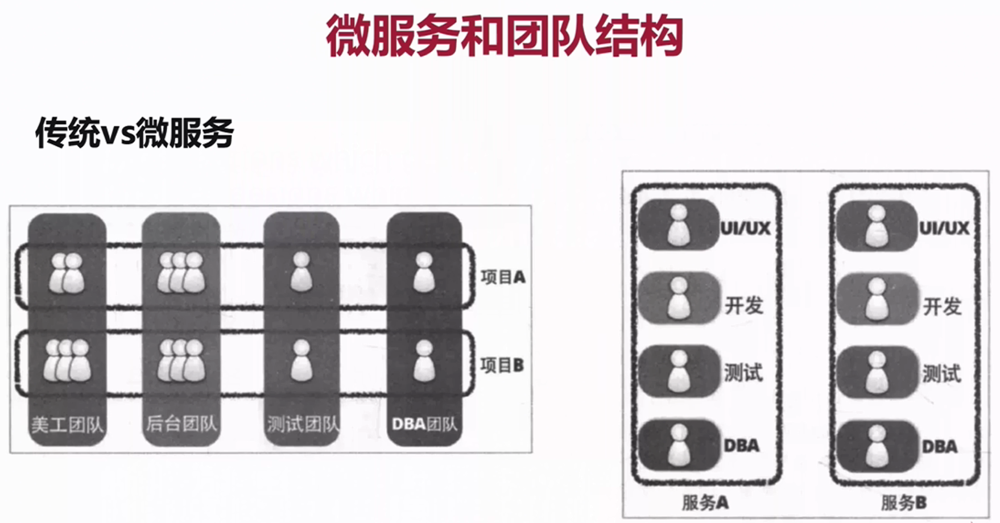

## 微服务如何拆分  
- 明白起点和终点  
- 需要考虑的因素与坚持的原则  
### 起点和终点  
- 起点：既有架构的形态  
- 终点：好的架构不是设计出来的，而是进化而来的，并且一直演进  
### 业务形态不适合微服务  
- 系统中包含很多很多强事务场景  
- 业务相对稳定，迭代周期长  
- 访问压力不大，可用性要求不高  
- ...
### 康威定律  
任何组织再设计一套系统（广义概念上的系统）时，所交付的设计方案在结构上都与该组织的沟通结构保持一致  
一个服务由一个团队进行沟通、维护、迭代  

### 服务拆分  
根据具体需求  
#### 服务拆分的方法论  
- 扩展立方模型（Scale Cube）  
X轴：水平复制  
Z轴：数据分区  
Y轴：功能解耦  

##### 如何拆“功能”  
- 单一职责，松耦合、高内聚  
- 关注点分离  
  - 按职责  
  - 按通用性  
  - 按粒度级别
##### 服务和数据的关系  
- 先考虑业务功能，再考虑数据    
- 无状态服务  
  - 如果一个数据需要被多个服务共享才能完成一个请求，那么这个数据可以成为`状态`  
  - 依赖这个状态的服务称为`有状态服务`，反之`无状态服务`  
  