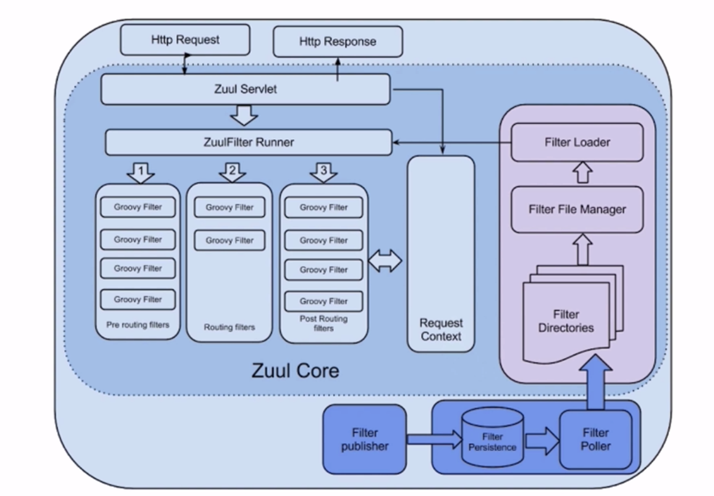
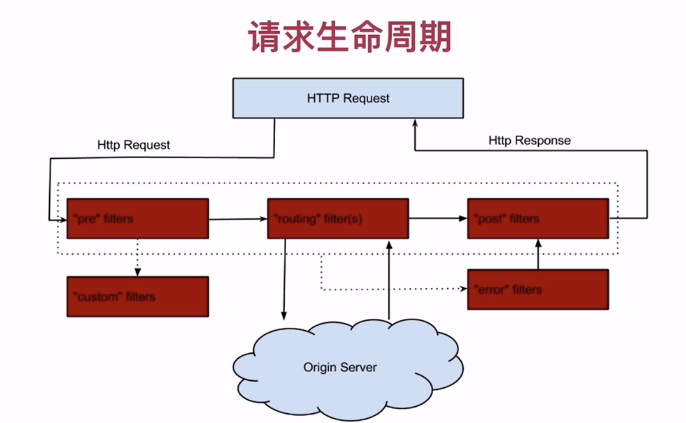
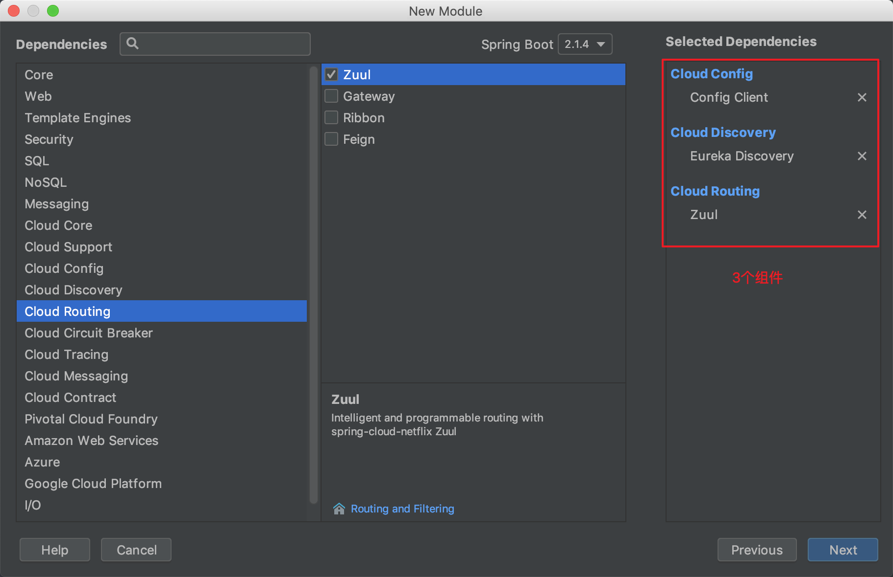
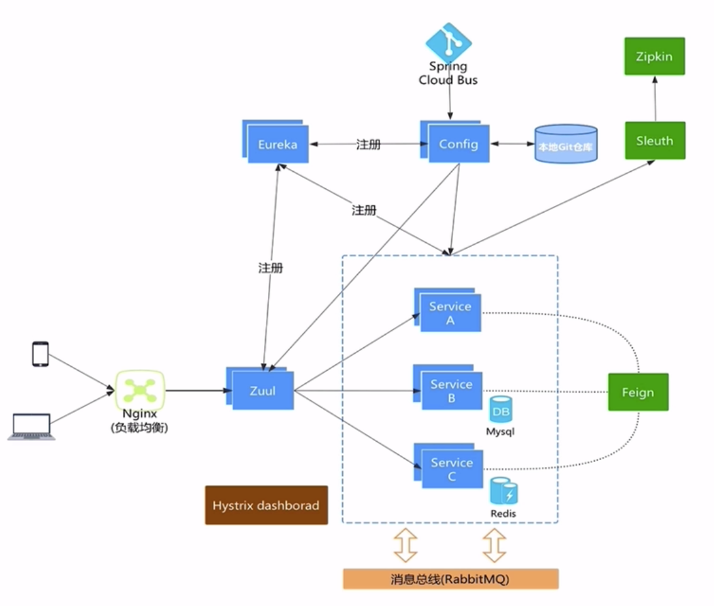
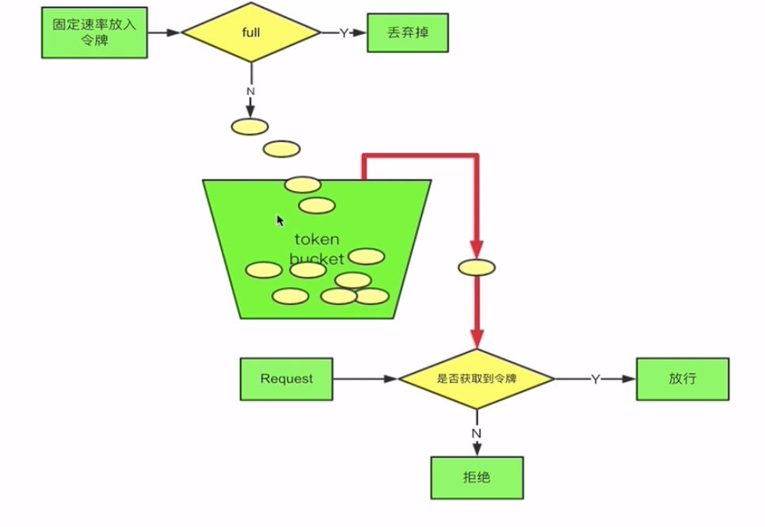

## 为什么需要网关服务
  
### 服务网关的要素  
- 稳定性，高可用  
- 性能、并发性  
- 安全性  
- 扩展性  
### 常见的网关方案  
- Nginx + Lua  
- Kong(源于Nginx)  
- Tyk(开源，go语言开发)
- Spring Cloud Zuul（Java开发、Spring家族、性能不如Nginx）  

为了既使用Nginx的高性能，又使用Zuul易于微服务开发，自动负载等特性，可以将Nginx作为服务最前端，然后将请求转发给Zuul  
这种混搭方案可以更好的满足项目需要  
### Zuul的特点  
- 路由 + 过滤器 = Zuul  
- 核心是一系列的过滤器  
### Zuul的四种过滤器API  
- 前置(Pre)  
- 路由(Route)  
- 后置(Post)  
- 错误(Error)  
### Zuul构架
  
  

### 创建Zuul网关服务  
1. 新建Springboot Zuul项目  
     
2. 修改配置文件  
   ```yml
    spring:
        application:
            name: api-gateway
        cloud:
            config:
                discovery:
                    enabled: true
                    # config在eureka上注册的服务名
                    service-id: CONFIG
    eureka:
        client:
            service-url:
                defaultZone: http://localhost:8761/eureka/
   ```
3. 添加注解`@EnableZuulProxy`  

例如:  
某微服务API部署在8082端口，API访问路径为http://localhost:8082/testrout  
在配置完网关服务在8080端口后，直接访问`http://localhost:8080/服务在Eureka注册名/testrout`后直接路由到localhost:8082/testrout地址上完成访问  
此时即可，只对外开放网关地址即可完成服务暴露  
### 自定义路由  
在网关地址访问时，必需符合网关要求规则，拼接服务名称，如果希望自定义拼接的服务名  
以 注册在Eureka上服务名为 `product`为例  
在配置文件中配置   
```yml
zuul:
  routes:
    # 自定义的路由名称
    myProduct:
      path: /myProduct/**
      # 路由到哪个服务上去
      serviceId: product
    # 如果只配置路由 简写 服务名：路由地址
    product: /myProduct/**
```
未配置之前的访问地址：`http://localhost:8080/product/testrout`  
配置之后的访问地址：`http://localhost:8080/myProduct/testrout`
### 禁止某些地址路由  
```yml
zuul: 
    # 禁止路由地址 避免外部访问
    ignored-patterns:
    # 配置一个Set 多个地址,如果配置了自定义路由，原地址和路由地址都得禁止
        # - /product/testrout
        # - /myProduct/testrout
        # 使用通配符简化地址
        - /**/testrout
```
### Zuul传递Cookie  
Zuul默认会过滤掉`敏感头`，不会向后端传递  
同样的敏感头默认的是`Cookie`、`Set-Cookie`、`Authorization`  

如果不过滤，仅需要将敏感头设置为空即可  
```yml
zuul:
  routes:
    # 自定义的路由名称
    myProduct:
      path: /myProduct/**
      serviceId: product
      # 过滤敏感头  
      sensitiveHeaders: 
```
### 动态路由配置
如果路由信息写在本地服务，每次修改后都得重启服务  
因此可以将路由信息配置在`配置中心`,实现路由配置信息的动态加载  

在网关中再动态的注入路由配置
新建一个`ZuulConfig`或者直接写在启动类中  
```java
@Component
public class ZuulConfig {

    @ConfigurationProperties("zuul")
    @RefreshScope
    public ZuulProperties zuulProperties() {
        return new ZuulProperties();
    }
}
```  
### 过滤器典型应用场景  
前置（Pre）  
 - 限流  
 - 鉴权  
 - 参数校验  
后置（Post）  
 - 统计  
 - 日志  
### Zuul的高可用  
- 多个Zuul节点注册到Eureka Server  
- Nginx和Zuul“混搭”,可以取长补短  

  
### 自定义Zuul过滤器  
- 前置过滤器  
    ```java
    /**
    * 前置过滤 验证token
    */
    @Component
    public class TokenFilter extends ZuulFilter {

        @Override
        public String filterType() {
            return FilterConstants.PRE_TYPE;
        }

        @Override
        public int filterOrder() {
            /**
            * 数值越小，优先级越高
            */
            return FilterConstants.PRE_DECORATION_FILTER_ORDER - 1;
        }

        @Override
        public boolean shouldFilter() {
            return true;
        }

        @Override
        public Object run() throws ZuulException {
            /**
            * filter中实现的逻辑
            */
            // 获取当前的上下文
            RequestContext requestContext = RequestContext.getCurrentContext();
            HttpServletRequest request = requestContext.getRequest();

            // 此处从url参数中获取token，也可以从Cookie，header里获取
            String token = request.getParameter("token");
            if (StringUtils.isEmpty(token)) {
                // 表示验证不通过
                requestContext.setSendZuulResponse(false);
                requestContext.setResponseStatusCode(HttpStatus.SC_UNAUTHORIZED);
            }
            return null;
        }
    }
    ```
- 后置过滤器  
    ```java
    /**
    * 后置过滤 方法调用完成后执行
    */
    @Component
    public class AddResponseHeaderFilter extends ZuulFilter {

        @Override
        public String filterType() {
            return POST_TYPE;
        }

        @Override
        public int filterOrder() {
            return SEND_RESPONSE_FILTER_ORDER - 1;
        }

        @Override
        public boolean shouldFilter() {
            return true;
        }

        @Override
        public Object run() throws ZuulException {
            RequestContext requestContext = RequestContext.getCurrentContext();
            HttpServletResponse response = requestContext.getResponse();
            response.setHeader("Post-Filter", "now " + new Date());
            return null;
        }
    }
    ```
### Zuul 限流  
限流是被放在前置过滤器中的  
- 时机：请求被转发之前调用  

Zuul的前置过滤中有很多过滤器，比如限流、鉴权等  
限流应早于鉴权  
#### 令牌桶限流  
  
```java
/**
 * 限流
 */
@Component
public class RateLimitFilter extends ZuulFilter {

    /**
     * 限流算法 已有Google的guava中的开源算法
     */
    private static final RateLimiter RATE_LIMITER = RateLimiter.create(100);

    @Override
    public String filterType() {
        return PRE_TYPE;
    }

    @Override
    public int filterOrder() {
        // 修改优先级为最高
        return SERVLET_DETECTION_FILTER_ORDER -1;
    }

    @Override
    public boolean shouldFilter() {
        return true;
    }

    @Override
    public Object run() throws ZuulException {
        // 如果没有拿到令牌，可以返回错误状态，也可以抛出异常
        if (!RATE_LIMITER.tryAcquire()) {
            throw new RateLimitException();
        }
        return null;
    }
}
```
### Zuul权限校验  
分别为不同的权限角色设定不同的filter  
然后匹配不同的url地址来决定是否进行拦截  

鉴权的情况下 gateway最好不要直接连接数据库或者调用其他服务  
导致数据库压力或者其他服务压力过大  
可以读取Redis缓存或者消息消费等模式来应对大量压力  

- 在前置过滤器中实现相关逻辑  
- 分布式Session Vs OAuth2  

### Zuul 跨域  
- 跨域问题 （其实就是Spring跨域问题）  
- 在被调用的类或方法上添加`@CrossOrigin`注解（缺点：每个需要的类或方法都得添加）  
- 在Zuul里增加CorsFilter过滤器  

```java
/**
 * 跨域配置
 */
@Configuration
public class CorsConfig {
    @Bean
    public CorsFilter corsFilter() {
        final UrlBasedCorsConfigurationSource source = new UrlBasedCorsConfigurationSource();
        final CorsConfiguration config = new CorsConfiguration();

        // 是否支持跨域
        config.setAllowCredentials(true);
        // 允许哪些原始域
        config.setAllowedOrigins(Arrays.asList("*"));
        // 允许的请求头
        config.setAllowedHeaders(Arrays.asList("*"));
        // 允许的请求方法
        config.setAllowedMethods(Arrays.asList("*"));
        // 缓存时间 对当前的跨域请求不再检查  300秒
        config.setMaxAge(300L);

        source.registerCorsConfiguration("/**", config);
        return new CorsFilter();
    }
}
```