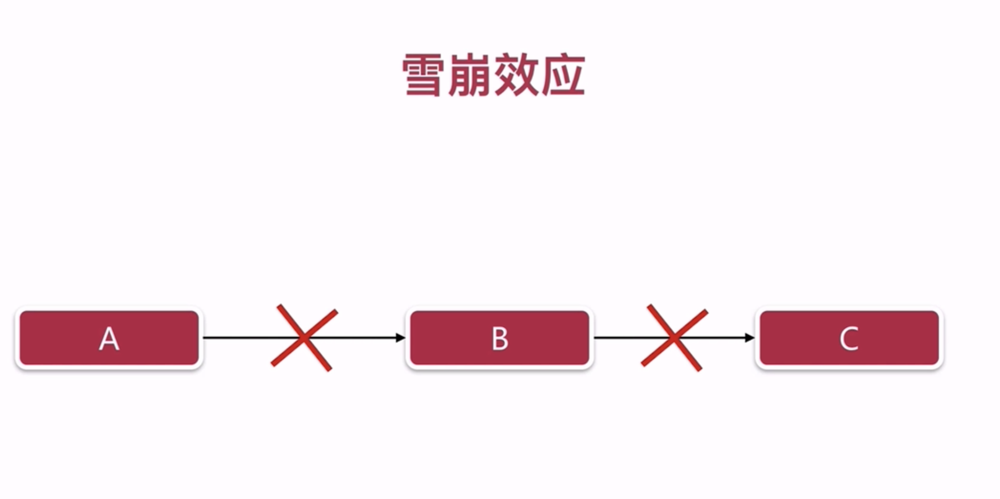
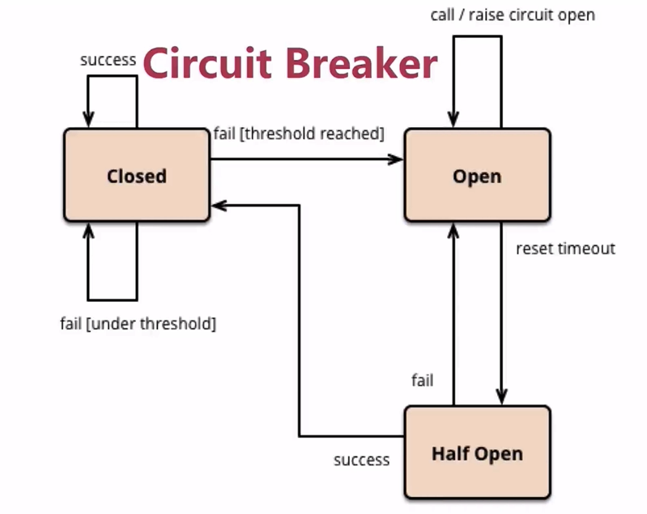
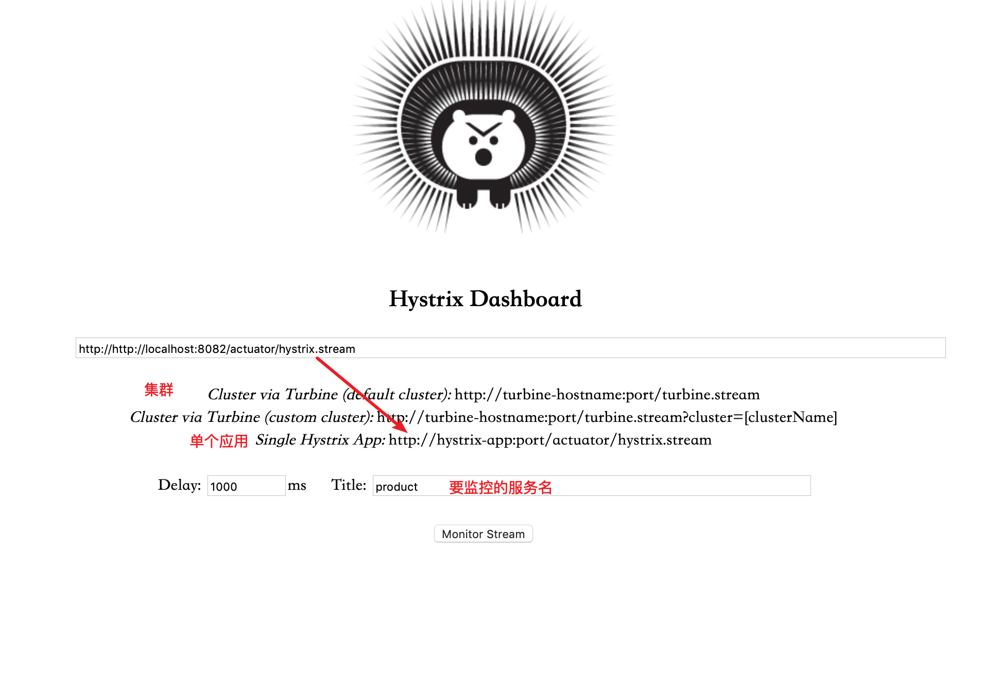
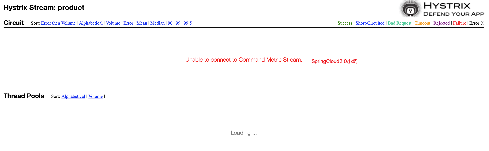
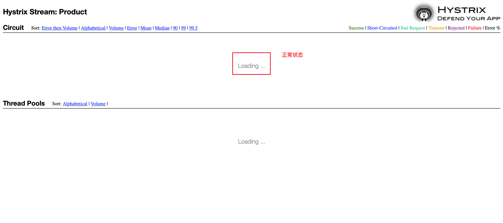

## 雪崩效应  
  
微服务中，A服务调用B服务，B服务调用C服务，此时C服务若不可用，B服务会不断重试，重复等待会导致资源耗尽，导致B服务不可用，A又不断重试B，最终结果A不可用，B不可用，C不可用，极有可能导致整个系统均不可用  
这种状态被称作`雪崩效应`  
## Spring Cloud Hystrix  
- 防雪崩利器  
- 基于Netflix对应的Hystrix  
### 特色功能  
- 服务降级 
- 依赖隔离  
- 服务熔断  
- 监控（Hystrix Dashboard）  
### 服务降级  
- 优先核心服务，非核心服务不可用或弱可用  
- 通过`@HystrixCommand`注解指定  
- fallbackMehtod（回退函数）中具体实现降级逻辑  

1. 业务模块pom引入依赖  
   ```xml
   <dependency>
        <groupId>org.springframework.cloud</groupId>
        <artifactId>spring-cloud-starter-stream-hystrix</artifactId>
    </dependency>
    <!-- spring 2.0 需要添加-->
    <dependency>
        <groupId>com.netflix.hystrix</groupId>
        <artifactId>hystrix-javanica</artifactId>
    </dependency>
   ```
2. 启动类添加`@EnableCircuitBreaker`注解  
   **注：**  
   如果启动类上有`@SpringBootApplication`、`@EnableDiscoveryClient`、`@EnableCircuitBreaker`三个注解可以使用一个聚合注解 `@SpringCloudApplication`代替  
3. 在调用其他服务的方法上添加`@HystrixCommand(fallbackMethod = "fallbackmethod")`，并编写fallback降级方法,当调用的服务`不可用``超时`或者`抛出异常`时，将会使用fallbackmethod进行处理    
   ```java
   /**
     * 使用Feign来调用User服务msg接口
     * @return
     */
    @HystrixCommand(fallbackMethod = "fallbackmethod")
    @GetMapping("/userMsg4")
    public String userMsg4() {
        String response = userClient.queryUserMsg();

        log.info("response={}", response);
        return response;
    }
    private String fallbackmethod() {
        return "test: 接口出现问题，请稍后再试";
    }
   ```

   可以在`Contorller`上使用使用`@DefaultProperties(defaultFallback = "defaultFallback")`注解配置默认处理方法，不用每一个方法上都去配置，当然默认降级的方法中的逻辑需要自己去实现  
### 超时设置
Hystrix默认设置`com.netflix.hystrix.HystrixCommandProperties`  
> private static final Integer default_executionTimeoutInMilliseconds = 1000;  // 默认1秒，单位毫秒  

```java
this.executionTimeoutInMilliseconds = getProperty(propertyPrefix, key, "execution.isolation.thread.timeoutInMilliseconds", builder.getExecutionIsolationThreadTimeoutInMilliseconds(), default_executionTimeoutInMilliseconds);
```
使用注解
```  
@HystrixCommand(commandProperties = {@HystrixProperty(name = "execution.isolation.thread.timeoutInMilliseconds", value = "2000")})
```
### 依赖隔离  
- 线程池隔离  
- Hystrix自动实现了依赖隔离  
### 服务熔断  
```java
this.circuitBreakerEnabled = getProperty(propertyPrefix, key, "circuitBreaker.enabled", builder.getCircuitBreakerEnabled(), default_circuitBreakerEnabled);  

this.circuitBreakerRequestVolumeThreshold = getProperty(propertyPrefix, key, "circuitBreaker.requestVolumeThreshold", builder.getCircuitBreakerRequestVolumeThreshold(), default_circuitBreakerRequestVolumeThreshold);

this.circuitBreakerSleepWindowInMilliseconds = getProperty(propertyPrefix, key, "circuitBreaker.sleepWindowInMilliseconds", builder.getCircuitBreakerSleepWindowInMilliseconds(), default_circuitBreakerSleepWindowInMilliseconds);

this.circuitBreakerErrorThresholdPercentage = getProperty(propertyPrefix, key, "circuitBreaker.errorThresholdPercentage", builder.getCircuitBreakerErrorThresholdPercentage(), default_circuitBreakerErrorThresholdPercentage);    
```

- circuit Breaker : 断路器  
断路器模式：将受保护的服务封装到一个可以监控故障的断路器对象里面，当故障达到一定的值，断路器将会跳闸，断路器对象返回错误
  

调用失败累计达到一定阈值或者一定比例，就会启动熔断机制，open是熔断打开状态，此时对服务会直接返回错误。再设计一个时钟选项，默认的时钟，到了这个时钟时间后，会进入半熔断状态`half open`，允许定量的服务请求，如果调用都成功或者一定的比例，则认为服务恢复，会关闭熔断器`closed`；否则，继续回到熔断器打开状态  

> circuitBreaker.sleepWindowInMilliseconds // 休眠时间窗  
当断路器打开，对主逻辑进行熔断后，Hystrix会启动休眠时间窗口，在此时间窗内，降级逻辑临时成为主逻辑；当休眠时间窗到期，断路器进入`半开状态`，释放一次请求到原来的主逻辑上，如果此次请求正常返回，那么断路器将继续闭合，主逻辑恢复；如果请求依然有问题，断路器将继续进入打开状态，休眠时间窗继续计时  

> circuitBreaker.requestVolumeThreshold  // 设置在滚动时间窗口中断路器的最小请求数  

> circuitBreaker.errorThresholdPercentage  // 设置断路器打开的错误百分比条件 单位 `%` 

1. 在方法上配置注解
```java
// 服务熔断
@HystrixCommand(commandProperties = {
        // 设置熔断  circuitBreaker断路器
        @HystrixProperty(name = "circuitBreaker.enabled", value = "true"),
        @HystrixProperty(name = "circuitBreaker.requestVolumeThreshold", value = "10"),
        @HystrixProperty(name = "circuitBreaker.sleepWindowInMilliseconds", value = "10000"),
        @HystrixProperty(name = "circuitBreaker.errorThresholdPercentage", value = "60"),
})
```
2. 也可以写在配置文件中，之后在相应的方法添加`@HystrixCommand`注解  
```yml
比如超时的配置书写
hystrix:
  command:
    default:
      execution:
        isolation:
          thread:
            # 超时设置
            timeoutInMilliseconds: 2000
    # 为getHystrixTest这个方法单独设置超时时间， 与default同级
    getHystrixTest:
      execution:
        isolation:
          thread:
            # 超时设置
            timeoutInMilliseconds: 3000
```
### 熔断可视化组件  
Spring Cloud为Hystrix提供了可视化组件  
1. 引入依赖  
    ```xml
    <dependency>
        <groupId>org.springframework.cloud</groupId>
        <artifactId>spring-cloud-starter-hystrix-dashboard</artifactId>
    </dependency>
    <dependency>
        <groupId>org.springframework.boot</groupId>
        <artifactId>spring-boot-starter-actuator</artifactId>
    </dependency>
    ```
2. 启动类添加注解`@EnableHystrixDashboard`  
3. 启动相应服务端口加上后缀`/hystrix`，比如`http://localhost:8082/hystrix`  
      
      
    出现无法连接相应服务需要在配置文件中配置，因为默认是 `/application`，导致访问路径与填写的不一样    
    ```yml
      #暴露全部的监控信息
      management:
        endpoints:
          web:
            exposure:
              include: '*'
    ```
      