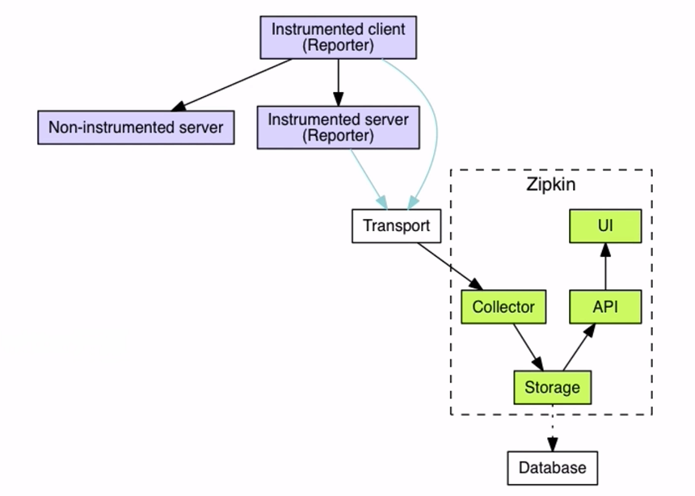

## 服务追踪  
如果服务是链式调用了，哪些服务耗时多少，会导致超时？除了代码分析，还可以如何准确判断呢？  
### 链路监控  
Spring Cloud Sleuth  
1. 引入组件  
   ```xml
    <dependency>
        <groupId>org.springframework.cloud</groupId>
        <artifactId>spring-cloud-starter-sleuth</artifactId>
    </dependency>
   ```
   此组件就会拦截打印好多项目日志在控制台（服务名，链路ID，spanId，把此数据收集到其他服务展示）  
2. 安装Zipkin Server框架（docker容器），图形化显示拦截的链路信息    
3. 在需要分析的项目添加依赖  
   ```xml
    <!--<dependency>-->
        <!--<groupId>org.springframework.cloud</groupId>-->
        <!--<artifactId>spring-cloud-starter-sleuth</artifactId>-->
    <!--</dependency>-->
    <!--<dependency>-->
        <!--<groupId>org.springframework.cloud</groupId>-->
        <!--<artifactId>spring-cloud-sleuth-zipkin</artifactId>-->
    <!--</dependency>-->

    <!-- 包含 sleuth和zipkin -->
    <dependency>
        <groupId>org.springframework.cloud</groupId>
        <artifactId>spring-cloud-starter-zipkin</artifactId>
    </dependency>
   ```
4. 配置文件中配置  
   ```yml
   spring:
        zipkin:  
            # web地址 zipkin的docker web管理地址
            base-url: http://localhost:9411/
        sleuth:  
            sampler:  
                # 转发请求的百分比 默认 0.1f 即10%
                # 开发环境可以设置为1 因为转发所有请求对服务器压力很大，所以生产环境不要这样设置
                percentage: 1
   ```
## 分布式追踪系统  
### 核心步骤  
- 数据采集  
- 数据存储  
- 查询展示  
### OpenTracing
优势： 通过提供平台无关、厂商无关的API，可以使开发人员能够方便的添加或更换追踪系统的实现  
#### Annotation
事件类型  
cs(Client Send):客户端发起请求的时间  
cs(Client Received):客户端收到处理完请求的时间  
ss(Server Send):服务端处理完逻辑的时间  
sr(Server Received):服务端收到调用端请求的时间  
客户端调用时间 = cr - cs  
服务端处理时间 = sr - ss  
#### ZipKin  
Twitter开源  
  
